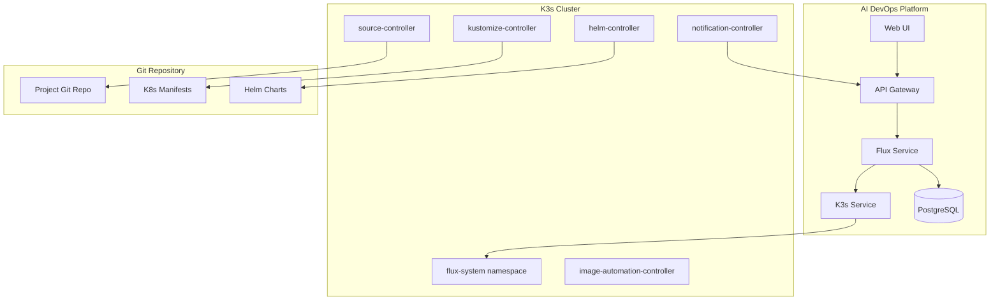
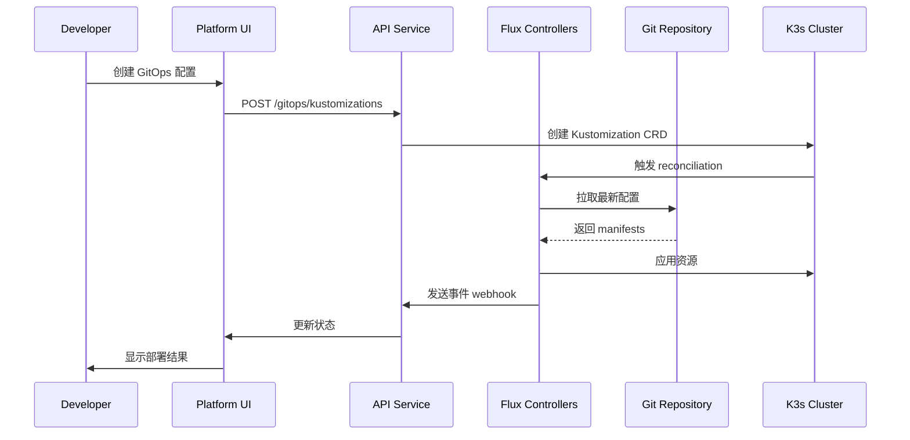

# GitOps 集成 - 设计文档

## 概述

本文档描述了将 Flux v2 GitOps 工作流集成到 AI DevOps 平台的技术设计。采用最前沿的云原生技术栈，基于 K3s 轻量级 Kubernetes 和 Flux v2 实现声明式、自动化的持续部署。

### 设计原则

1. **云原生优先**: 基于 K3s + Flux v2 的现代化 GitOps 架构
2. **声明式配置**: Git 作为唯一真实来源
3. **自动化同步**: Flux 自动检测 Git 变更并应用
4. **多租户隔离**: 每个项目独立的 GitOps 资源
5. **可观测性**: 完整的事件追踪和状态监控

### 技术栈

**容器编排**:
- K3s (轻量级 Kubernetes，已集成)
- BunK8sClient (自研 K8s API 客户端，针对 Bun 优化)

**GitOps 引擎**:
- Flux v2 (CNCF 孵化项目)
- Flux CLI (flux bootstrap, flux install)

**Flux 组件**:
- source-controller (Git/Helm 源管理)
- kustomize-controller (Kustomization 应用)
- helm-controller (Helm Release 管理)
- notification-controller (事件通知)
- image-reflector-controller (镜像扫描)
- image-automation-controller (自动镜像更新)

**后端框架**:
- NestJS 11 (已有)
- tRPC 11 (已有)
- Drizzle ORM (已有)

## 架构设计

### 整体架构



### GitOps 工作流



## 数据库设计（基于现有架构）

### 设计原则（与主平台一致）

1. **复用现有表** - 扩展 repositories、deployments、environments
2. **JSONB 优先** - GitOps 配置存储在 JSONB 字段
3. **软删除** - 所有表添加 deletedAt
4. **最小化新表** - 只添加 1 个核心新表

### 表结构变更

#### 1. 扩展现有 `repositories` 表

```typescript
// packages/core/database/src/schemas/repositories.schema.ts
export const repositories = pgTable('repositories', {
    // ... 现有字段保持不变 ...
    id: uuid('id').primaryKey().defaultRandom(),
    projectId: uuid('project_id').notNull().references(() => projects.id),
    provider: text('provider').notNull(),
    fullName: text('full_name').notNull(),
    cloneUrl: text('clone_url').notNull(),
    defaultBranch: text('default_branch').default('main'),
    lastSyncAt: timestamp('last_sync_at'),
    syncStatus: text('sync_status').default('pending'),
    
    // 新增：GitOps 配置（JSONB）
    gitopsConfig: jsonb('gitops_config').$type<{
        enabled: boolean;
        fluxNamespace: string;
        fluxResourceName: string;
        syncInterval: string; // '1m', '5m'
        secretRef?: string; // K8s Secret 名称
        timeout?: string;
    }>(),
    
    // 新增：Flux 同步状态
    fluxSyncStatus: text('flux_sync_status'), // 'ready', 'reconciling', 'failed'
    fluxLastSyncCommit: text('flux_last_sync_commit'),
    fluxLastSyncTime: timestamp('flux_last_sync_time'),
    fluxErrorMessage: text('flux_error_message'),
    
    createdAt: timestamp('created_at').notNull().defaultNow(),
    updatedAt: timestamp('updated_at').notNull().defaultNow(),
});
```


#### 2. 新增 `gitops_resources` 表（唯一新表）

```typescript
// packages/core/database/src/schemas/gitops-resources.schema.ts
export const gitopsResources = pgTable('gitops_resources', {
  id: uuid('id').primaryKey().defaultRandom(),
  projectId: uuid('project_id').notNull().references(() => projects.id, { onDelete: 'cascade' }),
  environmentId: uuid('environment_id').notNull().references(() => environments.id, { onDelete: 'cascade' }),
  repositoryId: uuid('repository_id').notNull().references(() => repositories.id, { onDelete: 'cascade' }),
  
  // 资源类型和标识
  type: text('type').notNull(), // 'kustomization' | 'helm'
  name: text('name').notNull(),
  namespace: text('namespace').notNull(),
  
  // 配置（JSONB 存储所有配置）
  config: jsonb('config').$type<{
    // Kustomization 配置
    path?: string;
    prune?: boolean;
    healthChecks?: Array<{
      apiVersion: string;
      kind: string;
      name: string;
      namespace?: string;
    }>;
    dependsOn?: Array<{
      name: string;
      namespace?: string;
    }>;
    interval?: string;
    timeout?: string;
    retryInterval?: string;
    
    // Helm 配置
    chartName?: string;
    chartVersion?: string;
    sourceType?: 'GitRepository' | 'HelmRepository';
    values?: Record<string, any>;
    valuesFrom?: Array<{
      kind: string;
      name: string;
      valuesKey?: string;
    }>;
    install?: {
      remediation?: { retries: number };
      createNamespace?: boolean;
    };
    upgrade?: {
      remediation?: { retries: number; remediateLastFailure: boolean };
      cleanupOnFail?: boolean;
    };
  }>(),
  
  // 状态
  status: text('status').notNull().default('pending'), // 'pending', 'ready', 'reconciling', 'failed'
  lastAppliedRevision: text('last_applied_revision'),
  lastAttemptedRevision: text('last_attempted_revision'),
  errorMessage: text('error_message'),
  
  deletedAt: timestamp('deleted_at'),
  createdAt: timestamp('created_at').notNull().defaultNow(),
  updatedAt: timestamp('updated_at').notNull().defaultNow(),
}, (table) => [
  uniqueIndex('gitops_resources_project_env_name_unique').on(table.projectId, table.environmentId, table.name),
  index('gitops_resources_project_idx').on(table.projectId),
  index('gitops_resources_env_idx').on(table.environmentId),
  index('gitops_resources_repo_idx').on(table.repositoryId),
  index('gitops_resources_status_idx').on(table.status),
  index('gitops_resources_deleted_idx').on(table.deletedAt),
]);

export type GitOpsResource = typeof gitopsResources.$inferSelect;
export type NewGitOpsResource = typeof gitopsResources.$inferInsert;
```

#### 3. 扩展现有 `deployments` 表

```typescript
// packages/core/database/src/schemas/deployments.schema.ts
export const deployments = pgTable('deployments', {
    // ... 现有字段保持不变 ...
    id: uuid('id').primaryKey().defaultRandom(),
    projectId: uuid('project_id').notNull().references(() => projects.id),
    environmentId: uuid('environment_id').notNull().references(() => environments.id),
    pipelineRunId: uuid('pipeline_run_id').references(() => pipelineRuns.id),
    version: text('version').notNull(),
    commitHash: text('commit_hash').notNull(),
    branch: text('branch').notNull(),
    strategy: text('strategy').default('rolling'),
    status: text('status').notNull().default('pending'),
    startedAt: timestamp('started_at'),
    finishedAt: timestamp('finished_at'),
    deployedBy: uuid('deployed_by').references(() => users.id),
    
    // 新增：GitOps 相关字段
    gitopsResourceId: uuid('gitops_resource_id').references(() => gitopsResources.id),
    deploymentMethod: text('deployment_method').default('manual'), // 'manual' | 'gitops-ui' | 'gitops-git' | 'pipeline'
    gitCommitSha: text('git_commit_sha'), // 用于 GitOps 的完整 commit SHA
    
    deletedAt: timestamp('deleted_at'),
    createdAt: timestamp('created_at').notNull().defaultNow(),
});
```


#### 4. 扩展现有 `environments` 表

```typescript
// packages/core/database/src/schemas/environments.schema.ts
export const environments = pgTable('environments', {
    // ... 现有字段保持不变 ...
    id: uuid('id').primaryKey().defaultRandom(),
    projectId: uuid('project_id').notNull().references(() => projects.id),
    name: text('name').notNull(),
    type: text('type').notNull(),
    config: jsonb('config').$type<{
        cloudProvider?: 'aws' | 'gcp' | 'azure';
        region?: string;
        approvalRequired: boolean;
        minApprovals: number;
        
        // 新增：GitOps 配置
        gitops?: {
            enabled: boolean;
            autoSync: boolean; // 是否自动同步
            gitBranch: string; // 对应的 Git 分支
            gitPath: string; // K8s 配置路径
            syncInterval: string;
        };
    }>(),
    permissions: jsonb('permissions').$type<Array<{
        subjectType: 'user' | 'team';
        subjectId: string;
        permission: 'read' | 'deploy' | 'admin';
    }>>(),
    
    deletedAt: timestamp('deleted_at'),
    createdAt: timestamp('created_at').notNull().defaultNow(),
    updatedAt: timestamp('updated_at').notNull().defaultNow(),
});
```

#### 5. 复用现有 `audit_logs` 表（用于 Flux 事件）

```typescript
// 不需要新表，复用现有的 audit_logs 表
// 添加新的 action 类型：
// - 'gitops.sync.started'
// - 'gitops.sync.completed'
// - 'gitops.sync.failed'
// - 'gitops.resource.created'
// - 'gitops.resource.updated'
// - 'gitops.resource.deleted'

// metadata 字段存储 Flux 事件详情
```


#### 6. image_policies (镜像版本策略)

```typescript
export const imagePolicies = pgTable('image_policies', {
  id: uuid('id').primaryKey().defaultRandom(),
  imageRepositoryId: uuid('image_repository_id').notNull().references(() => imageRepositories.id),
  
  name: text('name').notNull(),
  namespace: text('namespace').notNull(),
  
  // 策略配置
  policy: jsonb('policy').$type<{
    semver?: { range: string };
    alphabetical?: { order: 'asc' | 'desc' };
    numerical?: { order: 'asc' | 'desc' };
  }>(),
  
  filterTags: jsonb('filter_tags').$type<{
    pattern?: string;
    extract?: string;
  }>(),
  
  status: text('status').notNull(),
  latestImage: text('latest_image'),
  
  createdAt: timestamp('created_at').notNull().defaultNow(),
  updatedAt: timestamp('updated_at').notNull().defaultNow(),
});
```

#### 7. flux_events (Flux 事件记录)

```typescript
export const fluxEvents = pgTable('flux_events', {
  id: uuid('id').primaryKey().defaultRandom(),
  projectId: uuid('project_id').references(() => projects.id),
  
  // 事件来源
  involvedObjectKind: text('involved_object_kind').notNull(), // 'GitRepository', 'Kustomization', etc.
  involvedObjectName: text('involved_object_name').notNull(),
  involvedObjectNamespace: text('involved_object_namespace').notNull(),
  
  // 事件详情
  reason: text('reason').notNull(),
  message: text('message').notNull(),
  type: text('type').notNull(), // 'Normal', 'Warning', 'Error'
  severity: text('severity').notNull(), // 'info', 'error'
  
  // 元数据
  metadata: jsonb('metadata').$type<{
    revision?: string;
    commit?: string;
  }>(),
  
  timestamp: timestamp('timestamp').notNull().defaultNow(),
}, (table) => [
  index('flux_events_project_idx').on(table.projectId),
  index('flux_events_timestamp_idx').on(table.timestamp),
]);
```

## 模块设计

### Flux Service

```typescript
// packages/services/flux/src/flux.service.ts
import { Injectable } from '@nestjs/common';
import { K3sService } from '@/services/k3s';
import { BunK8sClient } from '../k3s/bun-k8s-client';

@Injectable()
export class FluxService {
  constructor(private k3s: K3sService) {}
  
  // Flux 安装
  async installFlux(clusterId: string, options?: {
    namespace?: string;
    version?: string;
  }): Promise<FluxInstallation> {
    // 使用 Flux CLI 或 kubectl apply 安装
  }
  
  // 创建 GitRepository
  async createGitRepository(data: CreateGitRepositoryInput): Promise<GitRepository> {
    // 创建 K8s Secret (如果需要认证)
    // 创建 GitRepository CRD
    // 保存到数据库
  }
  
  // 创建 Kustomization
  async createKustomization(data: CreateKustomizationInput): Promise<Kustomization> {
    // 创建 Kustomization CRD
    // 保存到数据库
  }
  
  // 手动触发同步
  async triggerReconciliation(kind: string, name: string, namespace: string): Promise<void> {
    // 使用 flux reconcile 命令或更新 annotation
  }
}
```


### Flux Watcher Service

```typescript
// packages/services/flux/src/flux-watcher.service.ts
import { Injectable, OnModuleInit } from '@nestjs/common';
import { K3sService } from '../k3s/k3s.service';

@Injectable()
export class FluxWatcherService implements OnModuleInit {
  private watchers: Map<string, k8s.Watch> = new Map();
  
  async onModuleInit() {
    await this.startWatching();
  }
  
  private async startWatching() {
    // Watch GitRepository 资源
    await this.watchResource('source.toolkit.fluxcd.io', 'v1', 'gitrepositories');
    
    // Watch Kustomization 资源
    await this.watchResource('kustomize.toolkit.fluxcd.io', 'v1', 'kustomizations');
    
    // Watch HelmRelease 资源
    await this.watchResource('helm.toolkit.fluxcd.io', 'v2beta1', 'helmreleases');
  }
  
  private async watchResource(group: string, version: string, plural: string) {
    const watch = new k8s.Watch(this.k3s.getKubeConfig());
    
    const path = `/apis/${group}/${version}/${plural}`;
    
    await watch.watch(
      path,
      {},
      (type, apiObj, watchObj) => {
        this.handleResourceEvent(type, apiObj, watchObj);
      },
      (err) => {
        console.error(`Watch error for ${plural}:`, err);
        // 重新连接
        setTimeout(() => this.watchResource(group, version, plural), 5000);
      }
    );
    
    this.watchers.set(plural, watch);
  }
  
  private async handleResourceEvent(type: string, resource: any, watchObj: any) {
    // 解析事件
    const event = {
      type, // 'ADDED', 'MODIFIED', 'DELETED'
      kind: resource.kind,
      name: resource.metadata.name,
      namespace: resource.metadata.namespace,
      status: resource.status,
    };
    
    // 更新数据库
    await this.updateResourceStatus(event);
    
    // 发送通知
    await this.sendNotification(event);
    
    // 记录事件
    await this.recordEvent(event);
  }
}
```

### Flux CLI Wrapper

```typescript
// packages/services/flux/src/flux-cli.service.ts
import { Injectable } from '@nestjs/common';
import { exec } from 'child_process';
import { promisify } from 'util';

const execAsync = promisify(exec);

@Injectable()
export class FluxCliService {
  // 安装 Flux
  async bootstrap(options: {
    kubeconfig: string;
    namespace?: string;
    version?: string;
  }): Promise<void> {
    const cmd = [
      'flux',
      'install',
      `--namespace=${options.namespace || 'flux-system'}`,
      options.version ? `--version=${options.version}` : '',
      '--export',
    ].filter(Boolean).join(' ');
    
    const { stdout, stderr } = await execAsync(cmd, {
      env: { ...process.env, KUBECONFIG: options.kubeconfig },
    });
    
    // 应用 YAML
    await this.applyManifests(stdout, options.kubeconfig);
  }
  
  // 手动同步
  async reconcile(kind: string, name: string, namespace: string, kubeconfig: string): Promise<void> {
    const cmd = `flux reconcile ${kind} ${name} -n ${namespace}`;
    await execAsync(cmd, {
      env: { ...process.env, KUBECONFIG: kubeconfig },
    });
  }
  
  // 检查 Flux 状态
  async check(kubeconfig: string): Promise<FluxStatus> {
    const cmd = 'flux check --pre';
    const { stdout } = await execAsync(cmd, {
      env: { ...process.env, KUBECONFIG: kubeconfig },
    });
    
    return this.parseFluxStatus(stdout);
  }
}
```


## API 设计

### tRPC Router

```typescript
// apps/api-gateway/src/routers/gitops.router.ts
import { Injectable } from '@nestjs/common';
import { TrpcService } from '@/trpc/trpc.service';
import { FluxService } from '@/services/flux';
import { z } from 'zod';

@Injectable()
export class GitOpsRouter {
  constructor(
    private trpc: TrpcService,
    private fluxService: FluxService,
  ) {}
  
  router = this.trpc.router({
    // Flux 安装
    installFlux: this.trpc.protectedProcedure
      .input(z.object({
        clusterId: z.string().uuid(),
        namespace: z.string().optional(),
        version: z.string().optional(),
      }))
      .mutation(async ({ input }) => {
        return await this.fluxService.installFlux(input.clusterId, input);
      }),
    
    // GitRepository CRUD
    createGitRepository: this.trpc.protectedProcedure
      .input(z.object({
        projectId: z.string().uuid(),
        name: z.string(),
        url: z.string().url(),
        branch: z.string().optional(),
        secretRef: z.string().optional(),
      }))
      .mutation(async ({ input }) => {
        return await this.fluxService.createGitRepository(input);
      }),
    
    listGitRepositories: this.trpc.protectedProcedure
      .input(z.object({
        projectId: z.string().uuid(),
      }))
      .query(async ({ input }) => {
        return await this.fluxService.listGitRepositories(input.projectId);
      }),
    
    // Kustomization CRUD
    createKustomization: this.trpc.protectedProcedure
      .input(z.object({
        projectId: z.string().uuid(),
        environmentId: z.string().uuid().optional(),
        gitRepositoryId: z.string().uuid(),
        name: z.string(),
        path: z.string().optional(),
        prune: z.boolean().optional(),
      }))
      .mutation(async ({ input }) => {
        return await this.fluxService.createKustomization(input);
      }),
    
    // 手动触发同步
    triggerSync: this.trpc.protectedProcedure
      .input(z.object({
        kind: z.enum(['GitRepository', 'Kustomization', 'HelmRelease']),
        id: z.string().uuid(),
      }))
      .mutation(async ({ input }) => {
        return await this.fluxService.triggerReconciliation(input.kind, input.id);
      }),
    
    // 获取 Flux 事件
    getFluxEvents: this.trpc.protectedProcedure
      .input(z.object({
        projectId: z.string().uuid(),
        limit: z.number().optional(),
      }))
      .query(async ({ input }) => {
        return await this.fluxService.getEvents(input.projectId, input.limit);
      }),
  });
}
```

## Flux 资源 YAML 生成

### GitRepository YAML

```typescript
function generateGitRepositoryYAML(data: GitRepositoryInput): string {
  return `
apiVersion: source.toolkit.fluxcd.io/v1
kind: GitRepository
metadata:
  name: ${data.name}
  namespace: ${data.namespace}
spec:
  interval: ${data.interval || '1m'}
  url: ${data.url}
  ref:
    branch: ${data.branch || 'main'}
  ${data.secretRef ? `secretRef:\n    name: ${data.secretRef}` : ''}
`;
}
```

### Kustomization YAML

```typescript
function generateKustomizationYAML(data: KustomizationInput): string {
  return `
apiVersion: kustomize.toolkit.fluxcd.io/v1
kind: Kustomization
metadata:
  name: ${data.name}
  namespace: ${data.namespace}
spec:
  interval: ${data.interval || '5m'}
  path: ${data.path || './'}
  prune: ${data.prune !== false}
  sourceRef:
    kind: GitRepository
    name: ${data.gitRepositoryName}
  ${data.healthChecks ? `healthChecks:\n${data.healthChecks.map(hc => `    - apiVersion: ${hc.apiVersion}\n      kind: ${hc.kind}\n      name: ${hc.name}`).join('\n')}` : ''}
  ${data.dependsOn ? `dependsOn:\n${data.dependsOn.map(dep => `    - name: ${dep.name}`).join('\n')}` : ''}
`;
}
```


### HelmRelease YAML

```typescript
function generateHelmReleaseYAML(data: HelmReleaseInput): string {
  return `
apiVersion: helm.toolkit.fluxcd.io/v2beta1
kind: HelmRelease
metadata:
  name: ${data.name}
  namespace: ${data.namespace}
spec:
  interval: ${data.interval || '5m'}
  chart:
    spec:
      chart: ${data.chartName}
      version: ${data.chartVersion || '*'}
      sourceRef:
        kind: ${data.sourceType}
        name: ${data.sourceName}
  ${data.values ? `values:\n${JSON.stringify(data.values, null, 2).split('\n').map(line => `    ${line}`).join('\n')}` : ''}
  install:
    remediation:
      retries: 3
  upgrade:
    remediation:
      retries: 3
      remediateLastFailure: true
    cleanupOnFail: true
`;
}
```

## 事件处理

### Webhook 接收器

```typescript
// apps/api-gateway/src/routers/flux-webhook.router.ts
import { Injectable } from '@nestjs/common';
import { TrpcService } from '@/trpc/trpc.service';
import { FluxEventsService } from '@/services/flux';

@Injectable()
export class FluxWebhookRouter {
  constructor(
    private trpc: TrpcService,
    private fluxEvents: FluxEventsService,
  ) {}
  
  // Flux Notification Controller 会发送 POST 请求到这个端点
  router = this.trpc.router({
    receiveFluxEvent: this.trpc.procedure
      .input(z.object({
        involvedObject: z.object({
          kind: z.string(),
          name: z.string(),
          namespace: z.string(),
        }),
        reason: z.string(),
        message: z.string(),
        type: z.string(),
        severity: z.string(),
        metadata: z.record(z.any()).optional(),
      }))
      .mutation(async ({ input }) => {
        // 记录事件到数据库
        await this.fluxEvents.recordEvent(input);
        
        // 更新资源状态
        await this.fluxEvents.updateResourceStatus(input);
        
        // 发送通知（如果是错误）
        if (input.severity === 'error') {
          await this.fluxEvents.sendNotification(input);
        }
        
        return { success: true };
      }),
  });
}
```

### Notification Provider 配置

```yaml
# 在 K3s 中创建 Provider 和 Alert
apiVersion: notification.toolkit.fluxcd.io/v1beta1
kind: Provider
metadata:
  name: platform-webhook
  namespace: flux-system
spec:
  type: generic
  address: https://platform.example.com/api/flux/webhook
  secretRef:
    name: webhook-token
---
apiVersion: notification.toolkit.fluxcd.io/v1beta1
kind: Alert
metadata:
  name: all-resources
  namespace: flux-system
spec:
  providerRef:
    name: platform-webhook
  eventSeverity: info
  eventSources:
    - kind: GitRepository
      name: '*'
    - kind: Kustomization
      name: '*'
    - kind: HelmRelease
      name: '*'
```

## GitOps 模板系统

### 模板定义

```typescript
interface GitOpsTemplate {
  id: string;
  name: string;
  description: string;
  type: 'web-app' | 'microservice' | 'cron-job' | 'helm-chart';
  
  gitRepository: {
    url: string;
    branch: string;
    path: string;
  };
  
  kustomization: {
    path: string;
    prune: boolean;
    healthChecks: Array<{
      apiVersion: string;
      kind: string;
      name: string;
    }>;
  };
  
  helmRelease?: {
    chartName: string;
    chartVersion: string;
    values: Record<string, any>;
  };
}
```


### 预定义模板

```typescript
const GITOPS_TEMPLATES: GitOpsTemplate[] = [
  {
    id: 'web-app-basic',
    name: 'Web 应用 (基础)',
    description: '标准的 Web 应用部署，包含 Deployment 和 Service',
    type: 'web-app',
    gitRepository: {
      url: '', // 用户提供
      branch: 'main',
      path: './',
    },
    kustomization: {
      path: './k8s/overlays/production',
      prune: true,
      healthChecks: [
        {
          apiVersion: 'apps/v1',
          kind: 'Deployment',
          name: 'app',
        },
      ],
    },
  },
  {
    id: 'microservice-helm',
    name: '微服务 (Helm)',
    description: '使用 Helm Chart 部署的微服务',
    type: 'helm-chart',
    gitRepository: {
      url: '', // 用户提供
      branch: 'main',
      path: './charts',
    },
    helmRelease: {
      chartName: 'microservice',
      chartVersion: '1.0.0',
      values: {
        replicaCount: 3,
        image: {
          repository: 'ghcr.io/org/app',
          tag: 'latest',
        },
        service: {
          type: 'ClusterIP',
          port: 80,
        },
      },
    },
  },
];
```

## 多环境管理

### 环境配置策略

```typescript
interface EnvironmentGitOpsConfig {
  environmentId: string;
  environmentName: string;
  
  // Git 配置
  branch: string; // 'develop', 'staging', 'main'
  path: string;   // './k8s/overlays/development', './k8s/overlays/production'
  
  // 同步策略
  autoSync: boolean; // 开发环境自动同步，生产环境需要审批
  syncInterval: string;
  
  // 审批配置
  requiresApproval: boolean;
  approvers: string[];
  
  // 健康检查
  healthChecks: Array<{
    apiVersion: string;
    kind: string;
    name: string;
  }>;
}

// 示例：为项目配置多环境
const environmentConfigs: EnvironmentGitOpsConfig[] = [
  {
    environmentId: 'dev-env-id',
    environmentName: 'development',
    branch: 'develop',
    path: './k8s/overlays/development',
    autoSync: true,
    syncInterval: '1m',
    requiresApproval: false,
    approvers: [],
    healthChecks: [],
  },
  {
    environmentId: 'prod-env-id',
    environmentName: 'production',
    branch: 'main',
    path: './k8s/overlays/production',
    autoSync: false, // 需要手动触发
    syncInterval: '10m',
    requiresApproval: true,
    approvers: ['user-1-id', 'user-2-id'],
    healthChecks: [
      { apiVersion: 'apps/v1', kind: 'Deployment', name: 'app' },
      { apiVersion: 'v1', kind: 'Service', name: 'app' },
    ],
  },
];
```

## 安全设计

### Git 凭证管理

```typescript
// 创建 K8s Secret 存储 Git 凭证
async function createGitSecret(data: {
  name: string;
  namespace: string;
  username?: string;
  password?: string;
  sshPrivateKey?: string;
}): Promise<void> {
  const secret: k8s.V1Secret = {
    apiVersion: 'v1',
    kind: 'Secret',
    metadata: {
      name: data.name,
      namespace: data.namespace,
    },
    type: data.sshPrivateKey ? 'Opaque' : 'kubernetes.io/basic-auth',
    stringData: data.sshPrivateKey
      ? {
          identity: data.sshPrivateKey,
          known_hosts: '', // 可选
        }
      : {
          username: data.username!,
          password: data.password!,
        },
  };
  
  await k3sService.createSecret(secret);
}
```

### RBAC 权限控制

```typescript
// 检查用户是否有权限操作 GitOps 资源
async function checkGitOpsPermission(
  userId: string,
  projectId: string,
  action: 'create' | 'update' | 'delete' | 'sync',
): Promise<boolean> {
  // 获取用户在项目中的角色
  const role = await getProjectRole(userId, projectId);
  
  // 权限矩阵
  const permissions = {
    owner: ['create', 'update', 'delete', 'sync'],
    maintainer: ['create', 'update', 'sync'],
    developer: ['sync'],
    viewer: [],
  };
  
  return permissions[role]?.includes(action) || false;
}
```


## 监控和可观测性

### Flux 指标收集

```typescript
// 收集 Flux 相关指标
const fluxMetrics = {
  // GitRepository 指标
  gitRepositorySyncCount: meter.createCounter('flux_git_repository_sync_total'),
  gitRepositorySyncDuration: meter.createHistogram('flux_git_repository_sync_duration_seconds'),
  
  // Kustomization 指标
  kustomizationApplyCount: meter.createCounter('flux_kustomization_apply_total'),
  kustomizationApplyDuration: meter.createHistogram('flux_kustomization_apply_duration_seconds'),
  
  // HelmRelease 指标
  helmReleaseInstallCount: meter.createCounter('flux_helm_release_install_total'),
  helmReleaseUpgradeCount: meter.createCounter('flux_helm_release_upgrade_total'),
  
  // 错误指标
  fluxErrorCount: meter.createCounter('flux_errors_total'),
};

// 在事件处理中记录指标
async function recordFluxMetrics(event: FluxEvent) {
  const labels = {
    kind: event.involvedObjectKind,
    namespace: event.involvedObjectNamespace,
    name: event.involvedObjectName,
  };
  
  if (event.type === 'Normal') {
    if (event.reason === 'ReconciliationSucceeded') {
      fluxMetrics.gitRepositorySyncCount.add(1, labels);
    }
  } else if (event.type === 'Warning' || event.type === 'Error') {
    fluxMetrics.fluxErrorCount.add(1, { ...labels, reason: event.reason });
  }
}
```

### Grafana 仪表板

```json
{
  "dashboard": {
    "title": "GitOps (Flux) 监控",
    "panels": [
      {
        "title": "GitRepository 同步成功率",
        "targets": [
          {
            "expr": "rate(flux_git_repository_sync_total{status=\"success\"}[5m]) / rate(flux_git_repository_sync_total[5m])"
          }
        ]
      },
      {
        "title": "Kustomization 应用延迟",
        "targets": [
          {
            "expr": "histogram_quantile(0.95, rate(flux_kustomization_apply_duration_seconds_bucket[5m]))"
          }
        ]
      },
      {
        "title": "Flux 错误率",
        "targets": [
          {
            "expr": "rate(flux_errors_total[5m])"
          }
        ]
      },
      {
        "title": "活跃的 GitOps 资源",
        "targets": [
          {
            "expr": "count(flux_resource_info{status=\"ready\"})"
          }
        ]
      }
    ]
  }
}
```

## 故障排查

### 诊断工具

```typescript
class FluxDiagnostics {
  // 检查 Flux 组件健康状态
  async checkFluxHealth(): Promise<FluxHealthReport> {
    const components = [
      'source-controller',
      'kustomize-controller',
      'helm-controller',
      'notification-controller',
    ];
    
    const health = await Promise.all(
      components.map(async (name) => {
        const deployment = await k3s.getDeployment('flux-system', name);
        return {
          name,
          ready: deployment.status?.readyReplicas === deployment.spec?.replicas,
          replicas: deployment.status?.replicas,
          conditions: deployment.status?.conditions,
        };
      })
    );
    
    return {
      overall: health.every(c => c.ready) ? 'healthy' : 'unhealthy',
      components: health,
    };
  }
  
  // 诊断 GitRepository 同步问题
  async diagnoseGitRepository(id: string): Promise<DiagnosticResult> {
    const repo = await db.query.gitRepositories.findFirst({
      where: eq(gitRepositories.id, id),
    });
    
    const issues: string[] = [];
    const suggestions: string[] = [];
    
    // 检查 URL 格式
    if (!repo.url.startsWith('https://') && !repo.url.startsWith('git@')) {
      issues.push('Git URL 格式不正确');
      suggestions.push('使用 HTTPS (https://...) 或 SSH (git@...) 格式');
    }
    
    // 检查认证
    if (repo.url.startsWith('git@') && !repo.secretRef) {
      issues.push('SSH URL 需要配置 Secret');
      suggestions.push('创建包含 SSH 私钥的 Secret');
    }
    
    // 检查 K8s 资源状态
    const k8sResource = await k3s.getCustomResource(
      'source.toolkit.fluxcd.io',
      'v1',
      repo.namespace,
      'gitrepositories',
      repo.name
    );
    
    if (k8sResource.status?.conditions) {
      const readyCondition = k8sResource.status.conditions.find(
        c => c.type === 'Ready'
      );
      
      if (readyCondition?.status !== 'True') {
        issues.push(readyCondition?.message || '资源未就绪');
      }
    }
    
    return {
      status: issues.length === 0 ? 'healthy' : 'unhealthy',
      issues,
      suggestions,
    };
  }
}
```


## 性能优化

### 资源缓存

```typescript
// 缓存 Flux 资源状态，减少 K8s API 调用
class FluxResourceCache {
  private cache = new Map<string, { data: any; timestamp: number }>();
  private ttl = 30000; // 30 秒
  
  async get(key: string, fetcher: () => Promise<any>): Promise<any> {
    const cached = this.cache.get(key);
    
    if (cached && Date.now() - cached.timestamp < this.ttl) {
      return cached.data;
    }
    
    const data = await fetcher();
    this.cache.set(key, { data, timestamp: Date.now() });
    
    return data;
  }
  
  invalidate(key: string) {
    this.cache.delete(key);
  }
}
```

### 批量操作

```typescript
// 批量创建 GitOps 资源
async function batchCreateGitOpsResources(
  resources: Array<{
    type: 'GitRepository' | 'Kustomization' | 'HelmRelease';
    data: any;
  }>
): Promise<void> {
  // 生成所有 YAML
  const yamls = resources.map(r => generateYAML(r.type, r.data));
  
  // 合并为单个 YAML 文档
  const combinedYAML = yamls.join('\n---\n');
  
  // 一次性应用
  await k3s.applyYAML(combinedYAML);
  
  // 批量保存到数据库
  await db.transaction(async (tx) => {
    for (const resource of resources) {
      await saveResource(tx, resource);
    }
  });
}
```

## 部署架构

### Docker Compose 配置

```yaml
# docker-compose.yml (更新)
version: '3.8'

services:
  api:
    build: .
    environment:
      - KUBECONFIG_PATH=/kubeconfig/config
      - FLUX_VERSION=v2.2.0
    volumes:
      - ~/.kube/config:/kubeconfig/config:ro
      - flux-cli:/usr/local/bin/flux
    depends_on:
      - k3s
  
  k3s:
    image: rancher/k3s:latest
    privileged: true
    environment:
      - K3S_KUBECONFIG_OUTPUT=/output/kubeconfig.yaml
    volumes:
      - k3s-data:/var/lib/rancher/k3s
      - k3s-kubeconfig:/output
    ports:
      - "6443:6443"

volumes:
  k3s-data:
  k3s-kubeconfig:
  flux-cli:
```

### Flux CLI 安装

```dockerfile
# Dockerfile (添加 Flux CLI)
FROM node:20-alpine

# 安装 Flux CLI
RUN wget -O- https://fluxcd.io/install.sh | sh

# 安装 kubectl
RUN apk add --no-cache curl && \
    curl -LO "https://dl.k8s.io/release/$(curl -L -s https://dl.k8s.io/release/stable.txt)/bin/linux/amd64/kubectl" && \
    install -o root -g root -m 0755 kubectl /usr/local/bin/kubectl

# ... 其他配置
```

## 测试策略

### 单元测试

```typescript
describe('FluxService', () => {
  it('should create GitRepository resource', async () => {
    const data = {
      projectId: 'project-123',
      name: 'my-repo',
      url: 'https://github.com/org/repo',
      branch: 'main',
    };
    
    const result = await fluxService.createGitRepository(data);
    
    expect(result.name).toBe('my-repo');
    expect(result.status).toBe('reconciling');
  });
  
  it('should handle Git authentication', async () => {
    const data = {
      projectId: 'project-123',
      name: 'private-repo',
      url: 'git@github.com:org/private-repo',
      secretRef: 'git-ssh-key',
    };
    
    await fluxService.createGitRepository(data);
    
    // 验证 Secret 已创建
    const secret = await k3s.getSecret('flux-system', 'git-ssh-key');
    expect(secret).toBeDefined();
  });
});
```

### 集成测试

```typescript
describe('GitOps Integration', () => {
  it('should complete full GitOps workflow', async () => {
    // 1. 安装 Flux
    await fluxService.installFlux('cluster-123');
    
    // 2. 创建 GitRepository
    const repo = await fluxService.createGitRepository({
      projectId: 'project-123',
      name: 'test-repo',
      url: 'https://github.com/test/repo',
    });
    
    // 3. 创建 Kustomization
    const kustomization = await fluxService.createKustomization({
      projectId: 'project-123',
      gitRepositoryId: repo.id,
      name: 'test-app',
      path: './k8s',
    });
    
    // 4. 等待同步完成
    await waitForReconciliation(kustomization.id, 60000);
    
    // 5. 验证资源已部署
    const deployment = await k3s.getDeployment('default', 'test-app');
    expect(deployment.status?.readyReplicas).toBeGreaterThan(0);
  });
});
```

## 总结

这个设计提供了：

✅ **现代化技术栈**: K3s + Flux v2 的前沿 GitOps 方案
✅ **完整的 Flux 集成**: 支持所有 Flux 核心功能
✅ **多环境管理**: 灵活的环境配置和审批流程
✅ **实时事件监听**: Kubernetes Watch API + Webhook
✅ **安全凭证管理**: K8s Secret 存储敏感信息
✅ **可观测性**: 完整的指标收集和监控
✅ **故障诊断**: 自动化的健康检查和问题诊断
✅ **性能优化**: 缓存和批量操作

准备好开始实施了！🚀


## 双向 GitOps 设计（核心创新）

### 设计理念

**问题：** 传统 GitOps 要求开发者熟悉 Git 和 K8s YAML，学习曲线陡峭。

**解决方案：** 实现双向同步机制，让 UI 操作和 Git 操作都能触发部署。

```
┌─────────────────────────────────────────────────────────┐
│                    双向 GitOps 架构                      │
├─────────────────────────────────────────────────────────┤
│                                                          │
│  Git Repository  ←──────────────→  Platform UI          │
│                                                          │
│  开发者 push     ←──────────────→  用户点击按钮         │
│       ↓                                    ↓             │
│  Flux 检测变更   ←──────────────→  平台生成 commit      │
│       ↓                                    ↓             │
│  自动部署到 K3s  ←──────────────→  自动部署到 K3s       │
│                                                          │
└─────────────────────────────────────────────────────────┘
```

### 用户体验设计

#### 场景 1: 不熟悉 Git 的用户（UI 优先）

```
用户在 UI 中操作：
1. 点击"部署"按钮
2. 选择镜像版本: v1.2.3
3. 调整副本数: 3 → 5
4. 点击"确认部署"

平台后台自动：
5. 生成 K8s YAML 变更
6. 创建 Git commit: "chore: update deployment config"
7. Push 到 Git 仓库
8. Flux 检测到变更
9. 自动部署到 K3s
10. UI 显示部署进度

✅ 用户无需了解 Git 或 YAML！
```

#### 场景 2: 熟悉 Git 的开发者（Git 优先）

```
开发者在本地操作：
1. 编辑 k8s/deployment.yaml
2. git commit -m "feat: scale to 5 replicas"
3. git push

平台自动：
4. Flux 检测到 Git 变更
5. 自动部署到 K3s
6. 平台监听 Flux 事件
7. UI 实时更新状态

✅ 开发者使用熟悉的 Git 工作流！
```

### 技术实现

#### 1. Git 操作服务

```typescript
// packages/services/git-ops/src/git-ops.service.ts
import { Injectable } from '@nestjs/common';
import simpleGit, { SimpleGit } from 'simple-git';

@Injectable()
export class GitOpsService {
  private git: SimpleGit;
  
  // 初始化 Git 仓库
  async initRepository(repoUrl: string, localPath: string): Promise<void> {
    this.git = simpleGit(localPath);
    
    // 克隆或拉取最新代码
    if (!await this.repoExists(localPath)) {
      await this.git.clone(repoUrl, localPath);
    } else {
      await this.git.pull();
    }
  }
  
  // UI 操作 → Git commit
  async commitFromUI(data: {
    projectId: string;
    environmentId: string;
    changes: DeploymentChanges;
    userId: string;
  }): Promise<string> {
    const { projectId, environmentId, changes, userId } = data;
    
    // 1. 获取项目的 Git 配置
    const gitConfig = await this.getProjectGitConfig(projectId);
    const localPath = `/tmp/repos/${projectId}`;
    
    // 2. 确保本地仓库是最新的
    await this.initRepository(gitConfig.url, localPath);
    
    // 3. 切换到正确的分支
    const branch = this.getEnvironmentBranch(environmentId);
    await this.git.checkout(branch);
    await this.git.pull('origin', branch);
    
    // 4. 生成或更新 YAML 文件
    const yamlPath = `k8s/overlays/${environmentId}/deployment.yaml`;
    const yaml = await this.generateYAML(changes);
    await fs.writeFile(`${localPath}/${yamlPath}`, yaml);
    
    // 5. 创建 commit
    await this.git.add(yamlPath);
    const commitMessage = this.generateCommitMessage(changes, userId);
    await this.git.commit(commitMessage);
    
    // 6. Push 到远程
    await this.git.push('origin', branch);
    
    // 7. 获取 commit SHA
    const log = await this.git.log(['-1']);
    return log.latest.hash;
  }
  
  // 生成友好的 commit 消息
  private generateCommitMessage(changes: DeploymentChanges, userId: string): string {
    const parts = [];
    
    if (changes.image) {
      parts.push(`update image to ${changes.image}`);
    }
    if (changes.replicas) {
      parts.push(`scale to ${changes.replicas} replicas`);
    }
    if (changes.env) {
      parts.push(`update environment variables`);
    }
    
    const message = parts.join(', ');
    return `chore(deploy): ${message}\n\nDeployed via Platform UI by ${userId}`;
  }
  
  // 智能 YAML 更新（保留注释和格式）
  private async generateYAML(changes: DeploymentChanges): Promise<string> {
    // 读取现有 YAML
    const existingYAML = await this.readExistingYAML();
    
    // 使用 yaml 库解析并更新
    const doc = yaml.parseDocument(existingYAML);
    
    if (changes.image) {
      doc.setIn(['spec', 'template', 'spec', 'containers', 0, 'image'], changes.image);
    }
    
    if (changes.replicas !== undefined) {
      doc.setIn(['spec', 'replicas'], changes.replicas);
    }
    
    if (changes.env) {
      const envArray = Object.entries(changes.env).map(([name, value]) => ({
        name,
        value,
      }));
      doc.setIn(['spec', 'template', 'spec', 'containers', 0, 'env'], envArray);
    }
    
    // 保留原有格式和注释
    return doc.toString();
  }
}
```

#### 2. UI 部署按钮实现

```typescript
// apps/api-gateway/src/routers/deployments.router.ts
export class DeploymentsRouter {
  // 新的部署 API（支持 GitOps）
  deployWithGitOps: this.trpc.protectedProcedure
    .input(z.object({
      projectId: z.string().uuid(),
      environmentId: z.string().uuid(),
      image: z.string().optional(),
      replicas: z.number().optional(),
      env: z.record(z.string()).optional(),
    }))
    .mutation(async ({ ctx, input }) => {
      // 1. 检查项目是否启用 GitOps
      const project = await db.query.projects.findFirst({
        where: eq(projects.id, input.projectId),
      });
      
      if (!project.gitOpsEnabled) {
        // 回退到传统部署方式
        return await this.deployTraditional(input);
      }
      
      // 2. 通过 Git 操作服务创建 commit
      const commitSha = await gitOpsService.commitFromUI({
        projectId: input.projectId,
        environmentId: input.environmentId,
        changes: {
          image: input.image,
          replicas: input.replicas,
          env: input.env,
        },
        userId: ctx.user.id,
      });
      
      // 3. 记录部署请求
      const [deployment] = await db.insert(deployments).values({
        projectId: input.projectId,
        environmentId: input.environmentId,
        deployedBy: ctx.user.id,
        version: input.image,
        commitSha,
        status: 'pending',
        deploymentMethod: 'gitops-ui',
      }).returning();
      
      // 4. 等待 Flux 同步（可选）
      // 或者立即返回，让前端轮询状态
      
      return {
        deploymentId: deployment.id,
        commitSha,
        message: '部署请求已提交到 Git，Flux 将自动同步',
      };
    }),
}
```

#### 3. UI 组件设计

```vue
<!-- apps/web/src/components/DeploymentDialog.vue -->
<template>
  <Dialog v-model:open="open">
    <DialogContent class="max-w-2xl">
      <DialogHeader>
        <DialogTitle>部署到 {{ environmentName }}</DialogTitle>
        <DialogDescription>
          {{ gitOpsEnabled 
            ? '你的更改将自动提交到 Git 并通过 Flux 部署' 
            : '直接部署到 K3s 集群' 
          }}
        </DialogDescription>
      </DialogHeader>
      
      <div class="space-y-4">
        <!-- 镜像版本选择 -->
        <div>
          <Label>镜像版本</Label>
          <Select v-model="form.image">
            <SelectTrigger>
              <SelectValue placeholder="选择版本" />
            </SelectTrigger>
            <SelectContent>
              <SelectItem v-for="tag in imageTags" :key="tag" :value="tag">
                {{ tag }}
              </SelectItem>
            </SelectContent>
          </Select>
        </div>
        
        <!-- 副本数调整 -->
        <div>
          <Label>副本数</Label>
          <div class="flex items-center gap-4">
            <Button 
              variant="outline" 
              size="icon"
              @click="form.replicas = Math.max(1, form.replicas - 1)"
            >
              <Minus class="h-4 w-4" />
            </Button>
            <span class="w-12 text-center font-mono">{{ form.replicas }}</span>
            <Button 
              variant="outline" 
              size="icon"
              @click="form.replicas += 1"
            >
              <Plus class="h-4 w-4" />
            </Button>
          </div>
        </div>
        
        <!-- 环境变量编辑器 -->
        <div>
          <Label>环境变量</Label>
          <div class="space-y-2">
            <div v-for="(value, key) in form.env" :key="key" class="flex gap-2">
              <Input :value="key" disabled class="flex-1" />
              <Input v-model="form.env[key]" class="flex-1" />
              <Button variant="ghost" size="icon" @click="delete form.env[key]">
                <X class="h-4 w-4" />
              </Button>
            </div>
            <Button variant="outline" @click="addEnvVar">
              <Plus class="h-4 w-4 mr-2" />
              添加变量
            </Button>
          </div>
        </div>
        
        <!-- GitOps 信息提示 -->
        <Alert v-if="gitOpsEnabled">
          <GitBranch class="h-4 w-4" />
          <AlertTitle>GitOps 模式</AlertTitle>
          <AlertDescription>
            此操作将创建一个 Git commit 并推送到 
            <code class="px-1 py-0.5 bg-muted rounded">{{ gitBranch }}</code> 分支。
            Flux 将在 1 分钟内自动同步部署。
          </AlertDescription>
        </Alert>
      </div>
      
      <DialogFooter>
        <Button variant="outline" @click="open = false">取消</Button>
        <Button @click="handleDeploy" :loading="deploying">
          <Rocket class="h-4 w-4 mr-2" />
          {{ gitOpsEnabled ? '提交并部署' : '立即部署' }}
        </Button>
      </DialogFooter>
    </DialogContent>
  </Dialog>
</template>

<script setup lang="ts">
const handleDeploy = async () => {
  deploying.value = true;
  
  try {
    const result = await trpc.deployments.deployWithGitOps.mutate({
      projectId: props.projectId,
      environmentId: props.environmentId,
      ...form,
    });
    
    if (result.commitSha) {
      toast.success('部署请求已提交', {
        description: `Git commit: ${result.commitSha.slice(0, 7)}`,
      });
      
      // 跳转到部署详情页，显示实时进度
      router.push(`/deployments/${result.deploymentId}`);
    }
  } catch (error) {
    toast.error('部署失败', {
      description: error.message,
    });
  } finally {
    deploying.value = false;
  }
};
</script>
```


#### 4. 可视化配置编辑器

```vue
<!-- apps/web/src/components/GitOpsConfigEditor.vue -->
<template>
  <div class="space-y-6">
    <!-- 标签页：UI 编辑器 vs YAML 编辑器 -->
    <Tabs v-model="activeTab">
      <TabsList>
        <TabsTrigger value="visual">
          <Layout class="h-4 w-4 mr-2" />
          可视化编辑
        </TabsTrigger>
        <TabsTrigger value="yaml">
          <Code class="h-4 w-4 mr-2" />
          YAML 编辑
        </TabsTrigger>
        <TabsTrigger value="diff">
          <GitCompare class="h-4 w-4 mr-2" />
          变更对比
        </TabsTrigger>
      </TabsList>
      
      <!-- 可视化编辑器 -->
      <TabsContent value="visual">
        <Card>
          <CardHeader>
            <CardTitle>部署配置</CardTitle>
            <CardDescription>
              使用表单编辑配置，我们会自动生成 YAML 并提交到 Git
            </CardDescription>
          </CardHeader>
          <CardContent class="space-y-4">
            <!-- 容器配置 -->
            <div>
              <h3 class="font-semibold mb-2">容器配置</h3>
              <div class="grid grid-cols-2 gap-4">
                <div>
                  <Label>镜像</Label>
                  <Input v-model="config.image" placeholder="ghcr.io/org/app:v1.0.0" />
                </div>
                <div>
                  <Label>拉取策略</Label>
                  <Select v-model="config.imagePullPolicy">
                    <SelectTrigger>
                      <SelectValue />
                    </SelectTrigger>
                    <SelectContent>
                      <SelectItem value="Always">Always</SelectItem>
                      <SelectItem value="IfNotPresent">IfNotPresent</SelectItem>
                      <SelectItem value="Never">Never</SelectItem>
                    </SelectContent>
                  </Select>
                </div>
              </div>
            </div>
            
            <!-- 资源配置 -->
            <div>
              <h3 class="font-semibold mb-2">资源限制</h3>
              <div class="grid grid-cols-2 gap-4">
                <div>
                  <Label>CPU 请求</Label>
                  <Input v-model="config.resources.requests.cpu" placeholder="100m" />
                </div>
                <div>
                  <Label>CPU 限制</Label>
                  <Input v-model="config.resources.limits.cpu" placeholder="500m" />
                </div>
                <div>
                  <Label>内存请求</Label>
                  <Input v-model="config.resources.requests.memory" placeholder="128Mi" />
                </div>
                <div>
                  <Label>内存限制</Label>
                  <Input v-model="config.resources.limits.memory" placeholder="512Mi" />
                </div>
              </div>
            </div>
            
            <!-- 健康检查 -->
            <div>
              <h3 class="font-semibold mb-2">健康检查</h3>
              <div class="space-y-2">
                <div class="flex items-center gap-2">
                  <Checkbox v-model="config.livenessProbe.enabled" />
                  <Label>启用存活探针</Label>
                </div>
                <div v-if="config.livenessProbe.enabled" class="ml-6 grid grid-cols-3 gap-2">
                  <Input v-model="config.livenessProbe.path" placeholder="/health" />
                  <Input v-model.number="config.livenessProbe.port" placeholder="8080" type="number" />
                  <Input v-model.number="config.livenessProbe.initialDelaySeconds" placeholder="30" type="number" />
                </div>
              </div>
            </div>
          </CardContent>
          <CardFooter>
            <Button @click="saveConfig" :loading="saving">
              <Save class="h-4 w-4 mr-2" />
              保存并提交到 Git
            </Button>
          </CardFooter>
        </Card>
      </TabsContent>
      
      <!-- YAML 编辑器 -->
      <TabsContent value="yaml">
        <Card>
          <CardHeader>
            <CardTitle>YAML 配置</CardTitle>
            <CardDescription>
              直接编辑 Kubernetes YAML（适合高级用户）
            </CardDescription>
          </CardHeader>
          <CardContent>
            <MonacoEditor
              v-model="yamlContent"
              language="yaml"
              :height="500"
              :options="{
                minimap: { enabled: false },
                lineNumbers: 'on',
                formatOnPaste: true,
              }"
            />
          </CardContent>
          <CardFooter class="justify-between">
            <Button variant="outline" @click="validateYAML">
              <CheckCircle class="h-4 w-4 mr-2" />
              验证 YAML
            </Button>
            <Button @click="saveYAML" :loading="saving">
              <Save class="h-4 w-4 mr-2" />
              保存并提交到 Git
            </Button>
          </CardFooter>
        </Card>
      </TabsContent>
      
      <!-- 变更对比 -->
      <TabsContent value="diff">
        <Card>
          <CardHeader>
            <CardTitle>变更对比</CardTitle>
            <CardDescription>
              查看你的修改与当前 Git 版本的差异
            </CardDescription>
          </CardHeader>
          <CardContent>
            <DiffEditor
              :original="originalYAML"
              :modified="yamlContent"
              language="yaml"
              :height="500"
            />
          </CardContent>
          <CardFooter>
            <div class="flex items-center gap-2 text-sm text-muted-foreground">
              <Info class="h-4 w-4" />
              <span>绿色表示新增，红色表示删除</span>
            </div>
          </CardFooter>
        </Card>
      </TabsContent>
    </Tabs>
    
    <!-- Commit 信息输入 -->
    <Card v-if="hasChanges">
      <CardHeader>
        <CardTitle>Commit 信息</CardTitle>
      </CardHeader>
      <CardContent class="space-y-2">
        <Input 
          v-model="commitMessage" 
          placeholder="描述你的更改..."
        />
        <Textarea 
          v-model="commitDescription" 
          placeholder="详细说明（可选）"
          rows="3"
        />
      </CardContent>
    </Card>
  </div>
</template>

<script setup lang="ts">
import { ref, computed, watch } from 'vue';
import yaml from 'yaml';

const config = ref({
  image: '',
  imagePullPolicy: 'IfNotPresent',
  replicas: 3,
  resources: {
    requests: { cpu: '100m', memory: '128Mi' },
    limits: { cpu: '500m', memory: '512Mi' },
  },
  livenessProbe: {
    enabled: true,
    path: '/health',
    port: 8080,
    initialDelaySeconds: 30,
  },
});

// 自动同步：可视化配置 ↔ YAML
const yamlContent = computed({
  get: () => generateYAMLFromConfig(config.value),
  set: (value) => {
    try {
      const parsed = yaml.parse(value);
      config.value = parseConfigFromYAML(parsed);
    } catch (error) {
      console.error('YAML 解析失败:', error);
    }
  },
});

const saveConfig = async () => {
  saving.value = true;
  
  try {
    await trpc.gitOps.commitConfigChanges.mutate({
      projectId: props.projectId,
      environmentId: props.environmentId,
      yaml: yamlContent.value,
      commitMessage: commitMessage.value || '更新部署配置',
      commitDescription: commitDescription.value,
    });
    
    toast.success('配置已保存并提交到 Git');
  } catch (error) {
    toast.error('保存失败', { description: error.message });
  } finally {
    saving.value = false;
  }
};
</script>
```

### 5. 智能冲突解决

```typescript
// 处理并发编辑冲突
class GitConflictResolver {
  async handleConflict(data: {
    projectId: string;
    localChanges: any;
    remoteChanges: any;
  }): Promise<ConflictResolution> {
    const { localChanges, remoteChanges } = data;
    
    // 1. 检测冲突类型
    const conflicts = this.detectConflicts(localChanges, remoteChanges);
    
    if (conflicts.length === 0) {
      // 无冲突，自动合并
      return {
        strategy: 'auto-merge',
        result: this.autoMerge(localChanges, remoteChanges),
      };
    }
    
    // 2. 尝试智能合并
    const canAutoResolve = conflicts.every(c => c.type === 'non-overlapping');
    
    if (canAutoResolve) {
      return {
        strategy: 'smart-merge',
        result: this.smartMerge(localChanges, remoteChanges, conflicts),
      };
    }
    
    // 3. 需要用户介入
    return {
      strategy: 'manual',
      conflicts,
      message: '检测到冲突，需要手动解决',
    };
  }
  
  // 智能合并：不同字段的修改可以自动合并
  private smartMerge(local: any, remote: any, conflicts: Conflict[]): any {
    const merged = { ...remote };
    
    // 合并不冲突的字段
    for (const [key, value] of Object.entries(local)) {
      const hasConflict = conflicts.some(c => c.path.startsWith(key));
      if (!hasConflict) {
        merged[key] = value;
      }
    }
    
    return merged;
  }
}
```


### 6. 用户体验优化

#### A. 实时协作提示

```vue
<!-- 显示谁正在编辑 -->
<Alert v-if="otherEditors.length > 0">
  <Users class="h-4 w-4" />
  <AlertTitle>其他用户正在编辑</AlertTitle>
  <AlertDescription>
    <div class="flex items-center gap-2 mt-2">
      <Avatar v-for="user in otherEditors" :key="user.id" class="h-6 w-6">
        <AvatarImage :src="user.avatar" />
        <AvatarFallback>{{ user.name[0] }}</AvatarFallback>
      </Avatar>
      <span class="text-sm">
        {{ otherEditors.map(u => u.name).join(', ') }} 正在编辑此配置
      </span>
    </div>
  </AlertDescription>
</Alert>
```

#### B. 变更预览

```vue
<!-- 部署前预览变更 -->
<Dialog v-model:open="showPreview">
  <DialogContent class="max-w-4xl">
    <DialogHeader>
      <DialogTitle>部署预览</DialogTitle>
      <DialogDescription>
        以下是即将应用的变更
      </DialogDescription>
    </DialogHeader>
    
    <div class="space-y-4">
      <!-- 变更摘要 -->
      <Card>
        <CardHeader>
          <CardTitle class="text-base">变更摘要</CardTitle>
        </CardHeader>
        <CardContent>
          <ul class="space-y-2">
            <li v-for="change in changes" :key="change.field" class="flex items-center gap-2">
              <Badge :variant="change.type === 'add' ? 'default' : change.type === 'remove' ? 'destructive' : 'secondary'">
                {{ change.type }}
              </Badge>
              <span class="font-mono text-sm">{{ change.field }}</span>
              <span class="text-muted-foreground">
                {{ change.oldValue }} → {{ change.newValue }}
              </span>
            </li>
          </ul>
        </CardContent>
      </Card>
      
      <!-- 影响分析 -->
      <Card>
        <CardHeader>
          <CardTitle class="text-base">影响分析</CardTitle>
        </CardHeader>
        <CardContent>
          <div class="space-y-2">
            <div class="flex items-center gap-2">
              <AlertCircle class="h-4 w-4 text-yellow-500" />
              <span>此变更将导致 Pod 重启</span>
            </div>
            <div class="flex items-center gap-2">
              <Clock class="h-4 w-4 text-blue-500" />
              <span>预计停机时间: ~30 秒</span>
            </div>
            <div class="flex items-center gap-2">
              <Users class="h-4 w-4 text-green-500" />
              <span>影响用户: 约 100 个活跃连接</span>
            </div>
          </div>
        </CardContent>
      </Card>
      
      <!-- Git Commit 信息 -->
      <Card>
        <CardHeader>
          <CardTitle class="text-base">Git Commit</CardTitle>
        </CardHeader>
        <CardContent>
          <div class="space-y-2">
            <div>
              <Label>Commit 消息</Label>
              <Input v-model="commitMessage" />
            </div>
            <div>
              <Label>分支</Label>
              <div class="flex items-center gap-2">
                <GitBranch class="h-4 w-4" />
                <code class="text-sm">{{ gitBranch }}</code>
              </div>
            </div>
          </div>
        </CardContent>
      </Card>
    </div>
    
    <DialogFooter>
      <Button variant="outline" @click="showPreview = false">取消</Button>
      <Button @click="confirmDeploy" :loading="deploying">
        <Rocket class="h-4 w-4 mr-2" />
        确认部署
      </Button>
    </DialogFooter>
  </DialogContent>
</Dialog>
```

#### C. 部署进度追踪

```vue
<!-- 实时显示 GitOps 流程 -->
<Card>
  <CardHeader>
    <CardTitle>部署进度</CardTitle>
  </CardHeader>
  <CardContent>
    <div class="space-y-4">
      <!-- 步骤 1: Git Commit -->
      <div class="flex items-center gap-4">
        <div class="flex h-8 w-8 items-center justify-center rounded-full" 
             :class="step >= 1 ? 'bg-green-500' : 'bg-gray-200'">
          <Check v-if="step >= 1" class="h-4 w-4 text-white" />
          <span v-else class="text-sm">1</span>
        </div>
        <div class="flex-1">
          <div class="font-medium">Git Commit 已创建</div>
          <div class="text-sm text-muted-foreground">
            Commit: <code>{{ commitSha?.slice(0, 7) }}</code>
          </div>
        </div>
        <Badge v-if="step >= 1" variant="default">完成</Badge>
      </div>
      
      <!-- 步骤 2: Flux 检测 -->
      <div class="flex items-center gap-4">
        <div class="flex h-8 w-8 items-center justify-center rounded-full"
             :class="step >= 2 ? 'bg-green-500' : step === 1 ? 'bg-blue-500 animate-pulse' : 'bg-gray-200'">
          <Check v-if="step >= 2" class="h-4 w-4 text-white" />
          <Loader v-else-if="step === 1" class="h-4 w-4 text-white animate-spin" />
          <span v-else class="text-sm">2</span>
        </div>
        <div class="flex-1">
          <div class="font-medium">Flux 同步中</div>
          <div class="text-sm text-muted-foreground">
            等待 Flux 检测 Git 变更...
          </div>
        </div>
        <Badge v-if="step >= 2" variant="default">完成</Badge>
        <Badge v-else-if="step === 1" variant="secondary">进行中</Badge>
      </div>
      
      <!-- 步骤 3: K8s 应用 -->
      <div class="flex items-center gap-4">
        <div class="flex h-8 w-8 items-center justify-center rounded-full"
             :class="step >= 3 ? 'bg-green-500' : step === 2 ? 'bg-blue-500 animate-pulse' : 'bg-gray-200'">
          <Check v-if="step >= 3" class="h-4 w-4 text-white" />
          <Loader v-else-if="step === 2" class="h-4 w-4 text-white animate-spin" />
          <span v-else class="text-sm">3</span>
        </div>
        <div class="flex-1">
          <div class="font-medium">应用到 K8s</div>
          <div class="text-sm text-muted-foreground">
            更新 Deployment 和 Service...
          </div>
        </div>
        <Badge v-if="step >= 3" variant="default">完成</Badge>
        <Badge v-else-if="step === 2" variant="secondary">进行中</Badge>
      </div>
      
      <!-- 步骤 4: 健康检查 -->
      <div class="flex items-center gap-4">
        <div class="flex h-8 w-8 items-center justify-center rounded-full"
             :class="step >= 4 ? 'bg-green-500' : step === 3 ? 'bg-blue-500 animate-pulse' : 'bg-gray-200'">
          <Check v-if="step >= 4" class="h-4 w-4 text-white" />
          <Loader v-else-if="step === 3" class="h-4 w-4 text-white animate-spin" />
          <span v-else class="text-sm">4</span>
        </div>
        <div class="flex-1">
          <div class="font-medium">健康检查</div>
          <div class="text-sm text-muted-foreground">
            {{ readyPods }}/{{ totalPods }} Pods 就绪
          </div>
        </div>
        <Badge v-if="step >= 4" variant="default">完成</Badge>
        <Badge v-else-if="step === 3" variant="secondary">进行中</Badge>
      </div>
    </div>
  </CardContent>
</Card>
```

### 7. 最佳实践和引导

#### 新用户引导

```typescript
// 首次使用 GitOps 时的引导流程
const gitOpsOnboarding = {
  steps: [
    {
      title: '欢迎使用 GitOps',
      description: 'GitOps 让你的部署更可靠、可追溯。我们会引导你完成设置。',
    },
    {
      title: '连接 Git 仓库',
      description: '选择你的代码仓库，我们会自动创建 k8s 配置目录。',
      action: 'connectRepository',
    },
    {
      title: '选择部署方式',
      description: '你可以通过 UI 按钮部署，也可以直接 push 代码到 Git。两种方式都支持！',
      options: [
        { label: 'UI 优先（推荐新手）', value: 'ui-first' },
        { label: 'Git 优先（推荐开发者）', value: 'git-first' },
        { label: '混合模式', value: 'hybrid' },
      ],
    },
    {
      title: '配置自动同步',
      description: '开发环境可以自动部署，生产环境需要审批。',
    },
    {
      title: '完成！',
      description: '现在你可以开始部署了。点击"部署"按钮试试吧！',
    },
  ],
};
```

### 总结：双向 GitOps 的优势

✅ **降低学习曲线** - 不熟悉 Git 的用户可以完全通过 UI 操作
✅ **保留 Git 优势** - 熟悉 Git 的开发者可以使用熟悉的工作流
✅ **自动化** - 无论哪种方式，都能享受 GitOps 的自动化部署
✅ **可追溯** - 所有变更都记录在 Git 历史中
✅ **协作友好** - 实时显示其他用户的编辑状态
✅ **渐进式采用** - 团队可以逐步从 UI 过渡到 Git 工作流

这个设计真正实现了"两全其美"！🎉
