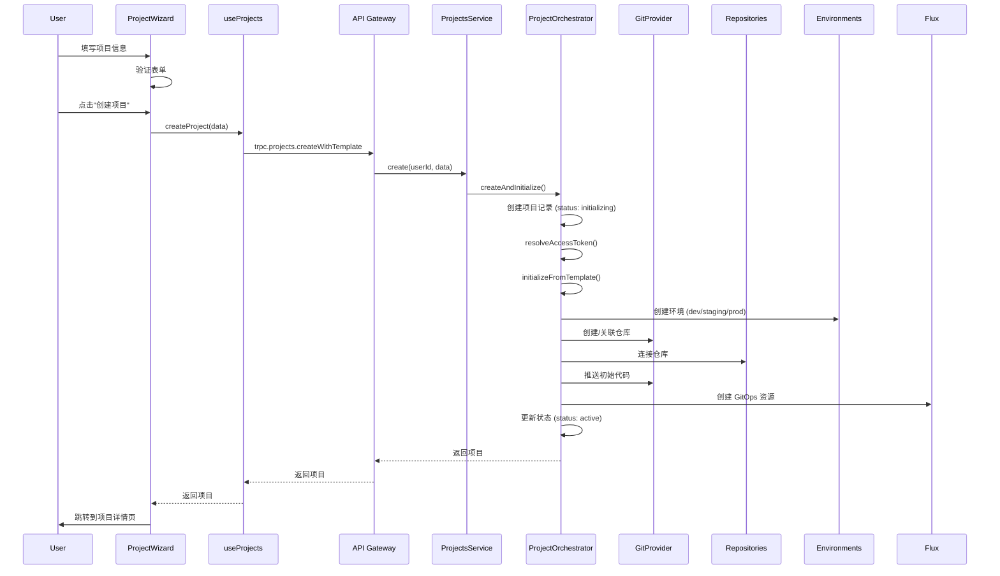

# 项目创建流程审查与优化 - 设计文档

## 概述

本设计文档针对项目创建流程的 5 个核心问题提供详细的技术方案，确保从前端到后端的整个流程稳定可靠。

## 架构

### 当前流程图




### 问题识别

通过代码审查，发现以下关键问题：

#### 问题 1: 前端数据传递不一致
- `ProjectWizard` 中 `formData.repository` 的类型定义与后端期望不完全匹配
- `includeAppCode` 字段在某些情况下可能未正确传递
- 模板配置 `templateConfig` 可能为空对象，导致后端处理异常

#### 问题 2: 后端初始化流程分支混乱
- `createAndInitialize` 中有三个分支：有模板、无模板有仓库、无模板无仓库
- 日志显示分支判断逻辑，但实际执行路径可能不清晰
- `initializeWithoutTemplate` 和 `initializeFromTemplate` 职责重叠

#### 问题 3: OAuth 令牌解析时机不当
- `resolveAccessToken` 在 `handleRepository` 之前调用，但日志显示可能被调用两次
- 错误信息不够友好，用户不知道如何解决问题
- 没有处理令牌过期的情况

#### 问题 4: 仓库创建错误处理不足
- `createNewRepository` 调用 GitProvider API，但没有详细的错误处理
- `pushInitialAppCode` 失败时只记录日志，不抛出错误，可能导致仓库状态不一致
- 仓库 URL 解析逻辑在 `useProjects.ts` 中，但在 orchestrator 中也有类似逻辑

#### 问题 5: 初始化状态更新不及时
- `updateInitializationStatus` 在某些步骤之间可能遗漏
- 前端无法实时获取初始化进度（需要轮询或 WebSocket）
- 失败时的错误信息没有正确传递到前端

## 组件和接口

### 1. 前端组件优化

#### ProjectWizard.vue 改进

**问题修复**:
- 统一 `repository` 数据结构
- 确保所有必填字段都有默认值
- 添加更详细的表单验证

**改进方案**:
```typescript
// 明确的仓库配置类型
interface RepositoryConfig {
  mode: 'existing' | 'create'
  provider: 'github' | 'gitlab'
  accessToken: string  // 可以是实际令牌或 '__USE_OAUTH__'
  
  // existing 模式必填
  url?: string
  
  // create 模式必填
  name?: string
  visibility?: 'public' | 'private'
  defaultBranch?: string
  includeAppCode?: boolean
}

// 表单验证
function validateRepositoryConfig(): boolean {
  if (!formData.value.repository) return true  // 仓库是可选的
  
  const repo = formData.value.repository
  
  if (repo.mode === 'existing') {
    if (!repo.url) {
      toast.error('请输入仓库 URL')
      return false
    }
  } else if (repo.mode === 'create') {
    if (!repo.name) {
      toast.error('请输入仓库名称')
      return false
    }
  }
  
  return true
}
```


#### useProjects.ts 改进

**问题修复**:
- 移除重复的仓库 URL 解析逻辑（应该由后端统一处理）
- 简化 `createProject` 方法，减少前端业务逻辑
- 改进错误处理和用户提示

**改进方案**:
```typescript
async function createProject(data: CreateProjectInput) {
  loading.value = true
  error.value = null

  try {
    // 验证数据
    if (!data.name || !data.slug) {
      throw new Error('项目名称和标识不能为空')
    }

    // 如果有仓库配置，验证必填字段
    if (data.repository) {
      if (data.repository.mode === 'existing' && !data.repository.url) {
        throw new Error('请输入仓库 URL')
      }
      if (data.repository.mode === 'create' && !data.repository.name) {
        throw new Error('请输入仓库名称')
      }
    }

    // 调用后端 API
    const result = await trpc.projects.createWithTemplate.mutate(data)

    // 刷新项目列表
    await fetchProjects(data.organizationId)

    toast.success('创建成功', '项目正在初始化，请稍候...')
    return result
  } catch (err) {
    console.error('Failed to create project:', err)
    
    // 友好的错误提示
    if (isTRPCClientError(err)) {
      const message = err.message
      if (message.includes('OAuth')) {
        toast.error('OAuth 授权失败', '请先连接 GitHub/GitLab 账户或手动输入访问令牌')
      } else if (message.includes('仓库')) {
        toast.error('仓库操作失败', message)
      } else {
        toast.error('创建项目失败', message)
      }
    } else {
      toast.error('创建项目失败', '请稍后重试')
    }
    
    throw err
  } finally {
    loading.value = false
  }
}
```

### 2. 后端服务优化

#### ProjectOrchestrator 改进

**问题修复**:
- 简化初始化流程分支逻辑
- 统一错误处理和回滚机制
- 改进日志记录

**改进方案**:

```typescript
async createAndInitialize(
  userId: string,
  data: CreateProjectWithTemplateInput,
): Promise<typeof schema.projects.$inferSelect> {
  this.logger.log(`Creating project: ${data.name}`)

  // 1. 创建项目记录
  const project = await this.createProjectRecord(userId, data)

  try {
    // 2. 根据配置决定初始化路径
    const hasTemplate = !!data.templateId
    const hasRepository = !!data.repository

    this.logger.log(`Initialization path: template=${hasTemplate}, repository=${hasRepository}`)

    if (hasTemplate) {
      // 路径 A: 使用模板初始化（可能包含仓库）
      await this.initializeFromTemplate(userId, project.id, data.templateId, {
        repository: data.repository,
        templateConfig: data.templateConfig,
      })
    } else if (hasRepository) {
      // 路径 B: 无模板但有仓库
      await this.initializeWithRepository(userId, project.id, data.repository)
    } else {
      // 路径 C: 空项目
      await this.markAsActive(project.id)
    }

    return project
  } catch (error) {
    // 统一错误处理
    await this.handleInitializationError(project.id, error as Error)
    throw error
  }
}

// 新增：创建项目记录
private async createProjectRecord(
  userId: string,
  data: CreateProjectWithTemplateInput,
): Promise<typeof schema.projects.$inferSelect> {
  const [project] = await this.db
    .insert(schema.projects)
    .values({
      organizationId: data.organizationId,
      name: data.name,
      slug: data.slug,
      description: data.description,
      visibility: data.visibility ?? 'private',
      status: 'initializing',
      templateId: data.templateId,
      templateConfig: data.templateConfig,
      initializationStatus: {
        step: 'create_project',
        progress: 10,
        completedSteps: [],
      },
    })
    .returning()

  if (!project) {
    throw new Error('创建项目记录失败')
  }

  this.logger.log(`Project record created: ${project.id}`)
  return project
}

// 新增：无模板但有仓库的初始化
private async initializeWithRepository(
  userId: string,
  projectId: string,
  repositoryConfig: NonNullable<CreateProjectWithTemplateInput['repository']>,
): Promise<void> {
  this.logger.log(`Initializing project ${projectId} with repository only`)

  await this.updateInitializationStatus(projectId, {
    step: 'setup_repository',
    progress: 50,
    completedSteps: ['create_project'],
  })

  // 解析并处理仓库
  const resolvedConfig = await this.resolveAccessToken(userId, repositoryConfig)
  await this.handleRepository(userId, projectId, resolvedConfig)

  await this.markAsActive(projectId)
}

// 新增：标记为活跃状态
private async markAsActive(projectId: string): Promise<void> {
  await this.db
    .update(schema.projects)
    .set({
      status: 'active',
      initializationStatus: {
        step: 'completed',
        progress: 100,
        completedSteps: ['create_project'],
      },
      updatedAt: new Date(),
    })
    .where(eq(schema.projects.id, projectId))

  this.logger.log(`Project ${projectId} marked as active`)
}

// 新增：统一错误处理
private async handleInitializationError(
  projectId: string,
  error: Error,
): Promise<void> {
  this.logger.error(`Initialization failed for project ${projectId}:`, error)

  // 更新项目状态
  await this.db
    .update(schema.projects)
    .set({
      status: 'failed',
      initializationStatus: {
        step: 'failed',
        progress: 0,
        error: error.message,
        completedSteps: [],
      },
      updatedAt: new Date(),
    })
    .where(eq(schema.projects.id, projectId))

  // 发送通知
  await this.notifications.create({
    userId: 'system',
    type: 'system',
    title: '项目初始化失败',
    message: `项目初始化失败: ${error.message}`,
    priority: 'high',
  })
}
```


#### OAuth 令牌处理改进

**问题修复**:
- 避免重复调用 `resolveAccessToken`
- 改进错误提示
- 添加令牌验证

**改进方案**:

```typescript
private async resolveAccessToken(
  userId: string,
  repositoryConfig: NonNullable<CreateProjectWithTemplateInput['repository']>,
): Promise<NonNullable<CreateProjectWithTemplateInput['repository']>> {
  // 如果不是使用 OAuth，直接返回
  if (repositoryConfig.accessToken !== '__USE_OAUTH__') {
    this.logger.log('Using manually provided access token')
    return repositoryConfig
  }

  this.logger.log(`Resolving OAuth token for user ${userId}, provider: ${repositoryConfig.provider}`)

  try {
    // 从数据库获取 OAuth 账户
    const oauthAccount = await this.oauthAccounts.getAccountByProvider(
      userId,
      repositoryConfig.provider,
    )

    if (!oauthAccount) {
      throw new Error(
        `未找到 ${repositoryConfig.provider === 'github' ? 'GitHub' : 'GitLab'} OAuth 连接。` +
        `请前往"设置 > 账户连接"页面连接您的 ${repositoryConfig.provider === 'github' ? 'GitHub' : 'GitLab'} 账户，` +
        `或在创建项目时手动输入访问令牌。`
      )
    }

    if (!oauthAccount.accessToken) {
      throw new Error(
        `${repositoryConfig.provider === 'github' ? 'GitHub' : 'GitLab'} OAuth 令牌无效。` +
        `请重新连接您的账户。`
      )
    }

    // TODO: 检查令牌是否过期（如果有 expiresAt 字段）
    if (oauthAccount.expiresAt && new Date(oauthAccount.expiresAt) < new Date()) {
      throw new Error(
        `${repositoryConfig.provider === 'github' ? 'GitHub' : 'GitLab'} OAuth 令牌已过期。` +
        `请重新连接您的账户。`
      )
    }

    this.logger.log(`Successfully resolved OAuth token for ${repositoryConfig.provider}`)

    return {
      ...repositoryConfig,
      accessToken: oauthAccount.accessToken,
    }
  } catch (error) {
    this.logger.error(`Failed to resolve OAuth token:`, error)
    throw error
  }
}
```

#### 仓库处理改进

**问题修复**:
- 统一仓库创建和关联逻辑
- 改进错误处理
- 确保推送初始代码的可靠性

**改进方案**:

```typescript
private async handleRepository(
  userId: string,
  projectId: string,
  repositoryConfig: NonNullable<CreateProjectWithTemplateInput['repository']>,
): Promise<typeof schema.repositories.$inferSelect> {
  this.logger.log(`Handling repository for project ${projectId}, mode: ${repositoryConfig.mode}`)

  if (repositoryConfig.mode === 'existing') {
    return await this.connectExistingRepository(userId, projectId, repositoryConfig)
  } else {
    return await this.createNewRepositoryAndConnect(userId, projectId, repositoryConfig)
  }
}

private async connectExistingRepository(
  userId: string,
  projectId: string,
  config: NonNullable<CreateProjectWithTemplateInput['repository']>,
): Promise<typeof schema.repositories.$inferSelect> {
  this.logger.log(`Connecting existing repository: ${config.url}`)

  // 解析仓库 URL
  const parsed = this.parseRepositoryUrl(config.url!)
  if (!parsed) {
    throw new Error('仓库 URL 格式不正确，支持的格式：https://github.com/owner/repo 或 git@github.com:owner/repo.git')
  }

  // 连接仓库（RepositoriesService 会检查权限和重复）
  const repository = await this.repositories.connect(userId, {
    projectId,
    provider: config.provider,
    fullName: parsed.fullName,
    cloneUrl: config.url!,
    defaultBranch: config.defaultBranch || 'main',
  })

  if (!repository) {
    throw new Error('连接仓库失败')
  }

  this.logger.log(`Repository connected: ${repository.id}`)
  return repository
}

private async createNewRepositoryAndConnect(
  userId: string,
  projectId: string,
  config: NonNullable<CreateProjectWithTemplateInput['repository']>,
): Promise<typeof schema.repositories.$inferSelect> {
  this.logger.log(`Creating new repository: ${config.name}`)

  // 调用 Git Provider API 创建仓库
  const repoInfo = await this.gitProvider.createRepository(
    config.provider,
    config.accessToken,
    {
      name: config.name!,
      description: `Repository for project ${projectId}`,
      visibility: config.visibility || 'private',
      defaultBranch: config.defaultBranch || 'main',
      autoInit: true,
    },
  )

  this.logger.log(`Repository created: ${repoInfo.fullName}`)

  // 连接到数据库
  const repository = await this.repositories.connect(userId, {
    projectId,
    provider: config.provider,
    fullName: repoInfo.fullName,
    cloneUrl: repoInfo.cloneUrl,
    defaultBranch: repoInfo.defaultBranch,
  })

  if (!repository) {
    throw new Error('连接仓库失败')
  }

  // 推送初始代码（如果需要）
  if (config.includeAppCode) {
    try {
      await this.pushInitialAppCode(
        config.provider,
        config.accessToken,
        repoInfo.fullName,
        repoInfo.defaultBranch,
      )
      this.logger.log(`Initial code pushed to ${repoInfo.fullName}`)
    } catch (error) {
      // 推送失败不应该导致整个流程失败
      this.logger.error(`Failed to push initial code (non-fatal):`, error)
      // 但应该通知用户
      await this.notifications.create({
        userId,
        type: 'system',
        title: '初始代码推送失败',
        message: `仓库已创建，但初始代码推送失败。您可以手动推送代码。`,
        priority: 'normal',
      })
    }
  }

  return repository
}

private parseRepositoryUrl(url: string): { fullName: string; provider: 'github' | 'gitlab' } | null {
  const trimmed = url.trim().replace(/\.git$/i, '')
  
  // 匹配 GitHub/GitLab URL
  const match = trimmed.match(
    /(?:https?:\/\/|git@)?(github\.com|gitlab\.com)(?::|\/)([^\/]+\/[^\/\s]+)/i
  )
  
  if (!match) return null
  
  const host = match[1]!.toLowerCase()
  const fullName = match[2]!.replace(/\/+$/, '')
  const provider = host.includes('github') ? 'github' : 'gitlab'
  
  return { fullName, provider }
}
```


#### 初始化状态跟踪改进

**问题修复**:
- 确保每个步骤都更新状态
- 提供更详细的进度信息
- 前端实时显示进度

**改进方案**:

```typescript
// 后端：更详细的状态更新
private async updateInitializationStatus(
  projectId: string,
  status: {
    step: string
    progress: number
    completedSteps: string[]
    error?: string
    currentAction?: string  // 新增：当前正在执行的操作
  },
): Promise<void> {
  await this.db
    .update(schema.projects)
    .set({
      initializationStatus: status as any,
      updatedAt: new Date(),
    })
    .where(eq(schema.projects.id, projectId))

  this.logger.log(
    `Initialization status updated: ${status.step} (${status.progress}%) - ${status.currentAction || ''}`
  )

  // 发布状态更新事件（用于实时通知）
  await this.publishEvent({
    type: 'project.initialization.progress',
    projectId,
    status,
    timestamp: new Date(),
  })
}

// 在 initializeFromTemplate 中添加更多状态更新
async initializeFromTemplate(
  userId: string,
  projectId: string,
  templateId: string,
  config: any,
): Promise<InitializationResult> {
  const createdResources: InitializationResult['createdResources'] = {
    environments: [],
    repositories: [],
    gitopsResources: [],
  }

  try {
    // 1. 加载模板
    await this.updateInitializationStatus(projectId, {
      step: 'load_template',
      progress: 20,
      completedSteps: ['create_project'],
      currentAction: '正在加载项目模板...',
    })
    const template = await this.templates.getTemplate(templateId)

    // 2. 创建环境
    await this.updateInitializationStatus(projectId, {
      step: 'create_environments',
      progress: 30,
      completedSteps: ['create_project', 'load_template'],
      currentAction: '正在创建项目环境...',
    })
    
    for (const envType of ['development', 'staging', 'production']) {
      const env = await this.environments.create(userId, {
        projectId,
        name: envType,
        type: envType as any,
      })
      createdResources.environments.push(env.id)
    }

    // 3. 处理仓库（如果有）
    if (config.repository) {
      await this.updateInitializationStatus(projectId, {
        step: 'setup_repository',
        progress: 50,
        completedSteps: ['create_project', 'load_template', 'create_environments'],
        currentAction: '正在配置 Git 仓库...',
      })

      const resolvedConfig = await this.resolveAccessToken(userId, config.repository)
      const repository = await this.handleRepository(userId, projectId, resolvedConfig)
      createdResources.repositories.push(repository.id)

      // 4. 生成 K8s 配置
      await this.updateInitializationStatus(projectId, {
        step: 'generate_k8s_configs',
        progress: 70,
        completedSteps: ['create_project', 'load_template', 'create_environments', 'setup_repository'],
        currentAction: '正在生成 Kubernetes 配置...',
      })

      await this.generateAndCommitK8sConfigs(userId, projectId, repository.id, template)

      // 5. 创建 GitOps 资源
      await this.updateInitializationStatus(projectId, {
        step: 'create_gitops_resources',
        progress: 85,
        completedSteps: [
          'create_project',
          'load_template',
          'create_environments',
          'setup_repository',
          'generate_k8s_configs',
        ],
        currentAction: '正在创建 GitOps 资源...',
      })

      const environments = await this.environments.list(userId, projectId)
      for (const environment of environments) {
        const gitopsResource = await this.flux.createGitOpsResource({
          projectId,
          environmentId: environment.id,
          repositoryId: repository.id,
          type: 'kustomization',
          name: `${projectId}-${environment.type}`,
          namespace: 'default',
          config: {
            gitRepositoryName: repository.fullName,
            path: `k8s/overlays/${environment.type}`,
            interval: '5m',
          },
        })
        createdResources.gitopsResources.push(gitopsResource.id)
      }
    }

    // 6. 完成
    await this.updateInitializationStatus(projectId, {
      step: 'completed',
      progress: 100,
      completedSteps: [
        'create_project',
        'load_template',
        'create_environments',
        'setup_repository',
        'generate_k8s_configs',
        'create_gitops_resources',
      ],
      currentAction: '初始化完成',
    })

    await this.db
      .update(schema.projects)
      .set({ status: 'active', updatedAt: new Date() })
      .where(eq(schema.projects.id, projectId))

    return {
      success: true,
      projectId,
      createdResources,
    }
  } catch (error) {
    // 错误处理
    await this.updateInitializationStatus(projectId, {
      step: 'failed',
      progress: 0,
      completedSteps: [],
      error: error instanceof Error ? error.message : '未知错误',
      currentAction: '初始化失败',
    })

    await this.rollbackResources(projectId, createdResources)

    return {
      success: false,
      projectId,
      createdResources,
      errors: [error instanceof Error ? error.message : '未知错误'],
    }
  }
}
```

### 3. GitProvider 服务改进

**新增方法**:

```typescript
// packages/services/git-providers/src/git-provider.service.ts

/**
 * 验证仓库是否可访问
 */
async validateRepository(
  provider: 'github' | 'gitlab',
  accessToken: string,
  fullName: string,
): Promise<boolean> {
  try {
    if (provider === 'github') {
      const response = await fetch(`https://api.github.com/repos/${fullName}`, {
        headers: {
          Authorization: `Bearer ${accessToken}`,
          Accept: 'application/vnd.github.v3+json',
        },
      })
      return response.ok
    } else {
      // GitLab
      const encodedPath = encodeURIComponent(fullName)
      const response = await fetch(`https://gitlab.com/api/v4/projects/${encodedPath}`, {
        headers: {
          Authorization: `Bearer ${accessToken}`,
        },
      })
      return response.ok
    }
  } catch (error) {
    return false
  }
}

/**
 * 统一的仓库创建接口
 */
async createRepository(
  provider: 'github' | 'gitlab',
  accessToken: string,
  options: {
    name: string
    description?: string
    visibility: 'public' | 'private'
    defaultBranch?: string
    autoInit?: boolean
  },
): Promise<{
  id: string | number
  name: string
  fullName: string
  cloneUrl: string
  defaultBranch: string
}> {
  if (provider === 'github') {
    return await this.createGitHubRepository(accessToken, options)
  } else {
    return await this.createGitLabRepository(accessToken, options)
  }
}
```


## 数据模型

### 初始化状态类型定义

```typescript
// packages/core/types/src/project.types.ts

export interface InitializationStatus {
  step: 
    | 'create_project'
    | 'load_template'
    | 'create_environments'
    | 'setup_repository'
    | 'generate_k8s_configs'
    | 'create_gitops_resources'
    | 'completed'
    | 'failed'
  progress: number  // 0-100
  completedSteps: string[]
  error?: string
  currentAction?: string  // 用户友好的当前操作描述
  timestamp?: Date
}

export interface CreateProjectWithTemplateInput {
  organizationId: string
  name: string
  slug: string
  description?: string
  logoUrl?: string
  visibility?: 'public' | 'private' | 'internal'
  
  // 模板相关
  templateId?: string
  templateConfig?: Record<string, any>
  
  // 仓库配置
  repository?: {
    mode: 'existing' | 'create'
    provider: 'github' | 'gitlab'
    accessToken: string  // 可以是实际令牌或 '__USE_OAUTH__'
    
    // existing 模式字段
    url?: string
    
    // create 模式字段
    name?: string
    visibility?: 'public' | 'private'
    defaultBranch?: string
    includeAppCode?: boolean
  }
}
```

## 错误处理

### 错误处理策略（遵循项目现有模式）

项目中所有服务都使用简单的 `throw new Error('中文错误信息')` 模式，我们保持一致：

```typescript
// ❌ 不要创建自定义错误类
// ❌ 不要使用错误码
// ✅ 直接抛出带有清晰中文信息的 Error

// 示例：
if (!oauthAccount) {
  throw new Error('未找到 GitHub OAuth 连接，请前往"设置 > 账户连接"页面连接您的 GitHub 账户')
}

if (!repository) {
  throw new Error('仓库不存在或无法访问')
}

if (!hasPermission) {
  throw new Error('没有权限创建项目')
}
```

### 错误信息指南

1. **清晰描述问题**：直接说明发生了什么
2. **提供解决方案**：告诉用户如何解决（如果可能）
3. **使用中文**：保持与其他服务一致
4. **避免技术细节**：不要暴露内部实现

**好的错误信息示例**：
- ✅ "未找到 GitHub OAuth 连接，请前往"设置 > 账户连接"页面连接您的 GitHub 账户"
- ✅ "仓库 URL 格式不正确，请检查 URL 格式"
- ✅ "无法访问仓库，请检查仓库是否存在以及令牌权限"
- ✅ "仓库名称已存在，请使用其他名称"

**不好的错误信息示例**：
- ❌ "OAUTH_ERROR: Token not found"
- ❌ "Repository validation failed with code 404"
- ❌ "Error in handleRepository method"

## 测试策略

### 单元测试

```typescript
// packages/services/projects/src/__tests__/project-orchestrator.spec.ts

describe('ProjectOrchestrator', () => {
  describe('createAndInitialize', () => {
    it('should create project with template and repository', async () => {
      // 测试完整流程
    })

    it('should create project with repository only', async () => {
      // 测试无模板流程
    })

    it('should create empty project', async () => {
      // 测试空项目流程
    })

    it('should rollback on failure', async () => {
      // 测试回滚机制
    })
  })

  describe('resolveAccessToken', () => {
    it('should resolve OAuth token', async () => {
      // 测试 OAuth 令牌解析
    })

    it('should throw error when OAuth account not found', async () => {
      // 测试 OAuth 账户不存在
    })

    it('should return manual token as-is', async () => {
      // 测试手动输入的令牌
    })
  })

  describe('handleRepository', () => {
    it('should connect existing repository', async () => {
      // 测试关联现有仓库
    })

    it('should create new repository', async () => {
      // 测试创建新仓库
    })

    it('should handle repository creation failure', async () => {
      // 测试仓库创建失败
    })
  })
})
```

### 集成测试

```typescript
// apps/api-gateway/src/__tests__/projects.integration.spec.ts

describe('Projects API Integration', () => {
  it('should create project end-to-end', async () => {
    // 测试完整的 API 调用流程
  })

  it('should handle OAuth token resolution', async () => {
    // 测试 OAuth 集成
  })

  it('should handle Git provider API calls', async () => {
    // 测试 Git Provider 集成
  })
})
```

## 实施计划

### 阶段 1: 前端优化（优先级：高）
1. 修复 `ProjectWizard.vue` 的数据传递问题
2. 改进 `useProjects.ts` 的错误处理
3. 添加表单验证逻辑

### 阶段 2: 后端核心流程优化（优先级：高）
1. 重构 `ProjectOrchestrator.createAndInitialize` 方法
2. 简化初始化流程分支
3. 统一错误处理机制

### 阶段 3: OAuth 和仓库处理（优先级：高）
1. 改进 `resolveAccessToken` 方法
2. 重构 `handleRepository` 方法
3. 添加仓库验证逻辑

### 阶段 4: 状态跟踪和通知（优先级：中）
1. 改进初始化状态更新
2. 添加实时进度通知
3. 优化错误信息展示

### 阶段 5: 测试和文档（优先级：中）
1. 编写单元测试
2. 编写集成测试
3. 更新 API 文档

## 关键决策

### 决策 1: 同步 vs 异步初始化
**选择**: 同步初始化（在 API 调用中完成）
**理由**: 
- 简化前端逻辑，不需要轮询
- 用户可以立即看到结果
- 初始化时间通常在 10-30 秒内，可接受

### 决策 2: 错误回滚策略
**选择**: 尽力回滚，记录失败
**理由**:
- 避免留下孤立资源
- 回滚失败不应阻止错误报告
- 提供手动清理的审计日志

### 决策 3: OAuth 令牌处理
**选择**: 在后端统一处理
**理由**:
- 前端不需要知道令牌细节
- 更安全，令牌不经过前端
- 便于统一管理和刷新

### 决策 4: 仓库 URL 解析
**选择**: 在后端统一解析
**理由**:
- 避免前后端逻辑重复
- 后端可以做更严格的验证
- 便于支持更多 URL 格式

## 风险和缓解措施

### 风险 1: Git Provider API 限流
**缓解**: 
- 添加重试机制
- 使用指数退避
- 提示用户稍后重试

### 风险 2: 初始化时间过长
**缓解**:
- 优化并行处理
- 添加超时机制
- 提供取消功能

### 风险 3: 部分资源创建失败
**缓解**:
- 详细的错误日志
- 清晰的回滚逻辑
- 提供手动重试选项

### 风险 4: 并发创建冲突
**缓解**:
- 数据库唯一约束
- 乐观锁机制
- 友好的冲突提示
