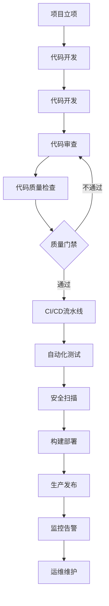

# 企业级DevOps平台产品需求文档

## 1. 产品概述

本项目旨在构建一个现代化的企业级DevOps平台，集成完整的开发运维工具链，为中型技术团队提供从代码管理到生产部署的全流程自动化解决方案。平台采用前沿技术栈构建，确保高性能、高可用性和优秀的用户体验。

## 2. 核心功能

### 2.1 用户角色

| 角色      | 注册方式   | 核心权限                                 |
| ------- | ------ | ------------------------------------ |
| 开发工程师   | 邮箱注册   | 可以管理代码仓库、触发构建、查看部署状态、访问开发环境          |
| 高级开发工程师 | 部门主管邀请 | 具备开发工程师所有权限，可以管理分支策略、审核代码、配置CI/CD流水线 |
| 运维工程师   | IT部门分配 | 可以管理基础设施、监控系统状态、处理告警、管理生产环境          |
| 项目经理    | 管理层分配  | 可以查看项目进度、部署统计、团队效能报告、成本分析            |
| 系统管理员   | 系统分配   | 拥有所有权限，可以管理用户、配置系统、维护平台安全            |

### 2.2 功能模块

我们的企业级DevOps平台包含以下主要页面：

1. **运营仪表板**：项目概览、部署统计、系统健康状态、团队效能指标
2. **项目管理**：代码仓库管理、分支策略、发布计划、环境配置
3. **CI/CD流水线**：构建配置、自动化测试、部署流程、流水线监控
4. **代码质量管理**：代码检查、质量评分、覆盖率统计、技术债务管理、代码规范检查
5. **容器镜像管理**：Harbor镜像仓库、镜像扫描、版本管理、镜像分发
6. **API管理中心**：Swagger文档、API网关、接口测试、版本控制
7. **数据库管理**：数据库连接、迁移脚本、备份恢复、性能监控
8. **配置管理**：环境变量、配置文件、密钥管理、配置版本控制
9. **日志管理**：ELK Stack集成、日志聚合、搜索分析、告警配置
10. **性能测试**：压力测试、负载测试、性能分析、基准测试
11. **基础设施管理**：K3s集群管理、容器编排、资源监控、扩缩容配置
12. **服务网格管理**：Istio配置、流量管理、安全策略、可观测性
13. **监控告警中心**：Grafana仪表板、Prometheus指标、日志分析、告警规则配置
14. **安全合规**：代码扫描、漏洞检测、访问控制、审计日志
15. **灾备管理**：备份策略、数据恢复、灾难演练、业务连续性
16. **多云管理**：云资源统一管理、混合云部署、成本优化、迁移工具
17. **自动化运维**：运维脚本管理、任务调度、批量操作、自动化工作流
18. **团队协作**：Notion集成、项目文档、知识库、团队沟通
19. **成本管理**：资源使用统计、成本分析、预算控制、优化建议
20. **系统配置**：用户权限管理、系统参数配置、集成配置、备份恢复

### 2.3 页面详情

| 页面名称     | 模块名称        | 功能描述                                      |
| -------- | ----------- | ----------------------------------------- |
| 运营仪表板    | 项目概览        | 显示所有项目的整体状态、部署频率、成功率等关键指标                 |
| 运营仪表板    | 系统健康状态      | 实时监控K3s集群、数据库、缓存等基础设施的运行状态                |
| 运营仪表板    | 团队效能指标      | 展示代码提交频率、部署周期、故障恢复时间等团队绩效数据               |
| 项目管理     | 代码仓库管理      | 集成GitHub和GitLab，管理代码仓库、分支权限、合并请求          |
| 项目管理     | 发布计划        | 制定和跟踪发布计划，管理版本发布、回滚策略                     |
| 项目管理     | 环境配置        | 管理开发、测试、生产环境的配置参数和部署策略                    |
| CI/CD流水线 | 构建配置        | 配置GitLab CI/CD流水线，定义构建步骤、测试阶段、部署流程        |
| CI/CD流水线 | 自动化测试       | 集成单元测试、集成测试、安全扫描等自动化测试工具                  |
| CI/CD流水线 | 部署监控        | 监控部署进度、查看部署日志、管理部署审批流程                    |
| 代码质量管理   | 代码质量仪表板     | 展示项目整体代码质量评分、质量趋势、技术债务统计                  |
| 代码质量管理   | 代码检查报告      | 显示SonarQube静态代码分析结果、代码异味、重复代码统计           |
| 代码质量管理   | 质量门禁配置      | 配置代码质量门禁规则、阻断条件、质量标准                      |
| 代码质量管理   | 代码覆盖率分析     | 展示单元测试覆盖率、集成测试覆盖率、覆盖率趋势分析                 |
| 代码质量管理   | 技术债务追踪      | 跟踪技术债务项目、优先级排序、修复进度管理                     |
| 代码质量管理   | 代码规范检查      | ESLint/Prettier规范检查结果、代码风格统计、规范配置         |
| 容器镜像管理   | Harbor镜像仓库  | 管理Docker镜像仓库，镜像版本控制、标签管理、镜像分发             |
| 容器镜像管理   | 镜像安全扫描      | 集成Trivy/Clair扫描镜像漏洞，生成安全报告、风险评估           |
| 容器镜像管理   | 镜像版本管理      | 镜像版本历史、回滚策略、清理策略、存储优化                     |
| API管理中心  | Swagger文档   | 自动生成和维护API文档，支持在线测试、版本管理                  |
| API管理中心  | API网关配置     | 配置API路由、限流策略、认证授权、监控统计                    |
| API管理中心  | 接口测试        | 集成Postman/Insomnia，自动化API测试、性能测试          |
| 数据库管理    | 数据库连接       | 管理多种数据库连接，支持PostgreSQL、MySQL、MongoDB等     |
| 数据库管理    | 迁移脚本管理      | 数据库版本控制、迁移脚本执行、回滚策略                       |
| 数据库管理    | 备份恢复        | 自动化数据库备份、定时备份、一键恢复、备份验证                   |
| 数据库管理    | 性能监控        | 数据库性能指标、慢查询分析、连接池监控                       |
| 配置管理     | 环境变量管理      | 多环境配置管理、配置加密、版本控制、配置同步                    |
| 配置管理     | 配置文件管理      | 配置文件版本控制、模板管理、配置验证、热更新                    |
| 配置管理     | 密钥管理        | 集成Vault/K8s Secrets，密钥轮换、访问控制、审计日志        |
| 日志管理     | ELK Stack集成 | Elasticsearch日志存储、Logstash数据处理、Kibana可视化  |
| 日志管理     | 日志聚合        | 多服务日志收集、日志格式化、日志路由、日志过滤                   |
| 日志管理     | 搜索分析        | 全文搜索、日志分析、异常检测、趋势分析                       |
| 日志管理     | 告警配置        | 基于日志的告警规则、异常模式识别、告警通知                     |
| 性能测试     | 压力测试        | 集成JMeter/K6，HTTP负载测试、并发测试、持久化测试           |
| 性能测试     | 负载测试        | 模拟真实用户负载、渐进式负载测试、峰值测试                     |
| 性能测试     | 性能分析        | 响应时间分析、吞吐量统计、资源使用分析                       |
| 性能测试     | 基准测试        | 性能基准建立、性能回归测试、性能对比分析                      |
| 基础设施管理   | K3s集群管理     | 通过Rancher管理Kubernetes集群，配置节点、命名空间、资源配额    |
| 基础设施管理   | 容器编排        | 管理Pod、Service、Ingress等Kubernetes资源，配置负载均衡 |
| 基础设施管理   | 资源监控        | 监控CPU、内存、存储等资源使用情况，配置自动扩缩容                |
| 服务网格管理   | Istio配置     | 服务网格配置、流量管理、安全策略、可观测性                     |
| 服务网格管理   | 流量管理        | 流量路由、负载均衡、故障注入、超时重试                       |
| 服务网格管理   | 安全策略        | mTLS配置、访问控制、安全策略、证书管理                     |
| 服务网格管理   | 可观测性        | 分布式追踪、服务拓扑、性能指标、调用链分析                     |
| 监控告警中心   | Grafana仪表板  | 创建和管理监控面板，展示应用性能、基础设施指标                   |
| 监控告警中心   | 告警规则配置      | 配置Prometheus告警规则，设置通知渠道和升级策略              |
| 监控告警中心   | 日志分析        | 通过Loki分析应用日志，支持日志搜索、过滤和可视化                |
| 安全合规     | 代码扫描        | 集成SAST/DAST工具，扫描代码漏洞和安全风险                 |
| 安全合规     | 访问控制        | 管理用户权限、API访问控制、网络安全策略                     |
| 安全合规     | 审计日志        | 记录和查询系统操作日志，满足合规审计要求                      |
| 灾备管理     | 备份策略        | 制定备份计划、备份验证、备份存储管理、恢复测试                   |
| 灾备管理     | 数据恢复        | 快速数据恢复、点时间恢复、跨区域恢复、恢复验证                   |
| 灾备管理     | 灾难演练        | 定期灾难演练、演练计划、演练报告、改进建议                     |
| 灾备管理     | 业务连续性       | 业务影响分析、恢复时间目标、恢复点目标、应急预案                  |
| 多云管理     | 云资源管理       | 统一管理AWS/Azure/GCP资源、资源清单、成本分析             |
| 多云管理     | 混合云部署       | 跨云部署策略、云间数据同步、负载均衡、故障转移                   |
| 多云管理     | 成本优化        | 云成本分析、资源优化建议、预算控制、成本预测                    |
| 多云管理     | 迁移工具        | 云间迁移工具、迁移计划、迁移验证、回滚策略                     |
| 自动化运维    | 脚本管理        | 运维脚本版本控制、脚本模板、脚本执行、结果记录                   |
| 自动化运维    | 任务调度        | 定时任务管理、任务依赖、任务监控、失败重试                     |
| 自动化运维    | 批量操作        | 批量服务器操作、批量部署、批量配置、操作审计                    |
| 自动化运维    | 自动化工作流      | 工作流设计器、流程自动化、审批流程、通知机制                    |
| 团队协作     | Notion集成    | 同步项目文档到Notion，管理团队知识库和工作流程                |
| 团队协作     | 项目文档        | 维护技术文档、API文档、运维手册等项目资料                    |
| 成本管理     | 资源统计        | 统计云资源使用情况，分析成本构成和趋势                       |
| 成本管理     | 预算控制        | 设置项目预算，监控成本超支，提供优化建议                      |

## 3. 核心流程

### 开发部署流程

1. **开发工程师** → 代码开发 → 提交到GitHub/GitLab → 创建合并请求
2. **代码审查** → 高级开发工程师审查 → 自动化测试执行 → 代码质量检查
3. **代码质量检查** → SonarQube静态分析 → ESLint代码规范检查 → 测试覆盖率检查 → 质量门禁验证
4. **CI/CD流水线** → 自动构建 → 单元测试 → 安全扫描 → 构建镜像
5. **部署流程** → 测试环境部署 → 集成测试 → 生产环境部署审批 → 自动化部署
6. **监控告警** → 部署后监控 → 性能指标收集 → 异常告警 → 故障处理

### 运维管理流程

1. **基础设施管理** → K3s集群维护 → 资源监控 → 容量规划
2. **监控告警** → Grafana仪表板 → Prometheus指标 → 告警规则配置
3. **故障处理** → 告警接收 → 问题诊断 → 故障修复 → 事后复盘
4. **安全合规** → 定期安全扫描 → 访问权限审计 → 合规报告生成

### 项目开发流程图

## 4. 用户界面设计

### 4.1 设计风格（B站风格统一标准）

* **主色调**：B站经典色彩系统 - 粉色 (#FB7299) 和蓝色 (#00A1D6)，配合淡雅辅助色 (#FFB3D1, #87CEEB)

* **辅助色**：成功状态使用B站蓝色变体、警告橙 (#F59E0B)、错误红 (#EF4444)、信息使用B站蓝色

* **背景效果**：和谐玻璃拟态效果 (backdrop-blur: 16px)、B站渐变背景、柔和阴影系统

* **按钮风格**：B站风格圆角设计，主按钮使用渐变色 (#FB7299 → #00A1D6)，悬停提升效果，柔和过渡动画

* **字体**：PingFang SC 中文字体系统，代码区域使用 SF Mono 等宽字体

* **布局风格**：PC优先侧边栏 + 主内容区，玻璃拟态卡片设计，支持浅色主题为主

* **图标风格**：Phosphor Icons，配合B站色彩系统，支持柔和动画效果

* **动画效果**：流畅页面切换、B站风格加载动画、悬停微动画、数据变化过渡动画，使用缓动函数 cubic-bezier(0.4, 0, 0.2, 1)

### 4.2 页面设计概览

| 页面名称     | 模块名称        | UI元素                    |
| -------- | ----------- | ----------------------- |
| 运营仪表板    | 项目概览        | 渐变统计卡片、动态图表、实时数据流、状态指示器 |
| 运营仪表板    | 系统健康状态      | 3D状态可视化、资源使用率环形图、服务拓扑动画 |
| 项目管理     | 代码仓库管理      | 现代化列表视图、分支可视化树、合并请求时间线  |
| 项目管理     | 发布计划        | 交互式甘特图、版本发布看板、进度环形图     |
| CI/CD流水线 | 构建配置        | 可视化流水线编辑器、YAML语法高亮、实时预览 |
| CI/CD流水线 | 部署监控        | 实时部署状态流、日志流式显示、进度动画     |
| 代码质量管理   | 代码质量仪表板     | 质量评分雷达图、趋势动画图表、技术债务热力图  |
| 容器镜像管理   | Harbor镜像仓库  | 镜像卡片网格、标签管理、扫描结果可视化     |
| API管理中心  | Swagger文档   | 交互式API文档、测试面板、响应可视化     |
| 数据库管理    | 数据库连接       | 连接状态指示器、查询编辑器、结果表格      |
| 配置管理     | 环境变量        | 配置编辑器、版本对比、加密状态指示       |
| 日志管理     | ELK Stack集成 | 日志流式显示、搜索高亮、过滤器面板       |
| 性能测试     | 压力测试        | 实时性能图表、测试配置面板、结果分析      |
| 基础设施管理   | K3s集群管理     | 3D集群拓扑、节点状态网格、资源分配饼图    |
| 服务网格管理   | Istio配置     | 服务网格可视化、流量流向图、策略配置      |
| 监控告警中心   | Grafana仪表板  | 嵌入式监控面板、自定义图表、告警通知      |
| 安全合规     | 代码扫描        | 安全评分仪表板、漏洞分类、修复建议       |
| 灾备管理     | 备份策略        | 备份时间线、恢复点选择、状态监控        |
| 多云管理     | 云资源管理       | 多云资源视图、成本分析图表、迁移工具      |
| 自动化运维    | 脚本管理        | 脚本编辑器、执行日志、任务调度         |
| 团队协作     | Notion集成    | 文档编辑器、知识库导航、协作状态        |

### 4.3 现代化交互设计

* **主题切换**：深色主题优先，支持系统主题跟随，一键切换动画

* **微交互**：按钮点击反馈、表单验证动画、数据加载骨架屏

* **响应式设计**：桌面优先，完美适配移动端，支持触控手势

* **无障碍设计**：键盘导航、屏幕阅读器支持、高对比度模式

* **性能优化**：虚拟滚动、懒加载、图片优化、代码分割

