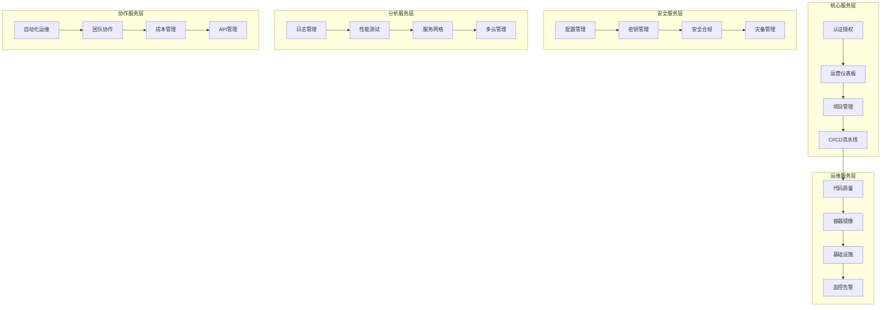

# 企业级DevOps平台项目重构方案

## 1. 项目概述

基于现有PRD和TRD文档，结合B站风格设计语言系统，完全重构企业级DevOps平台。采用现代化技术栈和设计理念，打造一个功能完整、体验优秀的DevOps管理平台。

### 重构目标
- 采用Vue 3 + NestJS现代化全栈架构
- 实现B站风格的现代化UI设计系统
- 集成完整的DevOps工具链
- 构建20个核心功能模块
- 提供优秀的开发者体验和用户体验

## 2. 技术架构重构

### 2.1 前端技术栈升级

```typescript
// 核心技术栈 - 以Naive UI为核心的组件化架构
{
  "framework": "Vue 3.4+",
  "buildTool": "Vite 5.0+",
  "uiLibrary": "Naive UI 2.35+ (主要UI组件库)",
  "uiCustomization": "Naive UI主题定制 + B站设计语言",
  "language": "TypeScript 5.0+",
  "stateManagement": "Pinia 2.0+",
  "packageManager": "pnpm",
  "testing": "Vitest + @vue/test-utils",
  "styling": "Naive UI主题定制 + UnoCSS工具类 + B站设计系统",
  "routing": "Vue Router 4",
  "utils": "VueUse",
  "charts": "ECharts + Chart.js (集成Naive UI)",
  "icons": "Naive UI Icons + Phosphor Icons"
}
```

#### Naive UI组件库优势
- **完整的组件生态**：提供60+高质量Vue 3组件
- **TypeScript原生支持**：完美的类型定义和开发体验
- **主题定制能力**：支持深度定制，完美适配B站设计语言
- **性能优化**：按需加载，Tree-shaking友好
- **可访问性**：内置ARIA支持，符合无障碍标准
- **文档完善**：详细的API文档和示例

#### Naive UI + UnoCSS 最佳实践组合

本项目采用 **Naive UI + UnoCSS** 的最佳实践组合，充分发挥两者各自优势：

##### 分工策略
```typescript
// 技术分工明确
{
  "NaiveUI": {
    "负责": ["组件功能逻辑", "交互行为", "可访问性", "表单验证", "数据处理"],
    "优势": ["完整组件生态", "TypeScript支持", "主题定制", "开箱即用"]
  },
  "UnoCSS": {
    "负责": ["快速样式", "响应式布局", "动画效果", "B站风格定制", "工具类"],
    "优势": ["原子化CSS", "按需生成", "性能优化", "灵活定制"]
  }
}
```

##### 集成配置
```typescript
// uno.config.ts - UnoCSS配置
export default defineConfig({
  presets: [
    presetUno(),
    presetAttributify(),
    presetIcons(),
  ],
  theme: {
    colors: {
      // B站色彩系统
      bilibili: {
        pink: '#FB7299',
        blue: '#00A1D6',
        'pink-light': '#FFB3D1',
        'pink-dark': '#E85A8A',
        'blue-light': '#87CEEB',
        'blue-dark': '#0088B8',
      }
    },
    fontFamily: {
      sans: ['PingFang SC', 'Source Han Sans CN', 'Microsoft YaHei', 'sans-serif'],
    },
    borderRadius: {
      'bilibili': '12px',
      'bilibili-sm': '8px',
      'bilibili-lg': '16px',
    },
    boxShadow: {
      'bilibili': '0 8px 32px rgba(251, 114, 153, 0.2)',
      'glass': '0 8px 32px rgba(255, 255, 255, 0.4)',
    }
  },
  shortcuts: {
    // 玻璃拟态效果
    'glass-card': 'bg-white/85 backdrop-blur-md border border-bilibili-pink/15 rounded-bilibili shadow-glass',
    'glass-button': 'bg-white/80 backdrop-blur-sm border border-bilibili-pink/20 rounded-bilibili-sm hover:bg-white/90',
    
    // B站渐变效果
    'bg-bilibili-gradient': 'bg-gradient-to-br from-bilibili-pink to-bilibili-blue',
    'text-bilibili-gradient': 'bg-gradient-to-r from-bilibili-pink to-bilibili-blue bg-clip-text text-transparent',
    
    // 动画效果
    'hover-lift': 'transition-all duration-300 hover:(-translate-y-1 shadow-lg)',
    'pulse-glow': 'animate-pulse shadow-bilibili',
    
    // 响应式容器
    'container-responsive': 'container mx-auto px-4 sm:px-6 lg:px-8',
    'grid-responsive': 'grid grid-cols-1 sm:grid-cols-2 lg:grid-cols-3 xl:grid-cols-4 gap-4',
  },
  rules: [
    // 自定义规则
    [/^glass-(\d+)$/, ([, d]) => ({ 'backdrop-filter': `blur(${d}px)` })],
    [/^bilibili-shadow-(\d+)$/, ([, d]) => ({ 'box-shadow': `0 ${d}px ${d * 2}px rgba(251, 114, 153, 0.${d})` })],
  ]
})
```

##### 组件封装策略
```vue
<!-- BButton.vue - 组件封装示例 -->
<template>
  <n-button
    :class="[
      // UnoCSS工具类 - 负责样式
      'transition-all duration-300',
      variant === 'gradient' && 'bg-bilibili-gradient text-white hover:shadow-bilibili',
      variant === 'glass' && 'glass-button text-bilibili-pink hover:text-bilibili-pink-dark',
      effect === 'lift' && 'hover-lift',
      effect === 'glow' && 'pulse-glow'
    ]"
    v-bind="$attrs"
    @click="handleClick"
  >
    <!-- Naive UI - 负责功能逻辑 -->
    <slot />
  </n-button>
</template>

<script setup lang="ts">
// Naive UI处理组件逻辑
interface Props {
  variant?: 'primary' | 'gradient' | 'glass' | 'outline'
  effect?: 'lift' | 'glow' | 'none'
}

const props = withDefaults(defineProps<Props>(), {
  variant: 'primary',
  effect: 'none'
})

const handleClick = (e: MouseEvent) => {
  // 业务逻辑处理
  emit('click', e)
}
</script>
```

##### 使用指南
```vue
<!-- 页面组件中的使用示例 -->
<template>
  <div class="container-responsive py-8">
    <!-- 使用封装的组件 -->
    <BCard variant="glass" effect="lift" class="mb-6">
      <template #header>
        <h2 class="text-bilibili-gradient text-xl font-semibold">
          仪表板概览
        </h2>
      </template>
      
      <!-- 响应式网格布局 -->
      <div class="grid-responsive">
        <div 
          v-for="metric in metrics" 
          :key="metric.id"
          class="glass-card p-4 hover-lift"
        >
          <!-- Naive UI组件 + UnoCSS样式 -->
          <n-statistic 
            :label="metric.label"
            :value="metric.value"
            class="text-center"
          />
        </div>
      </div>
      
      <template #action>
        <div class="flex gap-3">
          <BButton variant="gradient" effect="lift">
            查看详情
          </BButton>
          <BButton variant="glass" effect="glow">
            导出数据
          </BButton>
        </div>
      </template>
    </BCard>
  </div>
</template>
```

##### 性能优化
```typescript
// 按需加载和优化策略
{
  "NaiveUI": {
    "按需导入": "只导入使用的组件，减少包体积",
    "主题缓存": "主题配置缓存，避免重复计算",
    "组件懒加载": "大型组件使用懒加载策略"
  },
  "UnoCSS": {
    "按需生成": "只生成使用的CSS类，极致优化",
    "预设优化": "合理配置预设，避免冗余",
    "构建时优化": "构建时生成最小CSS文件"
  }
}
```

##### 开发体验
```typescript
// 开发工具和体验优化
{
  "TypeScript支持": {
    "NaiveUI": "完整的类型定义和智能提示",
    "UnoCSS": "类型安全的工具类使用"
  },
  "开发工具": {
    "VSCode插件": "UnoCSS智能提示和预览",
    "DevTools": "Naive UI组件调试工具",
    "热重载": "样式和组件的快速热重载"
  },
  "文档和示例": {
    "组件文档": "详细的组件使用文档",
    "样式指南": "UnoCSS工具类使用指南",
    "最佳实践": "组合使用的最佳实践示例"
  }
}
```

这种组合方案的核心优势：
- **职责分离**：Naive UI负责功能，UnoCSS负责样式
- **开发效率**：快速构建和样式调整
- **性能优化**：按需加载和最小化输出
- **维护性**：清晰的架构和标准化流程
- **扩展性**：灵活的定制和扩展能力

### 2.2 后端技术栈升级

```typescript
// 后端架构
{
  "framework": "NestJS 10+",
  "database": "PostgreSQL 15+ + Prisma 5.0+",
  "cache": "Redis 7.0+",
  "authentication": "JWT + Passport",
  "validation": "class-validator + class-transformer",
  "documentation": "Swagger/OpenAPI",
  "logging": "Winston + Pino",
  "queue": "Bull Queue",
  "websocket": "Socket.io",
  "graphql": "GraphQL + Apollo"
}
```

### 2.3 DevOps工具链集成

```yaml
# DevOps工具链配置
devops_stack:
  code_management:
    - GitHub Enterprise
    - GitLab CI/CD
  
  container_orchestration:
    - K3s + Rancher
    - Docker + Harbor
  
  monitoring_observability:
    - Grafana + Prometheus
    - Loki + Uptime Kuma
    - Jaeger (分布式追踪)
  
  security_compliance:
    - Trivy (容器扫描)
    - Semgrep (代码安全)
    - Gitleaks (密钥检测)
    - OWASP Dependency-Check
  
  infrastructure_as_code:
    - Terraform OSS
    - Pulumi OSS
    - Kustomize + ArgoCD
  
  secret_management:
    - Vault Community Edition
    - External Secrets Operator
  
  code_quality:
    - SonarQube
    - ESLint + Prettier
    - CodeClimate
    - Husky (Git hooks)
```

## 3. B站风格设计系统集成

### 3.1 设计语言系统（统一标准）

```css
/* B站风格设计变量 - 与设计系统统一 */
:root {
  /* B站核心色彩 - 统一标准 */
  --bilibili-pink: #FB7299;
  --bilibili-blue: #00A1D6;
  --bilibili-pink-light: #FFB3D1;
  --bilibili-pink-dark: #E85A8A;
  --bilibili-blue-light: #87CEEB;
  --bilibili-blue-dark: #0088B8;
  
  /* 和谐渐变系统 */
  --gradient-primary: linear-gradient(135deg, #FB7299 0%, #00A1D6 100%);
  --gradient-soft: linear-gradient(135deg, #FFB3D1 0%, #87CEEB 100%);
  --gradient-ultra-soft: linear-gradient(135deg, #FFF0F7 0%, #F0F8FF 100%);
  --gradient-glass: linear-gradient(135deg, rgba(251, 114, 153, 0.1) 0%, rgba(0, 161, 214, 0.1) 100%);
  
  /* 平衡玻璃拟态效果 */
  --glass-bg: rgba(255, 255, 255, 0.85);
  --glass-bg-soft: rgba(255, 255, 255, 0.75);
  --glass-border: rgba(251, 114, 153, 0.15);
  --glass-border-soft: rgba(255, 179, 209, 0.1);
  --glass-blur: blur(16px);
  --glass-blur-soft: blur(12px);
  
  /* 和谐阴影系统 */
  --shadow-xs: 0 1px 3px rgba(0, 0, 0, 0.04);
  --shadow-sm: 0 2px 6px rgba(0, 0, 0, 0.06);
  --shadow-md: 0 4px 12px rgba(0, 0, 0, 0.08);
  --shadow-lg: 0 8px 20px rgba(0, 0, 0, 0.10);
  --shadow-xl: 0 12px 32px rgba(0, 0, 0, 0.12);
  --shadow-bilibili: 0 8px 32px rgba(251, 114, 153, 0.2);
  --shadow-glass: 0 8px 32px rgba(255, 255, 255, 0.4);
  
  /* 流畅动画系统 */
  --transition-fast: 0.15s cubic-bezier(0.4, 0, 0.2, 1);
  --transition-normal: 0.3s cubic-bezier(0.4, 0, 0.2, 1);
  --transition-slow: 0.5s cubic-bezier(0.4, 0, 0.2, 1);
  --transition-bounce: 0.4s cubic-bezier(0.68, -0.55, 0.265, 1.55);
}
```

### 3.2 Naive UI组件定制规范

#### 3.2.1 Naive UI主题配置

```typescript
// Naive UI主题定制 - B站风格适配
import { GlobalTheme } from 'naive-ui'

export const bilibiliTheme: GlobalTheme = {
  common: {
    // B站核心色彩
    primaryColor: '#FB7299',
    primaryColorHover: '#FFB3D1',
    primaryColorPressed: '#E85A8A',
    primaryColorSuppl: '#00A1D6',
    
    // 信息色彩
    infoColor: '#00A1D6',
    infoColorHover: '#87CEEB',
    infoColorPressed: '#0088B8',
    
    // 成功色彩（使用B站蓝色替代绿色）
    successColor: '#00A1D6',
    successColorHover: '#87CEEB',
    successColorPressed: '#0088B8',
    
    // 警告和错误色彩
    warningColor: '#FFB800',
    errorColor: '#FF6B6B',
    
    // 背景色系
    bodyColor: '#FEFEFE',
    popoverColor: 'rgba(255, 255, 255, 0.85)',
    cardColor: 'rgba(255, 255, 255, 0.8)',
    modalColor: 'rgba(255, 255, 255, 0.9)',
    
    // 边框和分割线
    borderColor: 'rgba(251, 114, 153, 0.15)',
    dividerColor: 'rgba(255, 179, 209, 0.1)',
    
    // 文本色彩
    textColorBase: '#2D3748',
    textColor1: '#2D3748',
    textColor2: '#718096',
    textColor3: '#A0AEC0',
    
    // 圆角系统
    borderRadius: '12px',
    borderRadiusSmall: '8px',
    
    // 字体系统
    fontFamily: '"PingFang SC", "Source Han Sans CN", "Microsoft YaHei", sans-serif',
    fontSize: '14px',
    fontSizeMedium: '16px',
    fontSizeLarge: '18px',
    
    // 阴影系统
    boxShadow1: '0 2px 6px rgba(0, 0, 0, 0.06)',
    boxShadow2: '0 4px 12px rgba(0, 0, 0, 0.08)',
    boxShadow3: '0 8px 20px rgba(0, 0, 0, 0.10)',
  },
  
  // 按钮组件定制
  Button: {
    // 主要按钮 - B站渐变风格
    colorPrimary: 'linear-gradient(135deg, #FB7299 0%, #00A1D6 100%)',
    colorHoverPrimary: 'linear-gradient(135deg, #FFB3D1 0%, #87CEEB 100%)',
    colorPressedPrimary: 'linear-gradient(135deg, #E85A8A 0%, #0088B8 100%)',
    
    // 次要按钮 - 玻璃拟态风格
    colorSecondary: 'rgba(255, 255, 255, 0.8)',
    colorHoverSecondary: 'rgba(255, 255, 255, 0.9)',
    borderSecondary: '1px solid rgba(251, 114, 153, 0.2)',
    
    // 按钮圆角和阴影
    borderRadius: '10px',
    boxShadow: '0 4px 12px rgba(251, 114, 153, 0.2)',
    boxShadowHover: '0 8px 20px rgba(251, 114, 153, 0.3)',
  },
  
  // 卡片组件定制
  Card: {
    color: 'rgba(255, 255, 255, 0.85)',
    colorModal: 'rgba(255, 255, 255, 0.9)',
    borderColor: 'rgba(251, 114, 153, 0.15)',
    borderRadius: '16px',
    boxShadow: '0 8px 32px rgba(255, 255, 255, 0.4)',
  },
  
  // 输入框组件定制
  Input: {
    color: 'rgba(255, 255, 255, 0.8)',
    colorFocus: 'rgba(255, 255, 255, 0.9)',
    border: '1px solid rgba(255, 179, 209, 0.2)',
    borderHover: '1px solid rgba(251, 114, 153, 0.3)',
    borderFocus: '1px solid #FB7299',
    borderRadius: '10px',
    boxShadowFocus: '0 0 0 2px rgba(251, 114, 153, 0.2)',
  },
  
  // 表格组件定制
  DataTable: {
    thColor: 'rgba(255, 255, 255, 0.9)',
    tdColor: 'rgba(255, 255, 255, 0.8)',
    tdColorHover: 'rgba(255, 179, 209, 0.1)',
    borderColor: 'rgba(251, 114, 153, 0.1)',
  },
  
  // 导航组件定制
  Menu: {
    color: 'rgba(255, 255, 255, 0.85)',
    itemColorActive: 'linear-gradient(135deg, #FFB3D1 0%, #87CEEB 100%)',
    itemColorHover: 'rgba(255, 179, 209, 0.15)',
    borderRadius: '8px',
  },
  
  // 标签页组件定制
  Tabs: {
    tabColorSegment: 'rgba(255, 255, 255, 0.8)',
    tabBorderColor: 'rgba(251, 114, 153, 0.2)',
    barColor: '#FB7299',
  }
}
```

#### 3.2.2 组件使用指南

```typescript
// 基于Naive UI的B站风格组件封装示例
interface BilibiliNaiveUIComponents {
  // 按钮组件封装
  BButton: {
    base: 'n-button + bilibili-theme';
    variants: {
      primary: 'gradient-background + hover-lift + soft-glow';
      secondary: 'glass-morphism + border-glow + hover-scale';
      ghost: 'transparent-bg + gradient-border + hover-fill';
      text: 'gradient-text + hover-background + smooth-transition';
    };
    sizes: ['small', 'medium', 'large'];
    animations: ['hover-lift', 'click-scale', 'loading-spin'];
  };
  
  // 卡片组件封装
  BCard: {
    base: 'n-card + glass-morphism + backdrop-blur';
    variants: {
      default: 'glass-bg + soft-shadow + gradient-border';
      elevated: 'stronger-shadow + hover-float + border-glow';
      flat: 'minimal-shadow + subtle-border + hover-lift';
    };
    features: ['hover-animations', 'content-transitions', 'loading-states'];
  };
  
  // 表单组件封装
  BForm: {
    input: 'n-input + floating-labels + focus-animations + validation-feedback';
    select: 'n-select + glass-dropdown + smooth-transitions + search-highlight';
    datePicker: 'n-date-picker + bilibili-calendar + range-selection';
    upload: 'n-upload + drag-drop + progress-animations + preview-modal';
  };
  
  // 数据展示组件
  BDataDisplay: {
    table: 'n-data-table + glass-rows + hover-effects + sort-animations';
    list: 'n-list + glass-items + infinite-scroll + skeleton-loading';
    tree: 'n-tree + expand-animations + selection-highlight + search-filter';
    timeline: 'n-timeline + gradient-lines + milestone-markers + smooth-scroll';
  };
  
  // 导航组件
  BNavigation: {
    menu: 'n-menu + glass-bg + hover-highlights + active-indicators';
    breadcrumb: 'n-breadcrumb + gradient-text + hover-effects + separator-icons';
    tabs: 'n-tabs + underline-animations + close-buttons + drag-reorder';
    pagination: 'n-pagination + bilibili-colors + smooth-transitions + size-options';
  };
  
  // 反馈组件
  BFeedback: {
    message: 'n-message + glass-bg + slide-animations + auto-dismiss';
    notification: 'n-notification + backdrop-blur + action-buttons + stack-management';
    modal: 'n-modal + scale-animations + backdrop-blur + focus-trap';
    drawer: 'n-drawer + slide-animations + glass-content + resize-handle';
    popover: 'n-popover + glass-bg + arrow-positioning + hover-delay';
  };
}
```

#### 3.2.3 主题切换和响应式

```typescript
// 主题管理系统
export const useTheme = () => {
  const isDark = ref(false)
  const currentTheme = computed(() => isDark.value ? darkTheme : bilibiliTheme)
  
  // 响应式主题变量
  const themeVars = computed(() => ({
    '--primary-color': currentTheme.value.common?.primaryColor,
    '--primary-hover': currentTheme.value.common?.primaryColorHover,
    '--glass-bg': 'rgba(255, 255, 255, 0.85)',
    '--glass-border': 'rgba(251, 114, 153, 0.15)',
    '--shadow-soft': '0 8px 32px rgba(255, 255, 255, 0.4)',
  }))
  
  return {
    isDark,
    currentTheme,
    themeVars,
    toggleTheme: () => isDark.value = !isDark.value
  }
}

// 响应式断点系统
export const useBreakpoints = () => {
  const { width } = useWindowSize()
  
  const breakpoints = {
    xs: 480,
    sm: 768,
    md: 1024,
    lg: 1280,
    xl: 1536,
  }
  
  const current = computed(() => {
    if (width.value >= breakpoints.xl) return 'xl'
    if (width.value >= breakpoints.lg) return 'lg'
    if (width.value >= breakpoints.md) return 'md'
    if (width.value >= breakpoints.sm) return 'sm'
    return 'xs'
  })
  
  return { current, breakpoints, width }
}
```

## 4. 项目结构重构

### 4.1 前端项目结构

```
src/
├── assets/                 # 静态资源
│   ├── images/
│   ├── icons/
│   └── fonts/
├── components/             # 通用组件（基于Naive UI封装）
│   ├── ui/                # B站风格UI组件封装
│   │   ├── BButton/       # 基于n-button的B站风格按钮
│   │   ├── BCard/         # 基于n-card的玻璃拟态卡片
│   │   ├── BInput/        # 基于n-input的渐变输入框
│   │   ├── BModal/        # 基于n-modal的玻璃模态框
│   │   ├── BTable/        # 基于n-data-table的现代表格
│   │   ├── BForm/         # 基于n-form的智能表单
│   │   ├── BMenu/         # 基于n-menu的玻璃导航
│   │   ├── BTabs/         # 基于n-tabs的渐变标签页
│   │   └── index.ts       # 统一导出
│   ├── charts/            # 图表组件（ECharts + B站配色）
│   │   ├── BChart/        # 基础图表组件
│   │   ├── LineChart/     # 折线图（部署趋势等）
│   │   ├── PieChart/      # 饼图（成功率分析等）
│   │   ├── BarChart/      # 柱状图（性能指标等）
│   │   └── index.ts
│   ├── forms/             # 表单组件（基于Naive UI Form）
│   │   ├── LoginForm/     # 登录表单
│   │   ├── ProjectForm/   # 项目创建表单
│   │   ├── PipelineForm/  # 流水线配置表单
│   │   └── index.ts
│   └── layout/            # 布局组件（基于Naive UI Layout）
│       ├── AppHeader/     # 应用头部（基于n-layout-header）
│       ├── AppSidebar/    # 侧边栏（基于n-menu）
│       ├── AppFooter/     # 页脚
│       └── index.ts
├── composables/           # Vue组合式函数
│   ├── useAuth.ts
│   ├── useTheme.ts
│   ├── useWebSocket.ts
│   └── useDevOps.ts
├── layouts/               # 页面布局
│   ├── AuthLayout.vue
│   ├── DashboardLayout.vue
│   └── BlankLayout.vue
├── pages/                 # 页面组件
│   ├── auth/              # 认证相关
│   ├── dashboard/         # 仪表板
│   ├── projects/          # 项目管理
│   ├── cicd/              # CI/CD流水线
│   ├── infrastructure/    # 基础设施
│   ├── monitoring/        # 监控告警
│   ├── security/          # 安全合规
│   ├── quality/           # 代码质量
│   └── [其他20个模块]/
├── stores/                # 状态管理
│   ├── auth.ts
│   ├── projects.ts
│   ├── cicd.ts
│   └── global.ts
├── utils/                 # 工具函数
│   ├── api.ts
│   ├── constants.ts
│   ├── helpers.ts
│   └── validators.ts
├── styles/                # 样式文件
│   ├── bilibili-theme.css
│   ├── components.css
│   ├── animations.css
│   └── utilities.css
├── types/                 # TypeScript类型定义
│   ├── api.ts
│   ├── components.ts
│   └── global.ts
├── router/                # 路由配置
│   └── index.ts
├── plugins/               # 插件配置
│   ├── naive-ui.ts
│   ├── echarts.ts
│   └── socket.ts
├── App.vue
└── main.ts
```

### 4.2 后端项目结构

```
api/
├── src/
│   ├── modules/           # 功能模块
│   │   ├── auth/          # 认证模块
│   │   ├── users/         # 用户管理
│   │   ├── projects/      # 项目管理
│   │   ├── cicd/          # CI/CD管理
│   │   ├── infrastructure/ # 基础设施
│   │   ├── monitoring/    # 监控数据
│   │   ├── security/      # 安全管理
│   │   ├── quality/       # 代码质量
│   │   └── [其他模块]/
│   ├── common/            # 通用模块
│   │   ├── decorators/
│   │   ├── filters/
│   │   ├── guards/
│   │   ├── interceptors/
│   │   ├── pipes/
│   │   └── utils/
│   ├── config/            # 配置管理
│   │   ├── database.config.ts
│   │   ├── redis.config.ts
│   │   └── app.config.ts
│   ├── database/          # 数据库相关
│   │   ├── migrations/
│   │   ├── seeds/
│   │   └── schema.prisma
│   ├── integrations/      # 外部集成
│   │   ├── github/
│   │   ├── gitlab/
│   │   ├── k3s/
│   │   ├── grafana/
│   │   └── notion/
│   ├── app.module.ts
│   └── main.ts
├── test/                  # 测试文件
├── docker/                # Docker配置
├── k8s/                   # Kubernetes配置
└── docs/                  # API文档
```

## 5. 核心功能模块重构

### 5.1 20个核心模块列表

1. **认证授权模块** - JWT + RBAC权限系统
2. **运营仪表板** - 实时数据展示 + 可视化图表
3. **项目管理中心** - GitHub/GitLab集成
4. **CI/CD流水线** - 可视化流水线编辑器
5. **代码质量管理** - SonarQube + ESLint集成
6. **容器镜像管理** - Harbor集成 + 安全扫描
7. **API管理中心** - Swagger文档 + 接口测试
8. **数据库管理** - 多数据库支持 + 迁移管理
9. **配置管理** - 环境配置 + 密钥管理
10. **日志管理** - ELK Stack集成 + 日志分析
11. **性能测试** - JMeter/K6集成 + 性能分析
12. **基础设施管理** - K3s + Rancher管理界面
13. **服务网格管理** - Istio配置 + 流量管理
14. **监控告警中心** - Grafana + Prometheus集成
15. **安全合规** - 安全扫描 + 合规检查
16. **灾备管理** - 备份策略 + 恢复管理
17. **多云管理** - 云资源统一管理
18. **自动化运维** - 脚本管理 + 任务调度
19. **团队协作** - Notion集成 + 文档管理
20. **成本管理** - 资源统计 + 成本优化

### 5.2 模块间集成架构



## 6. 开发工作流程

### 6.1 前端开发流程

```bash
# 1. 环境准备
pnpm install
pnpm dev

# 2. 组件开发（基于Naive UI）
# - 使用Naive UI作为基础组件库
# - 通过主题定制实现B站风格
# - 封装业务组件，避免重复造轮子
# - 使用TypeScript确保类型安全
# - 编写单元测试

# 3. 页面开发
# - 使用Vue 3 Composition API
# - 充分利用Naive UI组件生态
# - 通过主题变量实现设计一致性
# - 实现响应式设计

# 4. 状态管理
# - 使用Pinia管理全局状态
# - 实现数据持久化
# - 处理异步操作

# 5. 路由配置
# - 配置页面路由
# - 实现路由守卫
# - 处理权限控制
```

### 6.2 后端开发流程

```bash
# 1. 模块开发
# - 使用NestJS模块化架构
# - 实现RESTful API
# - 集成GraphQL

# 2. 数据库设计
# - 使用Prisma ORM
# - 设计数据模型
# - 编写迁移脚本

# 3. 外部集成
# - 集成DevOps工具
# - 实现API调用
# - 处理Webhook

# 4. 安全实现
# - JWT认证
# - RBAC权限控制
# - API限流

# 5. 测试部署
# - 单元测试
# - 集成测试
# - Docker部署
```

## 7. UI/UX设计重构

### 7.1 B站风格主题系统

```typescript
// 主题配置
export const bilibiliTheme = {
  colors: {
    primary: {
      50: '#fef2f4',
      100: '#fde6e9',
      200: '#fbd0d9',
      300: '#f7aab9',
      400: '#f27a93',
      500: '#fb7299', // B站粉
      600: '#e85a7a',
      700: '#d63c5e',
      800: '#b8334a',
      900: '#9f2e42'
    },
    secondary: {
      50: '#f0f9ff',
      100: '#e0f2fe',
      200: '#bae6fd',
      300: '#7dd3fc',
      400: '#38bdf8',
      500: '#00a1d6', // B站蓝
      600: '#0088b8',
      700: '#0369a1',
      800: '#075985',
      900: '#0c4a6e'
    }
  },
  
  effects: {
    glassMorphism: {
      background: 'rgba(255, 255, 255, 0.9)',
      backdropFilter: 'blur(20px)',
      border: '1px solid rgba(255, 255, 255, 0.2)',
      borderRadius: '16px'
    },
    
    neonGlow: {
      boxShadow: '0 0 20px rgba(251, 114, 153, 0.3), 0 0 40px rgba(0, 161, 214, 0.2)'
    },
    
    gradientAnimation: {
      background: 'linear-gradient(-45deg, #FB7299, #FF8BB4, #00A1D6, #1AB3E8)',
      backgroundSize: '400% 400%',
      animation: 'gradientShift 15s ease infinite'
    }
  }
};
```

### 7.2 响应式设计系统

```css
/* 响应式断点系统 */
@media (min-width: 640px) { /* sm */ }
@media (min-width: 768px) { /* md */ }
@media (min-width: 1024px) { /* lg */ }
@media (min-width: 1280px) { /* xl */ }
@media (min-width: 1536px) { /* 2xl */ }

/* 容器系统 */
.container {
  width: 100%;
  margin: 0 auto;
  padding: 0 1rem;
}

@media (min-width: 640px) {
  .container { max-width: 640px; }
}

@media (min-width: 768px) {
  .container { max-width: 768px; }
}

@media (min-width: 1024px) {
  .container { max-width: 1024px; }
}

@media (min-width: 1280px) {
  .container { max-width: 1280px; }
}
```

## 8. Naive UI集成最佳实践

### 8.1 组件封装策略

```typescript
// 组件封装示例 - BButton组件
<template>
  <n-button
    :type="naiveType"
    :size="size"
    :loading="loading"
    :disabled="disabled"
    :class="buttonClasses"
    @click="handleClick"
  >
    <template #icon v-if="icon">
      <component :is="icon" />
    </template>
    <slot />
  </n-button>
</template>

<script setup lang="ts">
import { computed } from 'vue'
import { NButton } from 'naive-ui'

interface Props {
  variant?: 'primary' | 'secondary' | 'ghost' | 'text'
  size?: 'small' | 'medium' | 'large'
  loading?: boolean
  disabled?: boolean
  icon?: Component
}

const props = withDefaults(defineProps<Props>(), {
  variant: 'primary',
  size: 'medium'
})

// 映射到Naive UI的type
const naiveType = computed(() => {
  const typeMap = {
    primary: 'primary',
    secondary: 'default',
    ghost: 'tertiary',
    text: 'text'
  }
  return typeMap[props.variant]
})

// B站风格样式类
const buttonClasses = computed(() => [
  'b-button',
  `b-button--${props.variant}`,
  {
    'b-button--glass': props.variant === 'secondary',
    'b-button--gradient': props.variant === 'primary'
  }
])
</script>

<style scoped>
.b-button {
  transition: all 0.3s cubic-bezier(0.4, 0, 0.2, 1);
}

.b-button--primary {
  background: linear-gradient(135deg, #FB7299 0%, #00A1D6 100%);
  border: none;
}

.b-button--primary:hover {
  transform: translateY(-2px);
  box-shadow: 0 8px 20px rgba(251, 114, 153, 0.3);
}

.b-button--glass {
  background: rgba(255, 255, 255, 0.8);
  backdrop-filter: blur(12px);
  border: 1px solid rgba(251, 114, 153, 0.2);
}
</style>
```

### 8.2 主题配置管理

```typescript
// plugins/naive-ui.ts - 主题配置
import { App } from 'vue'
import {
  create,
  NButton,
  NCard,
  NInput,
  NDataTable,
  NMenu,
  NLayout,
  NLayoutHeader,
  NLayoutSider,
  NLayoutContent,
  NForm,
  NFormItem,
  NSelect,
  NDatePicker,
  NModal,
  NDrawer,
  NMessage,
  NNotification,
  NTabs,
  NTabPane,
  NPagination,
  NPopover,
  NTooltip,
  NProgress,
  NSpin,
  NAvatar,
  NBadge,
  NTag,
  NSpace,
  NDivider,
  NIcon
} from 'naive-ui'

// 按需引入的组件
const naive = create({
  components: [
    NButton,
    NCard,
    NInput,
    NDataTable,
    NMenu,
    NLayout,
    NLayoutHeader,
    NLayoutSider,
    NLayoutContent,
    NForm,
    NFormItem,
    NSelect,
    NDatePicker,
    NModal,
    NDrawer,
    NMessage,
    NNotification,
    NTabs,
    NTabPane,
    NPagination,
    NPopover,
    NTooltip,
    NProgress,
    NSpin,
    NAvatar,
    NBadge,
    NTag,
    NSpace,
    NDivider,
    NIcon
  ]
})

export function setupNaiveUI(app: App) {
  app.use(naive)
}

// 导出主题配置
export { bilibiliTheme } from './theme'
```

### 8.3 全局样式覆盖

```css
/* styles/naive-ui-override.css - Naive UI样式覆盖 */

/* 按钮组件样式覆盖 */
.n-button--primary-type {
  background: linear-gradient(135deg, #FB7299 0%, #00A1D6 100%) !important;
  border: none !important;
  transition: all 0.3s cubic-bezier(0.4, 0, 0.2, 1) !important;
}

.n-button--primary-type:hover {
  background: linear-gradient(135deg, #FFB3D1 0%, #87CEEB 100%) !important;
  transform: translateY(-2px) !important;
  box-shadow: 0 8px 20px rgba(251, 114, 153, 0.3) !important;
}

/* 卡片组件样式覆盖 */
.n-card {
  background: rgba(255, 255, 255, 0.85) !important;
  backdrop-filter: blur(16px) !important;
  border: 1px solid rgba(251, 114, 153, 0.15) !important;
  border-radius: 16px !important;
  box-shadow: 0 8px 32px rgba(255, 255, 255, 0.4) !important;
  transition: all 0.3s cubic-bezier(0.4, 0, 0.2, 1) !important;
}

.n-card:hover {
  transform: translateY(-4px) !important;
  box-shadow: 0 12px 40px rgba(251, 114, 153, 0.2) !important;
}

/* 输入框组件样式覆盖 */
.n-input {
  background: rgba(255, 255, 255, 0.8) !important;
  border: 1px solid rgba(255, 179, 209, 0.2) !important;
  border-radius: 10px !important;
  transition: all 0.3s cubic-bezier(0.4, 0, 0.2, 1) !important;
}

.n-input:hover {
  border-color: rgba(251, 114, 153, 0.3) !important;
}

.n-input--focus {
  border-color: #FB7299 !important;
  box-shadow: 0 0 0 2px rgba(251, 114, 153, 0.2) !important;
  background: rgba(255, 255, 255, 0.9) !important;
}

/* 表格组件样式覆盖 */
.n-data-table-th {
  background: rgba(255, 255, 255, 0.9) !important;
  border-bottom: 1px solid rgba(251, 114, 153, 0.1) !important;
}

.n-data-table-td {
  background: rgba(255, 255, 255, 0.8) !important;
  border-bottom: 1px solid rgba(251, 114, 153, 0.05) !important;
}

.n-data-table-tr:hover .n-data-table-td {
  background: rgba(255, 179, 209, 0.1) !important;
}

/* 菜单组件样式覆盖 */
.n-menu {
  background: rgba(255, 255, 255, 0.85) !important;
  backdrop-filter: blur(12px) !important;
}

.n-menu-item--selected {
  background: linear-gradient(135deg, #FFB3D1 0%, #87CEEB 100%) !important;
  color: white !important;
}

.n-menu-item:hover {
  background: rgba(255, 179, 209, 0.15) !important;
}

/* 标签页组件样式覆盖 */
.n-tabs-bar {
  background: #FB7299 !important;
}

.n-tabs-tab {
  background: rgba(255, 255, 255, 0.8) !important;
  border: 1px solid rgba(251, 114, 153, 0.2) !important;
  border-radius: 8px 8px 0 0 !important;
}

.n-tabs-tab--active {
  background: rgba(255, 255, 255, 0.95) !important;
  border-bottom-color: transparent !important;
}
```

### 8.4 组件库使用规范

```typescript
// 组件使用规范文档
interface NaiveUIUsageGuidelines {
  // 1. 优先使用Naive UI原生组件
  preferNative: {
    buttons: 'n-button + 主题定制';
    forms: 'n-form + n-form-item + 验证规则';
    tables: 'n-data-table + 分页 + 排序';
    navigation: 'n-menu + n-breadcrumb + n-tabs';
    feedback: 'n-message + n-notification + n-modal';
  };
  
  // 2. 必要时进行组件封装
  customWrapper: {
    when: '需要特殊业务逻辑或样式定制';
    how: '基于Naive UI组件进行封装，保持API一致性';
    example: 'BButton, BCard, BForm等';
  };
  
  // 3. 避免重复造轮子
  avoidReinventing: {
    dont: '不要重新实现Naive UI已有的组件';
    do: '通过主题定制和样式覆盖实现设计需求';
    exception: '特殊业务需求无法通过定制满足时';
  };
  
  // 4. 保持设计一致性
  designConsistency: {
    theme: '统一使用bilibiliTheme主题配置';
    colors: '严格遵循B站色彩系统';
    animations: '使用统一的过渡动画';
    spacing: '遵循设计系统的间距规范';
  };
}
```

## 9. 部署和运维

### 9.1 容器化部署

```dockerfile
# 前端Dockerfile
FROM node:18-alpine AS builder
WORKDIR /app
COPY package*.json ./
RUN pnpm install
COPY . .
RUN pnpm build

FROM nginx:alpine
COPY --from=builder /app/dist /usr/share/nginx/html
COPY nginx.conf /etc/nginx/nginx.conf
EXPOSE 80
CMD ["nginx", "-g", "daemon off;"]
```

```dockerfile
# 后端Dockerfile
FROM node:18-alpine AS builder
WORKDIR /app
COPY package*.json ./
RUN pnpm install
COPY . .
RUN pnpm build

FROM node:18-alpine
WORKDIR /app
COPY --from=builder /app/dist ./dist
COPY --from=builder /app/node_modules ./node_modules
COPY package*.json ./
EXPOSE 3000
CMD ["node", "dist/main.js"]
```

### 8.2 Kubernetes部署配置

```yaml
# k8s/deployment.yaml
apiVersion: apps/v1
kind: Deployment
metadata:
  name: devops-platform
spec:
  replicas: 3
  selector:
    matchLabels:
      app: devops-platform
  template:
    metadata:
      labels:
        app: devops-platform
    spec:
      containers:
      - name: frontend
        image: devops-platform-frontend:latest
        ports:
        - containerPort: 80
      - name: backend
        image: devops-platform-backend:latest
        ports:
        - containerPort: 3000
        env:
        - name: DATABASE_URL
          valueFrom:
            secretKeyRef:
              name: db-secret
              key: url
```

## 9. 开发规范和最佳实践

### 9.1 代码规范

```json
// .eslintrc.json
{
  "extends": [
    "@vue/typescript/recommended",
    "@vue/prettier",
    "@vue/prettier/@typescript-eslint"
  ],
  "rules": {
    "vue/component-name-in-template-casing": ["error", "PascalCase"],
    "vue/component-definition-name-casing": ["error", "PascalCase"],
    "@typescript-eslint/no-unused-vars": "error",
    "@typescript-eslint/explicit-function-return-type": "warn"
  }
}
```

### 9.2 Git工作流

```bash
# 功能开发流程
git checkout -b feature/new-module
git add .
git commit -m "feat: add new module"
git push origin feature/new-module

# 创建Pull Request
# 代码审查
# 合并到main分支
```

### 9.3 测试策略

```typescript
// 单元测试示例
import { describe, it, expect } from 'vitest';
import { mount } from '@vue/test-utils';
import Button from '@/components/ui/Button/Button.vue';

describe('Button Component', () => {
  it('renders correctly', () => {
    const wrapper = mount(Button, {
      props: { type: 'primary' },
      slots: { default: 'Click me' }
    });
    
    expect(wrapper.text()).toBe('Click me');
    expect(wrapper.classes()).toContain('btn-primary');
  });
});
```

## 10. 项目里程碑

### 阶段一：基础架构搭建（2周）
- [ ] 项目初始化和环境配置
- [ ] 基础组件库开发
- [ ] 认证授权系统
- [ ] 基础布局和路由

### 阶段二：核心功能开发（6周）
- [ ] 运营仪表板
- [ ] 项目管理中心
- [ ] CI/CD流水线
- [ ] 代码质量管理
- [ ] 容器镜像管理

### 阶段三：高级功能开发（6周）
- [ ] 监控告警中心
- [ ] 安全合规管理
- [ ] 基础设施管理
- [ ] 日志管理系统
- [ ] 性能测试平台

### 阶段四：集成和优化（4周）
- [ ] 外部工具集成
- [ ] 性能优化
- [ ] 安全加固
- [ ] 文档完善
- [ ] 部署上线

## 11. 总结

本重构方案基于现代化技术栈和B站设计语言系统，将打造一个功能完整、体验优秀的企业级DevOps平台。通过模块化架构、组件化开发和标准化流程，确保项目的可维护性和可扩展性。

### 核心优势
- 🎨 **现代化设计**：B站风格的美观界面
- 🚀 **高性能架构**：Vue 3 + NestJS技术栈
- 🔧 **完整工具链**：20个核心DevOps模块
- 🛡️ **安全可靠**：企业级安全和合规
- 📱 **响应式设计**：支持多设备访问
- 🔄 **持续集成**：完整的CI/CD流程

通过这个重构方案，我们将构建一个真正现代化、专业化的企业级DevOps平台。