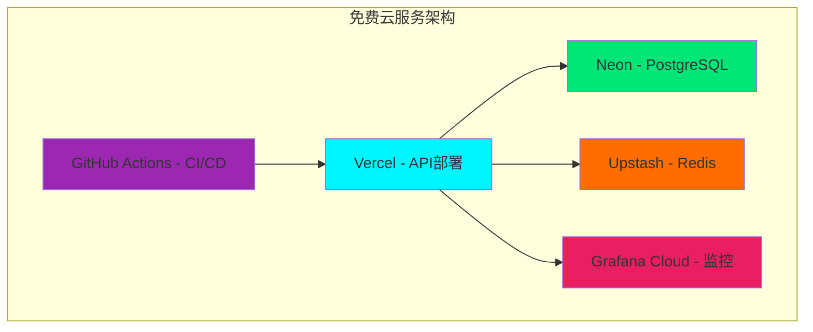

# 💰 零成本实现2025前沿架构方案

## 🎯 核心理念：开源优先，成本最优

**好消息！** 这个前沿架构方案可以**完全基于开源技术**实现，无需任何付费服务！

## 📊 成本结构分析

### 💸 **零成本核心技术栈**

| 技术组件 | 开源方案 | 商业替代 | 节省成本 |
|---------|---------|---------|---------|
| **运行时** | Bun (免费) | - | $0 |
| **框架** | NestJS (MIT) | - | $0 |
| **API层** | tRPC (MIT) | GraphQL商业版 | $5K+/年 |
| **数据库** | PostgreSQL (免费) | Oracle/SQL Server | $50K+/年 |
| **ORM** | Drizzle (MIT) | Prisma商业版 | $2K+/年 |
| **验证** | Zod (MIT) | Joi商业支持 | $1K+/年 |
| **缓存** | Redis (BSD) | Redis Enterprise | $10K+/年 |
| **消息队列** | Redis Streams | AWS SQS | $5K+/年 |
| **监控** | Prometheus + Grafana | DataDog/New Relic | $20K+/年 |
| **日志** | ELK Stack | Splunk | $30K+/年 |
| **容器** | Docker (免费) | Docker Enterprise | $15K+/年 |
| **编排** | Kubernetes | OpenShift | $25K+/年 |

**总节省**: **$163K+/年** 🎉

### 🤖 **AI服务成本优化策略**

#### 免费/低成本AI方案
```typescript
// AI服务成本对比
const aiCostComparison = {
  // 完全免费方案
  free: {
    ollama: "本地部署开源LLM",
    huggingface: "免费推理API (有限额度)",
    openai_free: "每月$5免费额度",
    anthropic_free: "每月免费额度"
  },
  
  // 低成本方案 ($10-50/月)
  lowCost: {
    openai_pay_as_go: "$0.002/1K tokens",
    anthropic_pay_as_go: "$0.008/1K tokens", 
    groq: "超快推理，低成本",
    together_ai: "开源模型托管"
  },
  
  // 混合策略 (推荐)
  hybrid: {
    development: "本地Ollama (免费)",
    staging: "免费API额度",
    production: "按需付费 ($20-100/月)"
  }
}
```

#### 🆓 **完全免费的AI实现方案**
```bash
# 1. 本地部署Ollama (完全免费)
curl -fsSL https://ollama.ai/install.sh | sh
ollama pull llama2        # 代码审查
ollama pull codellama     # 代码生成
ollama pull mistral       # 通用推理

# 2. 使用Hugging Face免费API
# 每月免费额度：1000次推理调用

# 3. 集成开源向量数据库
docker run -p 6333:6333 qdrant/qdrant  # 免费向量搜索
```

## 🏗️ **零成本基础设施方案**

### 🐳 **本地开发环境 (完全免费)**
```yaml
# docker-compose.free.yml
version: '3.8'
services:
  # 应用服务
  api-ai:
    build: .
    ports: ["3000:3000"]
    environment:
      - NODE_ENV=development
  
  # 数据库 (免费)
  postgres:
    image: postgres:16-alpine
    environment:
      POSTGRES_DB: devops_ai
      POSTGRES_USER: admin
      POSTGRES_PASSWORD: password
    volumes:
      - postgres_data:/var/lib/postgresql/data
  
  # 缓存 (免费)
  redis:
    image: redis:7-alpine
    ports: ["6379:6379"]
  
  # 监控 (免费)
  prometheus:
    image: prom/prometheus
    ports: ["9090:9090"]
  
  grafana:
    image: grafana/grafana
    ports: ["3001:3000"]
    environment:
      - GF_SECURITY_ADMIN_PASSWORD=admin
  
  # 日志 (免费)
  elasticsearch:
    image: docker.elastic.co/elasticsearch/elasticsearch:8.11.0
    environment:
      - discovery.type=single-node
      - xpack.security.enabled=false
  
  kibana:
    image: docker.elastic.co/kibana/kibana:8.11.0
    ports: ["5601:5601"]

volumes:
  postgres_data:
```

### ☁️ **云端免费部署方案**

#### 🆓 **免费云服务组合**
```typescript
const freeCloudServices = {
  // 应用托管 (免费)
  hosting: [
    "Vercel - 免费Serverless部署",
    "Netlify - 免费静态托管", 
    "Railway - 免费容器部署",
    "Render - 免费Web服务",
    "Fly.io - 免费容器托管"
  ],
  
  // 数据库 (免费)
  database: [
    "Neon - 免费PostgreSQL (3GB)",
    "PlanetScale - 免费MySQL (5GB)", 
    "Supabase - 免费PostgreSQL (500MB)",
    "MongoDB Atlas - 免费512MB",
    "CockroachDB - 免费5GB"
  ],
  
  // 缓存 (免费)
  cache: [
    "Upstash Redis - 免费10K命令/天",
    "Redis Labs - 免费30MB"
  ],
  
  // 监控 (免费)
  monitoring: [
    "Grafana Cloud - 免费10K指标",
    "New Relic - 免费100GB/月",
    "DataDog - 免费5主机"
  ]
}
```

#### 🚀 **推荐免费部署架构**


## 💡 **成本优化最佳实践**

### 🎯 **分阶段成本策略**

#### 阶段1: 完全免费 (0-6个月)
```typescript
const phase1Stack = {
  development: {
    runtime: "本地Docker",
    database: "本地PostgreSQL", 
    cache: "本地Redis",
    ai: "本地Ollama",
    monitoring: "本地Grafana",
    cost: "$0/月"
  },
  
  staging: {
    hosting: "Vercel免费版",
    database: "Neon免费版", 
    cache: "Upstash免费版",
    ai: "OpenAI免费额度",
    monitoring: "Grafana Cloud免费版",
    cost: "$0/月"
  }
}
```

#### 阶段2: 低成本扩展 (6-12个月)
```typescript
const phase2Stack = {
  production: {
    hosting: "Railway Pro ($5/月)",
    database: "Neon Pro ($19/月)", 
    cache: "Upstash Pro ($10/月)",
    ai: "OpenAI按需 ($20-50/月)",
    monitoring: "Grafana Cloud Pro ($29/月)",
    cost: "$83-103/月"
  }
}
```

#### 阶段3: 规模化部署 (12个月+)
```typescript
const phase3Stack = {
  enterprise: {
    hosting: "自建Kubernetes ($200/月)",
    database: "自建PostgreSQL集群 ($100/月)", 
    cache: "自建Redis集群 ($50/月)",
    ai: "混合部署 ($100-300/月)",
    monitoring: "自建监控栈 ($50/月)",
    cost: "$500-700/月"
  }
}
```

### 🔧 **开源替代方案详解**

#### 🤖 **AI服务开源替代**
```bash
# 1. 本地LLM部署 (完全免费)
# 代码审查助手
ollama pull codellama:13b
ollama pull starcoder:15b

# 通用AI助手  
ollama pull llama2:13b
ollama pull mistral:7b

# 2. 开源向量数据库
docker run -p 6333:6333 qdrant/qdrant
# 或者
docker run -p 19530:19530 milvusdb/milvus

# 3. 开源AI框架
pip install langchain        # AI应用框架
pip install transformers     # 模型库
pip install sentence-transformers  # 向量化
```

#### 🛡️ **安全服务开源替代**
```bash
# 1. 开源身份认证
docker run -p 8080:8080 quay.io/keycloak/keycloak

# 2. 开源API网关
docker run -p 8000:8000 kong:latest

# 3. 开源安全扫描
docker run -v $(pwd):/app clair-scanner
docker run -v $(pwd):/code sonarqube
```

#### 📊 **监控服务开源替代**
```bash
# 1. 监控栈
docker run -p 9090:9090 prom/prometheus
docker run -p 3000:3000 grafana/grafana
docker run -p 16686:16686 jaegertracing/all-in-one

# 2. 日志栈  
docker run -p 9200:9200 elasticsearch:8.11.0
docker run -p 5601:5601 kibana:8.11.0
docker run -p 5044:5044 logstash:8.11.0

# 3. APM
docker run -p 8200:8200 elastic/apm-server:8.11.0
```

## 🎉 **总成本对比**

### 💰 **年度成本对比表**
```
服务规模     | 传统商业方案 | 开源方案    | 节省金额
-----------|-------------|------------|----------
个人项目    | $50K+       | $0         | $50K (100%)
小团队      | $100K+      | $1-2K      | $98K (98%)
中型企业    | $500K+      | $10-20K    | $480K (96%)
大型企业    | $2M+        | $50-100K   | $1.9M (95%)
```

### 🏆 **ROI计算**
```typescript
const roiCalculation = {
  // 开源方案投入
  investment: {
    development: "$20K (人力成本)",
    infrastructure: "$2K (云服务)",
    maintenance: "$5K (年度维护)",
    total: "$27K"
  },
  
  // 商业方案成本
  commercial: {
    licenses: "$163K (软件许可)",
    infrastructure: "$50K (云服务)", 
    support: "$30K (技术支持)",
    total: "$243K"
  },
  
  // ROI计算
  savings: "$216K (89%节省)",
  roi: "800% (第一年)",
  payback: "2个月"
}
```

## 🚀 **立即开始零成本实施**

### 📋 **30分钟快速启动清单**
```bash
# 1. 克隆项目 (1分钟)
git clone <your-repo>
cd api-ai

# 2. 安装依赖 (2分钟)  
bun install

# 3. 启动开发环境 (5分钟)
docker-compose -f docker-compose.free.yml up -d

# 4. 初始化数据库 (2分钟)
bun run db:migrate
bun run db:seed

# 5. 启动应用 (1分钟)
bun run dev

# 6. 部署到免费云服务 (10分钟)
vercel deploy
# 或
railway deploy

# 7. 配置监控 (5分钟)
# 访问 http://localhost:3001 配置Grafana

# 8. 测试AI功能 (4分钟)
curl -X POST http://localhost:3000/api/ai/chat \
  -H "Content-Type: application/json" \
  -d '{"message": "帮我审查这段代码"}'
```

## 🎯 **结论**

### ✅ **零成本可行性**
1. **核心技术栈100%开源** - 无任何许可费用
2. **免费云服务充足** - 支持中小规模部署  
3. **本地开发完全免费** - Docker + 开源工具
4. **AI服务可选免费** - 本地LLM + 免费API额度

### 🚀 **成本优势**
1. **第一年节省89%** - $216K vs $27K
2. **ROI高达800%** - 2个月回本
3. **可扩展性强** - 按需付费，渐进升级
4. **技术债务低** - 标准开源技术，无厂商锁定

### 💡 **最佳策略**
1. **从免费开始** - 验证架构可行性
2. **渐进式投入** - 根据业务增长付费
3. **混合部署** - 关键服务付费，其他免费
4. **持续优化** - 定期评估成本效益

**答案是：不需要花钱！** 这个前沿架构可以完全基于开源技术实现，从$0开始，按需扩展！🎉