# Juanie DevOps 平台架构文档

本文档详细介绍 Juanie 平台的系统架构设计。

## 📚 目录

- [架构概览](#架构概览)
- [技术栈](#技术栈)
- [三层服务架构](#三层服务架构)
- [数据流](#数据流)
- [部署架构](#部署架构)
- [安全架构](#安全架构)

## 架构概览

Juanie 采用现代化的微服务架构，基于 Monorepo 管理，支持多租户和高可扩展性。

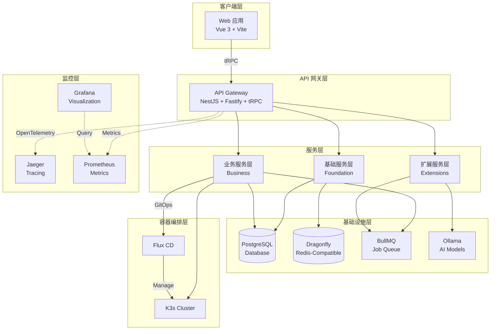

## 技术栈

### 后端技术栈

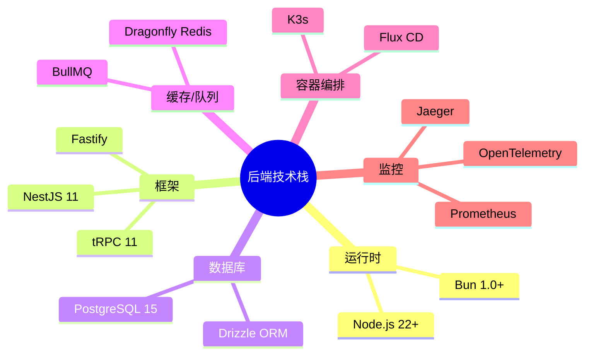

### 前端技术栈

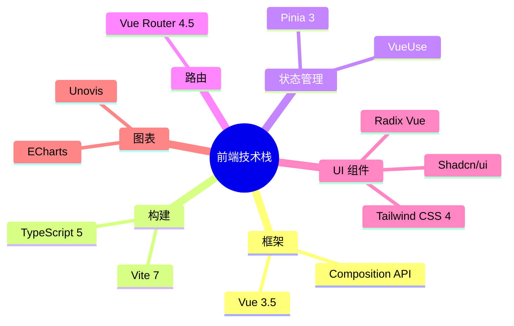

## 三层服务架构

Juanie 采用经典的三层架构设计，每层职责明确，依赖关系单向。

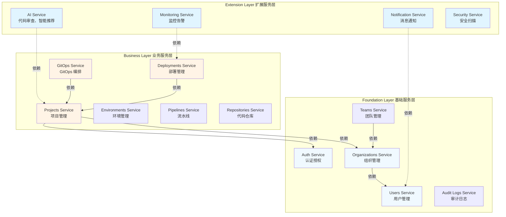

### 层级职责

| 层级 | 职责 | 依赖 |
|------|------|------|
| **Extension Layer** | 提供AI、监控、通知等扩展功能 | 依赖 Business Layer |
| **Business Layer** | 核心业务逻辑（项目、部署、GitOps） | 依赖 Foundation Layer |
| **Foundation Layer** | 基础服务（认证、用户、组织） | 无外部依赖 |

## 数据流

### 项目创建流程

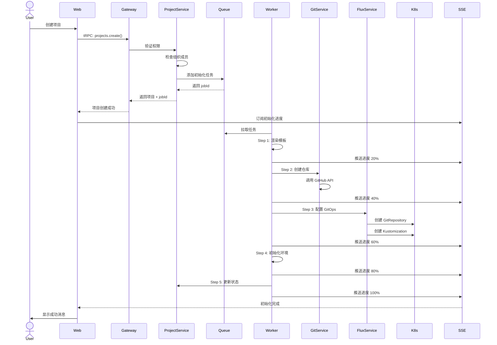

### 部署流程

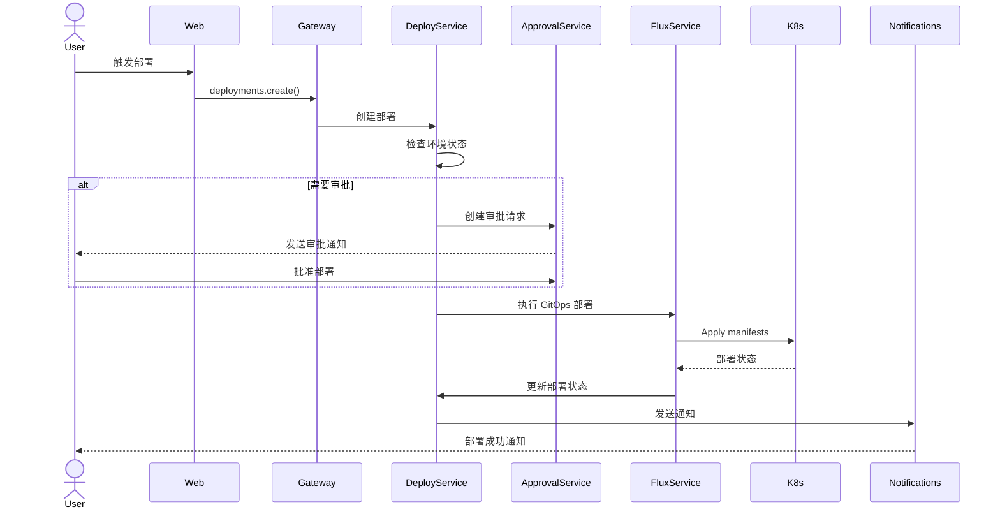

### AI 代码审查流程

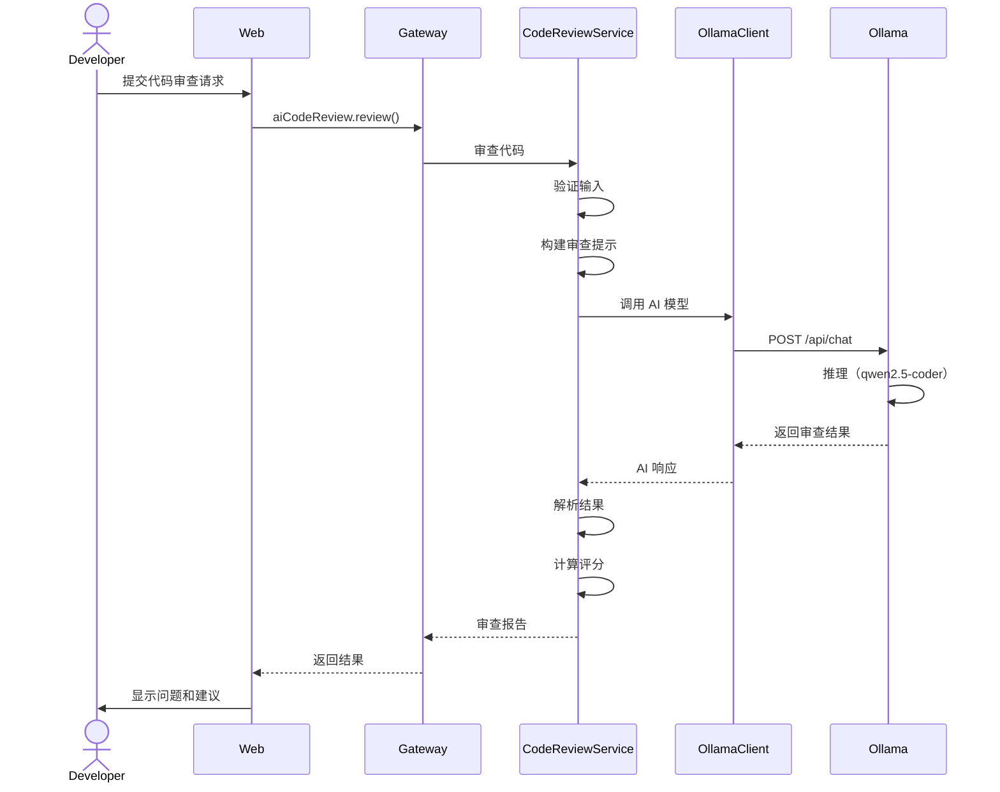

## 部署架构

### 本地开发环境

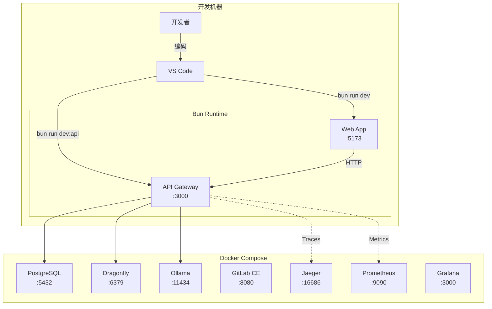

### 生产环境

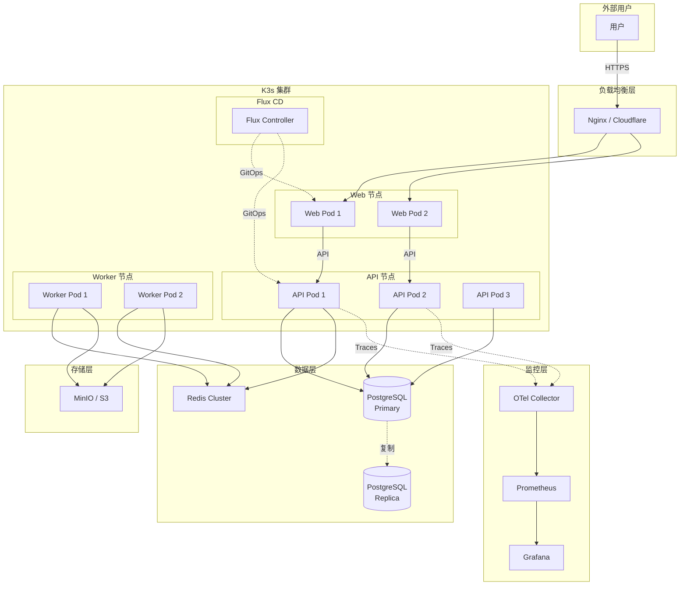

## 安全架构

### 认证与授权

```mermaid
graph TB
    User[用户] -->|1. 登录请求| Auth[Auth Service]
    
    Auth -->|2. 验证凭据| DB[(Database)]
    DB -->|3. 用户信息| Auth
    
    Auth -->|4. 生成 JWT| JWT[JWT Token]
    JWT -->|5. 返回 Token| User
    
    User -->|6. 携带 Token| API[API Gateway]
    API -->|7. 验证 Token| Auth
    Auth -->|8. 解析用户信息| API
    
    API -->|9. 检查权限| RBAC[RBAC Service]
    RBAC -->|10. 权限结果| API
    
    alt 有权限
        API -->|11. 执行操作| Service[Business Service]
        Service -->|12. 返回结果| API
    else 无权限
        API -->|403 Forbidden| User
    end
    
    API -->|13. 记录审计日志| Audit[Audit Logs]
```

### 多租户隔离

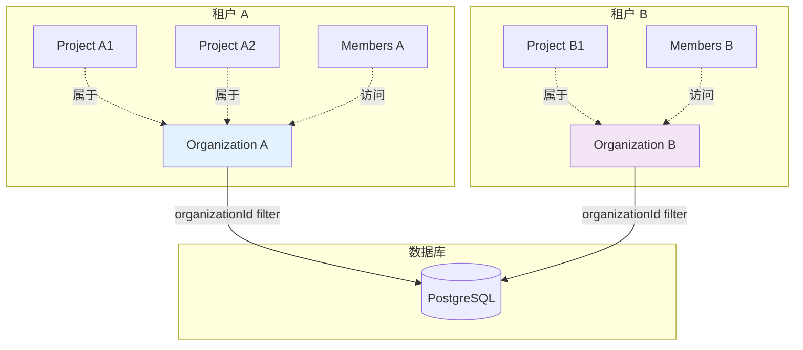

### 安全层级

```mermaid
graph LR
    subgraph "网络安全"
        Firewall[防火墙]
        SSL[SSL/TLS]
        WAF[WAF]
    end

    subgraph "应用安全"
        Auth[认证]
        RBAC[RBAC 权限]
        RateLimit[限流]
        CSRF[CSRF 保护]
    end

    subgraph "数据安全"
        Encryption[加密存储]
        Backup[备份]
        Audit[审计日志]
    end

    subgraph "基础设施安全"
        K8s[K8s RBAC]
        Secrets[Secrets 管理]
        NetworkPolicy[Network Policy]
    end

    Firewall --> SSL
    SSL --> WAF
    WAF --> Auth
    Auth --> RBAC
    RBAC --> RateLimit
    RateLimit --> CSRF
    CSRF --> Encryption
    Encryption --> Backup
    Backup --> Audit
    Audit --> K8s
    K8s --> Secrets
    Secrets --> NetworkPolicy
```

## 可观测性架构

### 三大支柱

```mermaid
graph TD
    subgraph "应用层"
        App[应用服务]
    end

    subgraph "Logs 日志"
        Logger[Logger]
        LogStorage[(Log Storage)]
    end

    subgraph "Metrics 指标"
        Metrics[Metrics Exporter]
        Prometheus[(Prometheus)]
    end

    subgraph "Traces 链路追踪"
        Tracer[@Trace Decorator]
        Jaeger[(Jaeger)]
    end

    subgraph "可视化"
        Grafana[Grafana Dashboard]
    end

    App -->|写日志| Logger
    Logger --> LogStorage
    
    App -->|上报指标| Metrics
    Metrics --> Prometheus
    
    App -->|链路追踪| Tracer
    Tracer --> Jaeger
    
    Prometheus --> Grafana
    Jaeger --> Grafana
    LogStorage --> Grafana
```

## 扩展性设计

### 水平扩展

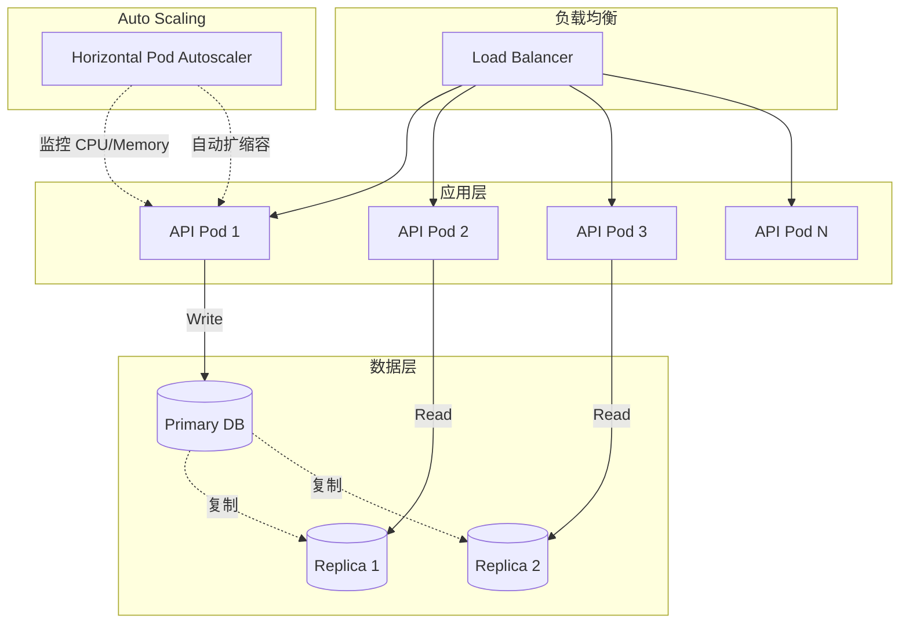

## 技术决策记录

### 为什么选择 Bun？

- ⚡ **性能**: 比 Node.js 快 25 倍
- 📦 **内置工具**: 集成包管理、测试、打包
- 🔧 **兼容性**: 完全兼容 Node.js API

### 为什么选择 tRPC？

- 🔒 **类型安全**: 端到端类型推导
- 🚀 **开发体验**: 无需手写 API 文档
- 📉 **减少样板代码**: 自动生成客户端

### 为什么选择 Drizzle ORM？

- 🎯 **TypeScript First**: 原生 TypeScript 支持
- 🏃 **性能优异**: 比 Prisma 快 2-3 倍
- 🔍 **SQL-like API**: 熟悉的 SQL 语法

### 为什么选择 K3s + Flux CD？

- 🪶 **轻量级**: K3s 资源占用小
- 🔄 **GitOps**: Flux CD 声明式部署
- 📦 **易于管理**: 自动同步 Git 仓库

## 性能优化策略

### 数据库优化

- ✅ 使用索引优化查询
- ✅ 读写分离（主从复制）
- ✅ 连接池管理
- ✅ 查询缓存

### 缓存策略

- ✅ Redis 缓存热点数据
- ✅ API 响应缓存
- ✅ 静态资源 CDN

### 前端优化

- ✅ 代码分割（懒加载）
- ✅ Tree Shaking
- ✅ 资源压缩
- ✅ PWA 离线支持

## 参考资料

- [错误处理指南](./ERROR_HANDLING_GUIDE.md)
- [API 文档指南](./API_DOCUMENTATION_GUIDE.md)
- [AI 代码审查指南](./AI_CODE_REVIEW_GUIDE.md)
- [项目 README](../README.md)
