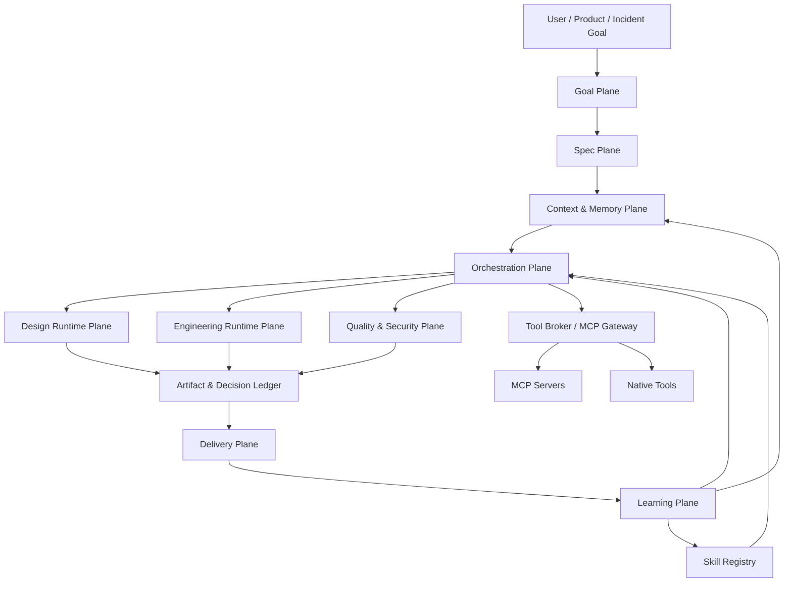
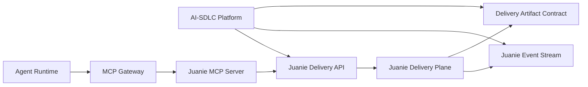

# AI-Native SDLC Platform Architecture

## 文档角色

本文档定义一个完整 AI-Native SDLC 平台的目标架构。它不把 Juanie 现有
release / delivery 能力误认为整个 SDLC；Juanie 在这套架构中属于靠后的
Delivery Plane。

目标不是给传统 DevOps 平台加 AI，而是重构软件交付的底层协作模型：

```text
Goal -> Spec -> Context -> Agent Graph -> Quality Gates -> Ledger -> Delivery -> Learn
```

## 核心结论

AI-Native SDLC 平台的核心资产不是某个 coding agent，也不是某个设计工具。
平台真正要掌握的是：

- Goal / Spec 的结构化控制面
- Context / Memory 的可信治理
- Skill 的能力包体系
- MCP Gateway 的工具治理边界
- Agent routing / quality gate / decision ledger
- 从交付结果回流到 skill、memory、eval、routing policy 的学习闭环

Claude Code、Codex、GitHub Copilot cloud agent、Claude Design、OpenDesign、Figma
MCP 都应作为可插拔执行面接入，而不是让其中任何一个成为平台大脑。

## 非目标

- 不做 chat-first 平台。聊天可以是交互方式，不是产品架构。
- 不从零自研 coding agent。
- 不从零自研 design runtime。
- 不让 agent 直接裸连 MCP server。
- 不把 Juanie delivery plane 扩大成整个 AI-SDLC。
- 不把 prompt 模板误当成 skill system。

## 总体架构



## 平面设计

### 1. Goal Plane

Goal 是用户真正要完成的目标，而不是一条流水线。

典型 goal 类型：

- `feature_goal`: 做一个新功能
- `bug_goal`: 修一个缺陷
- `refactor_goal`: 重构模块或架构
- `design_goal`: 设计界面、流程或设计系统
- `release_goal`: 发布某个版本或变更
- `incident_goal`: 诊断并恢复线上问题
- `research_goal`: 调研方案、选型或写设计文档

Goal 必须包含：

- 目标描述
- 业务背景
- 约束条件
- 验收标准
- 影响范围
- 风险等级
- 关联代码库、文档、设计稿、运行环境
- 人工审批要求

### 2. Spec Plane

Spec 是人和 agent 的共同契约，不是一次性文档。

推荐采用 living spec：

- 需求 spec
- UX / design spec
- 技术方案 spec
- 验收标准
- 测试矩阵
- 风险与回滚策略
- 审批记录

平台应强制关键路径经过：

```text
clarify -> spec -> approve -> build
```

没有被批准的 spec 不应进入高风险 build / release 流程。

### 3. Context & Memory Plane

Context 是 AI-SDLC 的资产层。平台不能只做 prompt 拼接。

上下文分层：

| 类型 | 说明 |
| --- | --- |
| Working context | 当前 run 的短期上下文 |
| Project memory | 项目长期惯例、模块结构、历史坑 |
| Decision memory | ADR、产品决策、安全决策 |
| Artifact memory | PRD、spec、设计稿、测试报告、发布报告 |
| Runtime memory | 故障、性能、日志、trace、发布事件 |
| User / team preference | 团队规范、偏好、审批习惯 |

每条 memory 都应记录：

- source
- scope
- version
- confidence
- createdAt / updatedAt
- expiration / decay policy
- derivedFrom
- applicable repository / branch / module

推荐 repo-local 文件形态：

```text
.sdlc/
  goals/
  specs/
  state/
  memory/
  artifacts/
  decisions/
  evaluations/
  runs/
```

平台数据库可用等价结构存储，但 repo-local artifact 对 local-first 和 agent
handoff 更友好。

### 4. Skill Registry

Skill 不是 prompt 模板。Skill 是能力包。

推荐结构：

```text
skills/frontend-design/
  SKILL.md
  references/
  scripts/
  templates/
  assets/
  evals/
  permissions.json
```

Skill 至少声明：

- 触发条件
- 工作流
- 输入 / 输出 schema
- 可用工具
- 权限级别
- 风险级别
- 支持脚本
- 参考材料
- 模板与资产
- eval / acceptance criteria
- 版本与兼容性

平台应兼容 Claude Agent Skills、Codex skills、OpenDesign skills 的能力包思想，
但不要被任何单家格式锁死。

### 5. Orchestration Plane

Orchestration 不应由单一 SDK 解决。推荐分层：

| 层 | 推荐 | 作用 |
| --- | --- | --- |
| Long-running workflow | Temporal | 长周期状态、审批、重试、补偿、恢复 |
| Agent graph | LangGraph | 多 agent 拓扑、循环、并行、状态累积 |
| Specialist runtime | OpenAI Agents SDK / Claude Code / Codex | 沙箱、工具调用、专用执行 |
| Product AI UI | Vercel AI SDK | streaming UI、轻量 tool loop、provider abstraction |

推荐架构：

```text
Temporal Workflow
  -> LangGraph Agent Subgraph
    -> Coding / Design / Review / Judge executors
```

### 6. Tool Broker / MCP Gateway

MCP 是工具生态协议，不是平台大脑。Agent 不允许直接裸连 MCP server。

MCP Gateway 负责：

- tool discovery
- schema validation
- OAuth / token audience 校验
- secret isolation
- permission policy
- human consent
- rate limit
- sandbox
- audit log
- tool result sanitization

支持 transport：

- stdio local MCP server
- Streamable HTTP remote MCP server
- first-party native tools

高危工具必须要求审批：

- 写代码库
- 创建 PR
- 执行 shell
- 修改数据库
- 部署 / 回滚
- 读取 secret
- 调用生产环境 API

### 7. Design Runtime Plane

不要把 UIUX Agent 设计成“生成漂亮页面”的单 agent。应设计成 Design Runtime Cell。

组成：

```text
Design Orchestrator
  -> Brief Clarifier
  -> Design System Extractor
  -> UX Flow Agent
  -> Visual Direction Agent
  -> Artifact Builder
  -> Accessibility Judge
  -> Handoff Builder
  -> Visual Regression Agent
```

可接执行面：

| 方案 | 优点 | 代价 | 适用 |
| --- | --- | --- | --- |
| Claude Design | 托管式高质量设计工作台，design-to-code handoff 强 | 订阅 / 可用性受 Anthropic 产品节奏影响 | 高质量人工协作设计 |
| OpenDesign | local-first、开源、BYOK、artifact 本地化、agent-agnostic | 成熟度和生态仍需验证 | 平台内建 design runtime |
| Figma MCP | 读取 / 写回设计上下文，连接现有设计资产 | 依赖 Figma workspace 权限 | 企业已有 Figma 流程 |
| Figma Code Connect | 连接 Figma 组件和真实代码组件 | 需要维护组件映射 | 设计系统成熟团队 |

设计产物：

- `DESIGN.md`
- design tokens
- user flow
- screen spec
- prototype artifact
- component contract
- handoff bundle
- visual QA report

### 8. Engineering Runtime Plane

Coding Agent 不是平台核心，而是可插拔执行器。

推荐 Engineering Cell：

```text
Repo Mapper
  -> Architecture Planner
  -> Implementation Agent
  -> Test Agent
  -> Independent Reviewer
  -> Repair Agent
  -> PR Agent
```

可接执行面：

| 方案 | 优点 | 代价 | 适用 |
| --- | --- | --- | --- |
| Codex CLI / Codex Cloud | OpenAI 代码执行能力强，支持 repo 操作、MCP、sandbox / custom provider 路线 | OpenAI 路线更强，非 OpenAI provider 能力需验证 | 平台默认 coding executor 候选 |
| Claude Code | subagents / skills / 长任务开发体验强 | Claude 生态依赖更强，本地模型需兼容层 | skill-heavy engineering workflow |
| GitHub Copilot cloud agent | GitHub issue -> PR 路径自然，和 GitHub Actions 集成好 | GitHub 生态绑定，平台可控性有限 | GitHub-native 团队 |
| OpenHands | 开源 software engineering agent 平台，适合研究和可控部署 | 成熟度和运维成本需评估 | 自托管 coding executor |
| OpenCode / Aider / SWE-agent | 轻量、开源、便于集成或研究 | 平台化能力较弱 | 低成本 worker / benchmark |
| Devin / Cursor / Windsurf | 产品成熟，单点能力强 | 可控性、审计、嵌入深度受限 | 外部 executor adapter |

工程产物：

- change plan
- patch / branch
- test report
- review report
- repair log
- PR description
- rollback notes

### 9. Quality & Security Plane

Quality Gate 不应只发生在 CI 末尾。

四层 gate：

| Gate | 内容 |
| --- | --- |
| Deterministic | lint、typecheck、unit test、build、migration check、安全扫描 |
| Semantic | spec 是否满足、API 是否兼容、设计是否一致、copy 是否符合场景 |
| Adversarial | breaker agent、security agent、independent reviewer、事实核查 |
| Runtime | preview smoke、visual diff、logs、traces、SLO、error rate |

失败处理：

```text
fail -> classify -> repair -> retry -> fork retry -> switch agent -> human escalation
```

LLM-as-Judge 必须输出结构化 verdict：

```json
{
  "verdict": "pass",
  "confidence": 0.82,
  "evidence": [],
  "failureClass": null,
  "recommendedNextAction": "continue"
}
```

LLM verdict 不能单独作为高风险生产事实。

### 10. Artifact & Decision Ledger

Ledger 是企业采用的关键。

必须记录：

- 原始 goal
- 澄清问题和用户回答
- spec 与审批记录
- context snapshot
- agent run
- tool invocation
- artifact
- test / judge / review result
- human approval
- delivery result
- learning event

Ledger 要回答：

- 为什么这么做？
- 谁 / 哪个 agent 做的？
- 用了哪些上下文？
- 调用了哪些工具？
- 哪些验证通过？
- 哪些风险被接受？
- 人在哪些点审批过？

### 11. Delivery Plane

Juanie 属于这一层。

职责：

- preview environment
- release readiness
- schema safety
- artifact provenance
- rollout / rollback
- promotion
- runtime governance
- delivery audit

Juanie 不应承担：

- spec authoring 主入口
- design runtime
- coding runtime
- 全局 context / memory governance
- 总 agent orchestrator

### 11.1 Juanie Integration Modes

AI-SDLC 平台连接 Juanie 不应只有一种方式。正确设计是多通道，每条通道服务
不同调用者。



| 通道 | 主要调用者 | 适合能力 | 优点 | 缺点 | 推荐 |
| --- | --- | --- | --- | --- | --- |
| REST / typed API | 平台服务 | 创建 preview、评估 release readiness、创建 release、查询状态 | 稳定、可测试、权限模型清楚、适合服务间调用 | Agent 动态发现能力弱 | 必做，作为主集成通道 |
| MCP Server | Agent runtime | 查询环境、读取 schema safety、触发受控 delivery action | 工具语义清楚，便于 agent 动态发现和跨平台复用 | 必须加 Gateway，否则权限边界危险 | 必做，但只能走 MCP Gateway |
| Event Stream / Webhook | 平台同步器 | release 状态、deployment 状态、rollout、schema gate、failure 事件 | 异步解耦，适合 ledger 和 learning loop | 需要幂等和事件版本治理 | 必做，用于状态回传 |
| Artifact Contract | 构建/交付链路 | image digest、source service、release artifact、test report、readiness report | 保留供应链证据，便于审计和复现 | 需要稳定 schema 和存储策略 | 必做 |
| Direct DB / internal import | 无 | 无 | 短期快 | 强耦合、破坏边界、难审计 | 禁止 |

推荐分工：

- 平台后端调用 Juanie 用 REST / typed Delivery API。
- Agent 调用 Juanie 用 Juanie MCP Server，但必须经过 MCP Gateway。
- Juanie 状态回传 AI-SDLC 用 Event Stream / Webhook。
- 构建产物、镜像来源、schema readiness、测试报告用 Artifact Contract。

#### Juanie Delivery API

Delivery API 是平台服务间主通道。第一版只暴露稳定能力：

```text
GET  /delivery/projects
GET  /delivery/projects/:id/environments
POST /delivery/projects/:id/previews
POST /delivery/releases/readiness
POST /delivery/releases
GET  /delivery/releases/:id
GET  /delivery/schema-safety
```

高风险动作后置：

```text
POST /delivery/releases/:id/promote
POST /delivery/releases/:id/rollback
POST /delivery/schema-repairs
```

这些动作必须在 AI-SDLC 的 approval / policy gate 成熟后再开放。

#### Juanie MCP Server

Juanie MCP Server 是给 agent 使用的工具面，不是服务间主通道。

建议 tools：

```text
list_projects
list_environments
get_environment
create_preview_environment
assess_release_readiness
create_release
get_release_status
get_schema_safety
```

危险 tools 后置：

```text
promote_release
rollback_release
request_schema_repair
delete_preview_environment
```

MCP tool 风险分级：

| 等级 | 工具 |
| --- | --- |
| read | list_projects, list_environments, get_environment, get_release_status, get_schema_safety |
| write | create_preview_environment, assess_release_readiness, create_release |
| dangerous | promote_release, rollback_release, request_schema_repair, delete_preview_environment |

部署形态建议：

| 形态 | 优点 | 缺点 | 建议 |
| --- | --- | --- | --- |
| 独立 `juanie-mcp-server` | 与 Juanie Web runtime 隔离，适合外部平台复用 | 需要维护 API client 和 token | 推荐 |
| Juanie 内置 `/api/mcp` | 复用 auth 和服务层 | 长连接 / streaming 与 Web runtime 耦合 | 可作为后续选项 |

#### Juanie Event Stream

事件用于让 AI-SDLC ledger 和 learning loop 感知交付结果。

第一版事件：

```text
delivery.preview.created
delivery.release.created
delivery.release.readiness_completed
delivery.release.failed
delivery.release.succeeded
delivery.rollout.paused
delivery.rollout.promoted
delivery.schema_gate.blocked
delivery.schema_gate.passed
```

事件必须包含：

- eventId
- eventType
- occurredAt
- juanieProjectId
- environmentId
- releaseId
- correlationId / traceId
- payload schema version

#### Delivery Artifact Contract

Artifact contract 是 AI-SDLC 与 Juanie 的证据边界。

应保留：

- source repository
- source ref / commit sha
- source service id
- image URI
- image digest
- image platform
- build provenance
- test report references
- readiness report references
- schema safety snapshot
- release id / environment id

Juanie 已经有 image-derived delivery artifact 和 `sourceImageDigest` 方向，这条线应继续作为
Delivery Plane 与 AI-SDLC ledger 的交付证据主线。

### 12. Learning Plane

Learning Plane 目前市场最不成熟，值得自研。

任务结束后要沉淀：

- 哪类任务返工最多
- 哪些 skill 成功率高
- 哪些 context 缺失导致失败
- 哪些 gate 误报 / 漏报
- 哪些 agent 组合效果好
- 哪些 prompt / policy 要退役
- 哪些项目规则应固化成 memory / skill / policy

学习结果回流：

- routing policy
- skill version
- eval dataset
- memory confidence
- quality gate threshold
- tool policy

## 关键选型对比

### Orchestration

| 方案 | 优点 | 缺点 | 推荐位置 |
| --- | --- | --- | --- |
| Temporal | 长周期可靠性强，支持暂停、恢复、重试、补偿、审计历史 | 不是 agent graph，需要自己建业务模型 | 外层 SDLC workflow |
| LangGraph | 图建模、循环、并行、多 agent 状态累积自然 | 长周期企业流程仍需外层 durable workflow | Agent subgraph 主选 |
| OpenAI Agents SDK | handoff、guardrails、tracing、OpenAI 工具和 sandbox 能力强 | 做全局 SDLC 状态机不够自然 | specialist agent runtime |
| Microsoft Agent Framework | 企业 Microsoft / Azure 场景友好 | 生态绑定，非 Microsoft 场景需权衡 | Microsoft 客户可选 |
| Vercel AI SDK | Next.js / React AI UI、streaming、provider abstraction、轻量 tool loop 强 | 不适合作为多天 SDLC durable backbone | 产品应用层 |

待决策：

- 是否采用 `Temporal + LangGraph` 作为默认主干。
- 是否把 OpenAI Agents SDK 作为 OpenAI-native specialist executor。
- 是否在 Next.js 产品层使用 Vercel AI SDK。

### Design Runtime

| 方案 | 优点 | 缺点 | 推荐 |
| --- | --- | --- | --- |
| Claude Design | 产品体验前沿，handoff 到 Claude Code 强 | 订阅和可用性受 Anthropic 控制 | Hosted adapter |
| OpenDesign | local-first、开源、BYOK、artifact 本地化 | 成熟度需 POC 验证 | 平台内建优先 POC |
| Figma MCP | 与真实设计资产连接 | 需要 Figma 权限和治理 | 必接 |

待决策：

- 设计主执行面优先 POC OpenDesign 还是 Claude Design adapter。
- 是否把 Figma 作为 design source of truth。

### Coding Runtime

| 方案 | 优点 | 缺点 | 推荐 |
| --- | --- | --- | --- |
| Codex | repo 级代码能力强，Codex CLI / Cloud 可覆盖本地和云端 | OpenAI 依赖较强 | 默认候选 |
| Claude Code | skills / subagents 强，和 Claude Design handoff 潜力大 | Anthropic 依赖较强 | 并列候选 |
| GitHub Copilot agent | GitHub-native、issue 到 PR 简洁 | 平台可控性弱 | GitHub adapter |
| OpenHands | 开源可控 | 成熟度 / 运维成本需评估 | 自托管备选 |

待决策：

- 首个 coding executor 选 Codex 还是 Claude Code。
- 是否需要自托管 OpenHands 作为可控 fallback。

### Skill System

| 方案 | 优点 | 缺点 | 推荐 |
| --- | --- | --- | --- |
| Claude Agent Skills 格式 | 官方化、生态强、支持脚本/资源/模板 | Anthropic 语义影响大 | 参考 |
| Codex skills | progressive disclosure、适合 coding workflow | Codex 生态影响大 | 参考 |
| OpenDesign skills | local-first design artifact 友好 | 生态较新 | 参考 |
| 自研 registry | 可做权限、版本、eval、审计 | 需要设计和维护 | 必做 |

待决策：

- Skill manifest 是否优先兼容 Agent Skills open standard。
- 是否允许 workspace 自定义 skill。

## 推荐路线

### MVP

```text
Goal Store
Spec / Approval
Skill Registry
Context Snapshot
AgentRun Ledger
Temporal Workflow
LangGraph Engineering Subgraph
Codex or Claude Code executor
Vercel AI SDK product UI
```

### P1

```text
MCP Gateway v1
Quality Gate Engine
Review / Breaker / Repair loop
PR automation
Tool audit
```

### P2

```text
OpenDesign adapter
Figma MCP adapter
Design handoff bundle
Visual QA
Design system memory
```

### P3

```text
Juanie Delivery adapter
Preview environment
Release readiness
Schema safety
Rollout / rollback
```

### P4

```text
Learning loop
Failure taxonomy
Eval case generation
Skill improvement
Routing policy tuning
Memory decay / promotion
```

## 风险

| 风险 | 缓解 |
| --- | --- |
| Agent 执行不可控 | Tool Broker、sandbox、人审、ledger |
| 上下文污染 | context snapshot、scope、source、confidence、decay |
| Skill 泛滥 | registry、版本、owner、eval、deprecation |
| MCP 安全边界失控 | Gateway、权限、secret isolation、audit |
| LLM judge 不可靠 | deterministic gate + adversarial gate + human escalation |
| 过早绑定单家模型 | executor adapter + provider policy |
| 平台范围过大 | 先 MVP engineering loop，再扩 design / delivery / learning |

## 当前对 Juanie 的含义

Juanie 现有 AI plugin、release intelligence、schema safety、preview、artifact provenance
能力应该继续保留，但定位应调整为 AI-SDLC 的 Delivery Plane。

后续不要把 Juanie 内部 AI plugin runtime 继续扩成全局 SDLC 大脑。正确方向是：

- Juanie 接收上游 goal / spec / artifact / readiness 结果
- Juanie 提供 delivery / release / runtime evidence
- Juanie 把 release outcome 回传 Learning Plane
