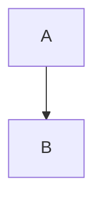

# 架构文档

> Juanie DevOps 平台的系统架构设计

## 🏗️ 核心架构

### 分层架构
- [分层架构分析](layered-architecture-analysis.md) - 三层服务架构设计
- [Business 层架构](business-layer-architecture.md) - 业务层详细设计
- [NestJS Service vs Utils 最佳实践](nestjs-service-vs-utils-best-practices.md) - 代码组织规范

### 数据库设计
- [数据库 Schema 参考](database-schema-reference.md) - 完整 Schema 定义
- [数据库 Schema 关系](database-schema-relationships.md) - 表关系图
- [数据库设计标准](database-design-standards.md) - 设计规范

### 认证与权限
- [认证架构](authentication-architecture.md) - OAuth + JWT 认证
- [权限控制架构](PERMISSION-CONTROL-ARCHITECTURE.md) - RBAC 权限模型

## 🚀 GitOps 架构

### 核心设计
- [GitOps 资源说明](gitops-resources-explained.md) - Flux 资源详解
- [GitOps 设置方案对比](gitops-setup-approach-comparison.md) - 不同方案对比
- [GitOps 扩展最佳实践](gitops-scale-best-practices.md) - 大规模部署

### K8s 集成
- [K8s 模板设计](k8s-template-design.md) - K8s 资源模板
- [K3s 资源优化实现](k3s-resource-optimization-implementation.md) - 资源优化
- [Bun K8s 客户端](bun-k8s-client.md) - Bun 运行时 K8s 客户端
- [TLS 证书验证说明](tls-certificate-verification-explained.md) - TLS 证书处理

## 📦 模块设计

### 项目初始化
- [项目初始化流程分析](project-initialization-flow-analysis.md) - 初始化流程
- [项目初始化流程完成](project-initialization-flow-complete.md) - 完整实现
- [项目初始化流程验证](project-initialization-flow-verification.md) - 验证测试

### 部署策略
- [部署策略对比](deployment-strategies-comparison.md) - 不同部署策略
- [自动部署触发](auto-deploy-trigger.md) - 自动触发机制
- [自动触发初始构建](auto-trigger-initial-build.md) - 初始构建触发

### CI/CD
- [现代 CI/CD 流水线](modern-cicd-pipeline.md) - CI/CD 设计
- [GitHub Actions 简单工作流](github-actions-simple-workflow.md) - Actions 配置
- [模板系统 EJS 迁移](template-system-ejs-migration.md) - 模板引擎

## 🐳 容器与镜像

### 镜像仓库
- [容器镜像仓库方案](container-registry-solutions.md) - 镜像仓库选型
- [现代 PaaS 镜像仓库方案](modern-paas-image-registry-solutions.md) - PaaS 方案
- [多租户 GHCR 方案](multi-tenant-ghcr-solution.md) - GitHub Container Registry

## 🔧 技术决策

### 架构演进
- [为什么存在复杂架构](why-complex-architecture-existed.md) - 架构演进历史
- [当前架构实际实现](current-architecture-actual-implementation.md) - 当前状态
- [后端架构分析](backend-architecture-analysis.md) - 后端设计

### 基础设施
- [Foundation 层架构分析](foundation-layer-architecture-analysis.md) - 基础层设计

## 📊 系统优化

### Flux 优化
- [Flux 间隔优化](flux-interval-optimization.md) - Reconcile 间隔优化

## 📚 参考资料

### 官方文档
- [Flux CD](https://fluxcd.io/docs/)
- [K3s](https://docs.k3s.io/)
- [NestJS](https://docs.nestjs.com/)
- [Drizzle ORM](https://orm.drizzle.team/)
- [tRPC](https://trpc.io/)

### 最佳实践
- [12-Factor App](https://12factor.net/)
- [GitOps Principles](https://opengitops.dev/)
- [Kubernetes Best Practices](https://kubernetes.io/docs/concepts/configuration/overview/)

## 🗂️ 历史归档

重构过程记录已归档到 [`../archive/refactoring/`](../archive/refactoring/)：

- [GitOps 模块重构](../archive/refactoring/gitops/) - 48 个文件
- [Projects 模块重构](../archive/refactoring/projects/) - 22 个文件
- [RBAC 重构](../archive/refactoring/rbac/) - 15 个文件
- [Core 包重构](../archive/refactoring/core/) - 14 个文件
- [Business 层重构](../archive/refactoring/business/) - 12 个文件
- [通用重构记录](../archive/refactoring/general/) - 35 个文件

## 🎯 架构原则

### 1. 分层清晰
```
Extensions → Business → Foundation → Core
```
- **Core**: 基础设施（database, queue, events, k8s, flux）
- **Foundation**: 基础服务（auth, users, storage）
- **Business**: 业务逻辑（projects, deployments, gitops）
- **Extensions**: 扩展功能（ai, monitoring）

### 2. 依赖方向
- 上层依赖下层
- 下层不依赖上层
- 同层之间通过事件通信

### 3. 职责分离
- **Service**: 业务逻辑
- **DTO**: 数据验证
- **Entity**: 数据模型
- **Router**: API 路由

### 4. 使用成熟工具
- 不重复造轮子
- 优先使用官方库
- 避免临时方案

## 🔍 架构决策记录 (ADR)

### 已采纳
- ✅ 使用 Bun 作为运行时
- ✅ 使用 Turborepo 管理 Monorepo
- ✅ 使用 Drizzle ORM
- ✅ 使用 tRPC 实现类型安全 API
- ✅ 使用 Flux CD 实现 GitOps
- ✅ 使用 K3s 作为 K8s 发行版
- ✅ 使用 GitHub Container Registry
- ✅ 使用 Pino 作为日志库
- ✅ 使用 BullMQ 作为队列

### 已废弃
- ❌ 自定义 EventBus（改用 EventEmitter2）
- ❌ 自定义 Progress 系统（改用 BullMQ）
- ❌ 自定义 K8s 包装器（直接使用 @kubernetes/client-node）
- ❌ 自定义 Flux 包装器（直接使用 Flux CLI）

## 📝 贡献架构文档

### 新增架构文档
1. 确定文档类型（核心架构/模块设计/技术决策）
2. 使用清晰的标题和结构
3. 包含架构图（使用 Mermaid）
4. 说明设计决策和权衡
5. 更新本 README 索引

### 架构文档模板
```markdown
# [组件名称] 架构

> 一句话描述

## 背景

## 设计目标

## 架构设计

### 组件图


### 核心概念

## 技术选型

## 实现细节

## 权衡与决策

## 参考资料
```

---

**最后更新**: 2025-12-29  
**架构版本**: 2.0
