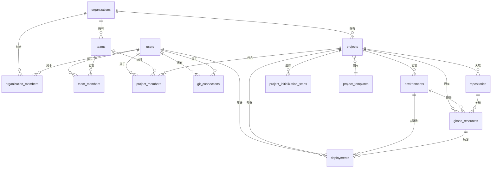

# 数据库 Schema 参考文档

**版本**: 1.0  
**日期**: 2025-12-19  
**数据库**: PostgreSQL 14+

---

## 概览

本文档描述了系统的完整数据库架构，包括所有表、字段、关系和索引。

### 表分类

**核心表**（8 个）:
- `users` - 用户
- `organizations` - 组织
- `teams` - 团队
- `team_members` - 团队成员
- `organization_members` - 组织成员
- `projects` - 项目
- `environments` - 环境
- `project_members` - 项目成员

**Git 相关表**（3 个）:
- `git_connections` - Git 连接
- `repositories` - 仓库
- `project_initialization_steps` - 项目初始化步骤

**GitOps 相关表**（2 个）:
- `gitops_resources` - GitOps 资源
- `deployments` - 部署记录

**其他表**（若干）:
- `project_templates` - 项目模板
- `pipeline_runs` - 流水线运行
- 等等...

---

## 实体关系图（ERD）



---

## 核心表详解

### users（用户表）

**用途**: 存储用户账户信息

**字段**:
| 字段名 | 类型 | 说明 |
|--------|------|------|
| id | uuid | 主键 |
| email | text | 邮箱（唯一） |
| username | text | 用户名 |
| display_name | text | 显示名称 |
| avatar_url | text | 头像 URL |
| password_hash | text | 密码哈希 |
| email_verified | boolean | 邮箱已验证 |
| status | text | 状态 |
| created_at | timestamptz | 创建时间 |
| updated_at | timestamptz | 更新时间 |

**索引**:
- `users_email_unique` - 邮箱唯一索引
- `users_username_idx` - 用户名索引

---

### organizations（组织表）

**用途**: 存储组织信息

**字段**:
| 字段名 | 类型 | 说明 |
|--------|------|------|
| id | uuid | 主键 |
| name | text | 组织名称 |
| slug | text | URL 标识 |
| description | text | 描述 |
| logo_url | text | Logo URL |
| settings | jsonb | 设置 |
| created_at | timestamptz | 创建时间 |
| updated_at | timestamptz | 更新时间 |

**索引**:
- `organizations_slug_unique` - slug 唯一索引

---

### projects（项目表）

**用途**: 存储项目基本信息和配置

**字段**:
| 字段名 | 类型 | 说明 |
|--------|------|------|
| id | uuid | 主键 |
| organization_id | uuid | 组织 ID（外键） |
| name | text | 项目名称 |
| slug | text | URL 标识 |
| description | text | 描述 |
| logo_url | text | Logo URL |
| visibility | text | 可见性 |
| status | text | 状态 |
| initialization_job_id | varchar | 初始化任务 ID |
| initialization_started_at | timestamptz | 初始化开始时间 |
| initialization_completed_at | timestamptz | 初始化完成时间 |
| initialization_error | text | 初始化错误 |
| template_id | uuid | 模板 ID（外键） |
| template_config | jsonb | 模板配置 |
| health_score | integer | 健康度评分 |
| health_status | text | 健康状态 |
| last_health_check | timestamptz | 最后健康检查 |
| config | jsonb | 项目配置 |
| deleted_at | timestamptz | 删除时间 |
| created_at | timestamptz | 创建时间 |
| updated_at | timestamptz | 更新时间 |

**索引**:
- `projects_org_slug_unique` - (organization_id, slug) 唯一索引
- `projects_organization_id_idx` - 组织 ID 索引
- `projects_status_idx` - 状态索引
- `projects_template_idx` - 模板 ID 索引

**关系**:
- `organization_id` → `organizations.id` (cascade)
- `template_id` → `project_templates.id` (set null)

---

### environments（环境表）

**用途**: 存储项目环境配置

**字段**:
| 字段名 | 类型 | 说明 |
|--------|------|------|
| id | uuid | 主键 |
| project_id | uuid | 项目 ID（外键） |
| name | text | 环境名称 |
| type | text | 环境类型 |
| description | text | 描述 |
| status | text | 状态 |
| health_check_url | text | 健康检查 URL |
| config | jsonb | 环境配置 |
| permissions | jsonb | 权限配置 |
| deleted_at | timestamptz | 删除时间 |
| created_at | timestamptz | 创建时间 |
| updated_at | timestamptz | 更新时间 |

**索引**:
- `envs_project_name_unique` - (project_id, name) 唯一索引
- `envs_type_idx` - 类型索引

**关系**:
- `project_id` → `projects.id` (cascade)

**注意**: GitOps 配置通过 `gitops_resources` 表关联，不在此表存储

---

### git_connections（Git 连接表）

**用途**: 统一管理用户的 Git 账户连接（OAuth 和集成）

**字段**:
| 字段名 | 类型 | 说明 |
|--------|------|------|
| id | uuid | 主键 |
| user_id | uuid | 用户 ID（外键） |
| provider | text | Git 提供商 |
| provider_account_id | text | 提供商账户 ID |
| username | text | 用户名 |
| email | text | 邮箱 |
| avatar_url | text | 头像 URL |
| access_token | text | 访问令牌（加密） |
| refresh_token | text | 刷新令牌（加密） |
| token_expires_at | timestamptz | 令牌过期时间 |
| scopes | text[] | 权限范围 |
| purpose | text | 用途 |
| status | text | 状态 |
| server_url | text | 服务器 URL |
| server_type | text | 服务器类型 |
| last_sync_at | timestamptz | 最后同步时间 |
| created_at | timestamptz | 创建时间 |
| updated_at | timestamptz | 更新时间 |

**索引**:
- `git_connections_user_provider_unique` - (user_id, provider, server_url) 唯一索引
- `git_connections_user_id_idx` - 用户 ID 索引
- `git_connections_provider_idx` - 提供商索引

**关系**:
- `user_id` → `users.id` (cascade)

---

### repositories（仓库表）

**用途**: 存储项目关联的 Git 仓库信息

**字段**:
| 字段名 | 类型 | 说明 |
|--------|------|------|
| id | uuid | 主键 |
| project_id | uuid | 项目 ID（外键） |
| provider | text | Git 提供商 |
| full_name | text | 完整名称 |
| clone_url | text | 克隆 URL |
| default_branch | text | 默认分支 |
| last_sync_at | timestamptz | 最后同步时间 |
| sync_status | text | 同步状态 |
| config | jsonb | 仓库配置 |
| created_at | timestamptz | 创建时间 |
| updated_at | timestamptz | 更新时间 |

**索引**:
- `repositories_project_id_idx` - 项目 ID 索引
- `repositories_provider_full_name_idx` - (provider, full_name) 索引

**关系**:
- `project_id` → `projects.id` (cascade)

**注意**: Flux 状态已移至 `gitops_resources` 表

---

### project_initialization_steps（项目初始化步骤表）

**用途**: 追踪项目初始化过程中每个步骤的详细状态

**字段**:
| 字段名 | 类型 | 说明 |
|--------|------|------|
| id | uuid | 主键 |
| project_id | uuid | 项目 ID（外键） |
| step | varchar(100) | 步骤名称 |
| status | varchar(50) | 步骤状态 |
| progress | varchar(10) | 进度百分比 |
| error | text | 错误消息 |
| error_stack | text | 错误堆栈 |
| started_at | timestamptz | 开始时间 |
| completed_at | timestamptz | 完成时间 |
| created_at | timestamptz | 创建时间 |
| updated_at | timestamptz | 更新时间 |

**索引**:
- `project_initialization_steps_project_id_idx` - 项目 ID 索引
- `project_initialization_steps_project_step_idx` - (project_id, step) 索引
- `project_initialization_steps_status_idx` - 状态索引

**关系**:
- `project_id` → `projects.id` (cascade)

**步骤类型**:
- `create_repository` - 创建 Git 仓库
- `push_template` - 推送模板代码
- `create_database_records` - 创建数据库记录
- `setup_gitops` - 配置 GitOps
- `finalize` - 完成初始化

---

### gitops_resources（GitOps 资源表）

**用途**: 存储 Flux CD 的 GitOps 资源配置和状态

**字段**:
| 字段名 | 类型 | 说明 |
|--------|------|------|
| id | uuid | 主键 |
| project_id | uuid | 项目 ID（外键） |
| environment_id | uuid | 环境 ID（外键） |
| repository_id | uuid | 仓库 ID（外键） |
| type | text | 资源类型 |
| name | text | 资源名称 |
| namespace | text | K8s 命名空间 |
| config | jsonb | 资源配置 |
| status | text | 状态 |
| status_reason | text | 状态原因 |
| status_message | text | 状态消息 |
| last_applied_revision | text | 最后应用版本 |
| last_attempted_revision | text | 最后尝试版本 |
| error_message | text | 错误消息 |
| last_status_update_at | timestamptz | 最后状态更新时间 |
| last_applied_at | timestamptz | 最后应用时间 |
| last_attempted_at | timestamptz | 最后尝试时间 |
| deleted_at | timestamptz | 删除时间 |
| created_at | timestamptz | 创建时间 |
| updated_at | timestamptz | 更新时间 |

**索引**:
- `gitops_resources_project_env_name_unique` - (project_id, environment_id, name) 唯一索引
- `gitops_resources_project_idx` - 项目 ID 索引
- `gitops_resources_env_idx` - 环境 ID 索引
- `gitops_resources_repo_idx` - 仓库 ID 索引
- `gitops_resources_status_idx` - 状态索引

**关系**:
- `project_id` → `projects.id` (cascade)
- `environment_id` → `environments.id` (cascade)
- `repository_id` → `repositories.id` (cascade)

**资源类型**:
- `kustomization` - Kustomization 资源
- `helm` - Helm Release 资源

---

### deployments（部署记录表）

**用途**: 记录所有部署历史

**字段**:
| 字段名 | 类型 | 说明 |
|--------|------|------|
| id | uuid | 主键 |
| project_id | uuid | 项目 ID（外键） |
| environment_id | uuid | 环境 ID（外键） |
| pipeline_run_id | uuid | 流水线运行 ID（外键） |
| version | text | 版本号 |
| commit_hash | text | Commit SHA（完整） |
| commit_message | text | Commit 消息 |
| branch | text | 分支名称 |
| strategy | text | 部署策略 |
| status | text | 部署状态 |
| started_at | timestamptz | 开始时间 |
| finished_at | timestamptz | 完成时间 |
| deployed_by | uuid | 部署人（外键） |
| gitops_resource_id | uuid | GitOps 资源 ID（外键） |
| deployment_method | text | 部署方法 |
| deleted_at | timestamptz | 删除时间 |
| created_at | timestamptz | 创建时间 |

**索引**:
- `deployments_project_idx` - 项目 ID 索引
- `deployments_env_idx` - 环境 ID 索引
- `deployments_status_idx` - 状态索引

**关系**:
- `project_id` → `projects.id`
- `environment_id` → `environments.id`
- `deployed_by` → `users.id`
- `gitops_resource_id` → `gitops_resources.id`

**部署方法**:
- `manual` - 手动部署
- `gitops` - GitOps 自动部署

**注意**: `commit_hash` 存储完整 SHA，显示时截取前 7 位

---

## 数据流图

### 项目创建流程

```
1. 创建 project 记录
2. 创建 environments 记录（development, staging, production）
3. 创建 repository 记录
4. 创建 gitops_resources 记录（每个环境一个）
5. 记录 project_initialization_steps（每个步骤）
```

### 部署流程

```
1. 用户触发部署 或 Git 提交触发
2. 创建 deployment 记录
3. 更新 gitops_resources 状态
4. Flux CD 同步变更
5. 更新 deployment 状态
```

---

## 查询示例

### 获取项目完整信息

```typescript
const project = await db.query.projects.findFirst({
  where: eq(projects.id, projectId),
  with: {
    environments: {
      with: {
        gitopsResources: true,
      },
    },
    repositories: true,
    initializationSteps: {
      orderBy: desc(projectInitializationSteps.createdAt),
    },
  },
})
```

### 获取环境的 GitOps 状态

```typescript
const gitopsResources = await db.query.gitopsResources.findMany({
  where: eq(gitopsResources.environmentId, environmentId),
})
```

### 获取部署历史

```typescript
const deployments = await db.query.deployments.findMany({
  where: and(
    eq(deployments.projectId, projectId),
    isNull(deployments.deletedAt)
  ),
  orderBy: desc(deployments.createdAt),
  limit: 20,
})
```

---

## 维护建议

### 定期任务

1. **清理软删除数据**: 定期清理超过 30 天的软删除记录
2. **更新健康度**: 定期更新项目健康度评分
3. **同步 Git 状态**: 定期同步 Git 仓库状态
4. **清理过期令牌**: 清理过期的 access_token

### 性能监控

1. **慢查询**: 监控执行时间超过 1 秒的查询
2. **索引使用**: 检查索引使用情况
3. **表大小**: 监控表大小增长
4. **连接数**: 监控数据库连接数

---

**维护者**: 开发团队  
**最后更新**: 2025-12-19
