# 数据库 Schema 关系图

## 概述

本文档描述了 AI DevOps Platform 的完整数据库架构，包括所有表的关系、职责和设计原则。

**冗余分析结论**: ✅ **无冗余** - 所有 schema 都有明确且不重叠的职责。

## 核心设计原则

1. **单一职责**: 每个表只负责一个明确的业务领域
2. **关注点分离**: 认证、授权、业务逻辑、审计分别独立
3. **可扩展性**: 使用 JSONB 存储灵活配置，支持未来扩展
4. **软删除**: 关键表支持 `deletedAt` 字段，保留历史数据
5. **审计友好**: 所有表包含 `createdAt` 和 `updatedAt` 时间戳

## Schema 分类

### 1. 基础层 (Foundation Layer)

#### 用户和认证
- **users** - 用户基础信息
- **oauth_accounts** - OAuth 认证账号（登录 + 项目认证）
- **user_git_accounts** - 用户的 Git 平台连接（新增，用于 Git 平台集成）

#### 组织和团队
- **organizations** - 组织
- **organization_members** - 组织成员关系
- **teams** - 团队
- **team_members** - 团队成员关系

### 2. 业务层 (Business Layer)

#### 项目管理
- **projects** - 项目
- **project_members** - 项目成员关系
- **team_projects** - 团队-项目关系
- **project_templates** - 项目模板
- **project_events** - 项目事件日志

#### 环境和部署
- **environments** - 环境（dev/staging/prod）
- **deployments** - 部署记录
- **deployment_approvals** - 部署审批

#### CI/CD
- **pipelines** - CI/CD 流水线
- **pipeline_runs** - 流水线执行记录

#### GitOps
- **repositories** - Git 仓库
- **project_git_auth** - 项目 Git 认证配置
- **gitops_resources** - GitOps 资源（Kustomization/Helm）
- **git_sync_logs** - Git 同步日志（新增，用于审计）

### 3. 扩展层 (Extensions Layer)

#### AI 功能
- **ai_assistants** - AI 助手配置

#### 监控和追踪
- **audit_logs** - 审计日志
- **cost_tracking** - 成本追踪
- **incidents** - 事件管理

#### 通知和安全
- **notifications** - 通知
- **security_policies** - 安全策略

## 完整关系图

```mermaid
erDiagram
    %% ========================================
    %% 基础层 - 用户和组织
    %% ========================================
    
    users ||--o{ oauth_accounts : "has"
    users ||--o{ user_git_accounts : "connects"
    users ||--o{ organization_members : "belongs to"
    users ||--o{ team_members : "belongs to"
    users ||--o{ project_members : "belongs to"
    users ||--o{ notifications : "receives"
    users ||--o{ audit_logs : "performs"
    
    organizations ||--o{ organization_members : "has"
    organizations ||--o{ teams : "contains"
    organizations ||--o{ projects : "owns"
    organizations ||--o{ project_templates : "creates"
    organizations ||--o{ ai_assistants : "configures"
    organizations ||--o{ security_policies : "defines"
    organizations ||--o{ cost_tracking : "tracks"
    organizations ||--o{ audit_logs : "logs"
    
    teams ||--o{ team_members : "has"
    teams ||--o{ team_projects : "accesses"
    
    %% ========================================
    %% 业务层 - 项目和部署
    %% ========================================
    
    projects ||--o{ project_members : "has"
    projects ||--o{ team_projects : "shared with"
    projects ||--o{ environments : "has"
    projects ||--o{ repositories : "uses"
    projects ||--o{ deployments : "deploys"
    projects ||--o{ pipelines : "runs"
    projects ||--o{ pipeline_runs : "executes"
    projects ||--o{ gitops_resources : "manages"
    projects ||--o{ project_git_auth : "authenticates"
    projects ||--o{ project_events : "logs"
    projects ||--o{ cost_tracking : "costs"
    projects ||--o{ incidents : "has"
    projects ||--o{ security_policies : "enforces"
    
    project_templates ||--o{ projects : "instantiates"
    
    environments ||--o{ deployments : "deploys to"
    environments ||--o{ gitops_resources : "configures"
    environments ||--o{ incidents : "affects"
    
    deployments ||--o{ deployment_approvals : "requires"
    
    pipelines ||--o{ pipeline_runs : "executes"
    pipeline_runs ||--o{ deployments : "triggers"
    
    %% ========================================
    %% GitOps 层
    %% ========================================
    
    repositories ||--o{ gitops_resources : "syncs"
    
    oauth_accounts ||--o{ project_git_auth : "used by"
    
    gitops_resources ||--o{ deployments : "deploys"
    
    %% ========================================
    %% 扩展层 - 监控和通知
    %% ========================================
    
    users ||--o{ deployments : "deploys"
    users ||--o{ deployment_approvals : "approves"
    users ||--o{ project_events : "triggers"
    users ||--o{ incidents : "resolves"
    
    projects }o--|| organizations : "belongs to"
    teams }o--|| organizations : "belongs to"
```



## 详细表关系说明

### 用户认证体系

```
users (用户基础信息)
  ├─→ oauth_accounts (OAuth 登录 + 项目认证)
  │     └─→ project_git_auth (项目级 Git 认证)
  │
  └─→ user_git_accounts (Git 平台集成 - 新增)
        └─→ git_sync_logs (同步日志 - 新增)
```

**职责划分**:
- `users`: 用户基础信息（email, username, preferences）
- `oauth_accounts`: OAuth 认证，支持多个 GitLab 私有服务器
- `user_git_accounts`: 用户级别的 Git 平台连接，用于自动同步项目
- `project_git_auth`: 项目级别的 Git 认证配置，支持多种认证方式

**无冗余原因**:
- `oauth_accounts` 用于登录和项目认证（通过 `project_git_auth` 引用）
- `user_git_accounts` 用于 Git 平台集成功能（自动同步用户的 GitHub/GitLab 项目）
- 两者服务于不同的业务场景，不存在重叠

### 组织架构

```
organizations (组织)
  ├─→ organization_members (组织成员)
  │     └─→ users
  │
  ├─→ teams (团队)
  │     ├─→ team_members (团队成员)
  │     │     └─→ users
  │     └─→ team_projects (团队项目)
  │           └─→ projects
  │
  └─→ projects (项目)
        └─→ project_members (项目成员)
              └─→ users
```

**三层权限模型**:
1. **组织级**: organization_members (owner/admin/member)
2. **团队级**: team_members (owner/maintainer/member)
3. **项目级**: project_members (owner/maintainer/developer/viewer)

### 项目生命周期

```
projects
  ├─→ project_templates (模板)
  ├─→ environments (环境)
  │     └─→ deployments (部署)
  │           └─→ deployment_approvals (审批)
  │
  ├─→ repositories (仓库)
  │     └─→ gitops_resources (GitOps 资源)
  │           └─→ deployments
  │
  ├─→ pipelines (流水线)
  │     └─→ pipeline_runs (执行记录)
  │           └─→ deployments
  │
  └─→ project_events (事件日志)
```

### GitOps 认证链路

```
项目部署认证流程:

project
  └─→ project_git_auth (项目认证配置)
        ├─→ oauth_accounts (OAuth 方式)
        ├─→ patToken (PAT 方式)
        ├─→ githubApp (GitHub App 方式)
        └─→ gitlabGroupToken (GitLab Group Token 方式)
              ↓
        repositories (Git 仓库)
              ↓
        gitops_resources (Flux 资源)
              ↓
        K8s Secret (认证凭证)
```

### Git 平台集成流程

```
用户 Git 平台集成:

user
  └─→ user_git_accounts (连接 GitHub/GitLab)
        ├─→ accessToken (OAuth 凭证)
        ├─→ syncStatus (同步状态)
        └─→ lastSyncAt (最后同步时间)
              ↓
        git_sync_logs (同步日志)
              ├─→ syncType (project/member/organization)
              ├─→ action (create/update/delete)
              └─→ status (pending/success/failed)
```

## 表职责详解

### 基础层表

| 表名 | 职责 | 关键字段 | 关系 |
|------|------|----------|------|
| **users** | 用户基础信息 | email, username, preferences | 1:N oauth_accounts, user_git_accounts |
| **oauth_accounts** | OAuth 认证账号 | provider, accessToken, serverUrl | N:1 users, 1:N project_git_auth |
| **user_git_accounts** | Git 平台连接 | provider, gitUserId, syncStatus | N:1 users |
| **organizations** | 组织 | name, slug, quotas | 1:N projects, teams |
| **organization_members** | 组织成员 | role, status | N:1 organizations, users |
| **teams** | 团队 | name, slug | N:1 organizations, 1:N team_members |
| **team_members** | 团队成员 | role | N:1 teams, users |

### 业务层表

| 表名 | 职责 | 关键字段 | 关系 |
|------|------|----------|------|
| **projects** | 项目 | name, status, config | N:1 organizations, 1:N environments |
| **project_members** | 项目成员 | role | N:1 projects, users |
| **team_projects** | 团队项目关系 | role | N:1 teams, projects |
| **project_templates** | 项目模板 | slug, techStack, k8sTemplates | 1:N projects |
| **environments** | 环境 | type, config, permissions | N:1 projects, 1:N deployments |
| **deployments** | 部署记录 | version, status, strategy | N:1 projects, environments |
| **deployment_approvals** | 部署审批 | status, comments | N:1 deployments, users |
| **pipelines** | CI/CD 流水线 | name, config | N:1 projects, 1:N pipeline_runs |
| **pipeline_runs** | 流水线执行 | status, duration | N:1 pipelines, projects |

### GitOps 层表

| 表名 | 职责 | 关键字段 | 关系 |
|------|------|----------|------|
| **repositories** | Git 仓库 | fullName, cloneUrl, syncStatus | N:1 projects |
| **project_git_auth** | 项目 Git 认证 | authType, oauthAccountId, patToken | N:1 projects, oauth_accounts |
| **gitops_resources** | GitOps 资源 | type, name, config, status | N:1 projects, environments, repositories |
| **git_sync_logs** | Git 同步日志 | syncType, action, status | N:1 projects, users, organizations |

### 扩展层表

| 表名 | 职责 | 关键字段 | 关系 |
|------|------|----------|------|
| **ai_assistants** | AI 助手 | type, modelConfig | N:1 organizations |
| **audit_logs** | 审计日志 | action, resourceType, metadata | N:1 users, organizations |
| **notifications** | 通知 | type, status, priority | N:1 users |
| **cost_tracking** | 成本追踪 | date, costs, currency | N:1 organizations, projects |
| **incidents** | 事件管理 | severity, status, source | N:1 projects, environments |
| **security_policies** | 安全策略 | type, rules, isEnforced | N:1 organizations, projects |
| **project_events** | 项目事件 | eventType, eventData | N:1 projects, users |

## 索引策略

### 主键索引
所有表使用 UUID 作为主键，自动创建主键索引。

### 外键索引
所有外键字段自动创建索引，优化 JOIN 查询。

### 唯一索引
- `users.email` - 用户邮箱唯一
- `organizations.slug` - 组织 slug 唯一
- `projects.organizationId + slug` - 组织内项目 slug 唯一（软删除）
- `oauth_accounts.userId + provider + serverUrl` - 用户每个服务器只能连接一次
- `user_git_accounts.userId + provider` - 用户每个平台只能连接一次

### 查询优化索引
- 状态字段: `status`, `syncStatus`, `healthStatus`
- 时间字段: `createdAt`, `deletedAt`, `lastSyncAt`
- 类型字段: `type`, `eventType`, `severity`

## JSONB 字段设计

### 优势
1. **灵活性**: 支持动态配置，无需频繁修改表结构
2. **可扩展性**: 新增配置项不需要数据库迁移
3. **类型安全**: TypeScript 类型定义保证类型安全

### 使用场景
- **配置数据**: `projects.config`, `environments.config`
- **元数据**: `oauth_accounts.metadata`, `audit_logs.metadata`
- **复杂结构**: `project_templates.k8sTemplates`, `gitops_resources.config`

### 示例

```typescript
// projects.config
{
  defaultBranch: 'main',
  enableCiCd: true,
  enableAi: true,
  quota: {
    maxEnvironments: 5,
    maxRepositories: 10,
    maxPods: 50,
    maxCpu: '4',
    maxMemory: '8Gi'
  }
}

// environments.config
{
  cloudProvider: 'aws',
  region: 'us-west-2',
  approvalRequired: true,
  minApprovals: 2,
  gitops: {
    enabled: true,
    autoSync: true,
    gitBranch: 'main',
    gitPath: 'k8s/production',
    syncInterval: '5m'
  }
}
```

## 软删除策略

### 支持软删除的表
- users
- organizations
- teams
- projects
- environments
- deployments
- gitops_resources

### 实现方式
```sql
-- 软删除
UPDATE projects SET deleted_at = NOW() WHERE id = 'xxx';

-- 查询时排除已删除
SELECT * FROM projects WHERE deleted_at IS NULL;

-- 唯一索引考虑软删除
CREATE UNIQUE INDEX projects_org_slug_unique 
ON projects(organization_id, slug) 
WHERE deleted_at IS NULL;
```

## 数据完整性

### 级联删除 (CASCADE)
- 删除组织 → 删除所有项目、团队、成员
- 删除项目 → 删除所有环境、部署、仓库
- 删除用户 → 删除所有成员关系、OAuth 账号

### 置空 (SET NULL)
- 删除用户 → 审计日志保留，用户 ID 置空
- 删除模板 → 项目保留，模板 ID 置空

### 保留 (NO ACTION)
- 部署记录永久保留，即使项目删除

## 性能优化建议

### 查询优化
1. 使用索引字段进行过滤
2. 避免 JSONB 字段的全表扫描
3. 使用分页查询大数据集
4. 合理使用 JOIN，避免 N+1 查询

### 数据归档
1. 定期归档旧的审计日志
2. 归档已完成的部署记录
3. 清理过期的通知

### 监控指标
1. 慢查询日志
2. 表大小和增长趋势
3. 索引使用率
4. JSONB 字段查询性能

## 迁移策略

### 新增表
1. 创建迁移文件
2. 定义 schema
3. 更新 index.ts 导出
4. 运行 `bun run db:push`

### 修改表结构
1. 评估影响范围
2. 创建迁移脚本
3. 测试环境验证
4. 生产环境执行

### 数据迁移
1. 备份现有数据
2. 编写迁移脚本
3. 分批执行
4. 验证数据完整性

## 安全考虑

### 敏感数据加密
- `oauth_accounts.accessToken` - 加密存储
- `user_git_accounts.accessToken` - 加密存储
- `project_git_auth.*Token` - 加密存储

### 访问控制
- 使用 Row Level Security (RLS)
- 基于角色的访问控制 (RBAC)
- 审计所有敏感操作

### 数据脱敏
- 日志中不记录敏感信息
- API 响应中过滤敏感字段
- 开发环境使用脱敏数据

## 总结

### 架构优势
1. ✅ **清晰的层次结构**: 基础层 → 业务层 → 扩展层
2. ✅ **无冗余设计**: 每个表职责明确，无重叠
3. ✅ **高度可扩展**: JSONB 字段支持灵活配置
4. ✅ **审计友好**: 完整的日志和事件追踪
5. ✅ **性能优化**: 合理的索引和查询策略

### 新增功能支持
- ✅ Git 平台集成 (`user_git_accounts`, `git_sync_logs`)
- ✅ 多种 Git 认证方式 (`project_git_auth`)
- ✅ GitOps 自动化 (`gitops_resources`, `repositories`)
- ✅ 完整的审计追踪 (`audit_logs`, `project_events`, `git_sync_logs`)

### 未来扩展方向
1. 支持更多 Git 平台（Bitbucket, Gitea）
2. 增强 AI 功能（代码分析、自动修复）
3. 多云支持（AWS, GCP, Azure）
4. 高级安全策略（零信任、合规检查）

---

**文档版本**: 1.0  
**最后更新**: 2024-12-01  
**维护者**: AI DevOps Platform Team
