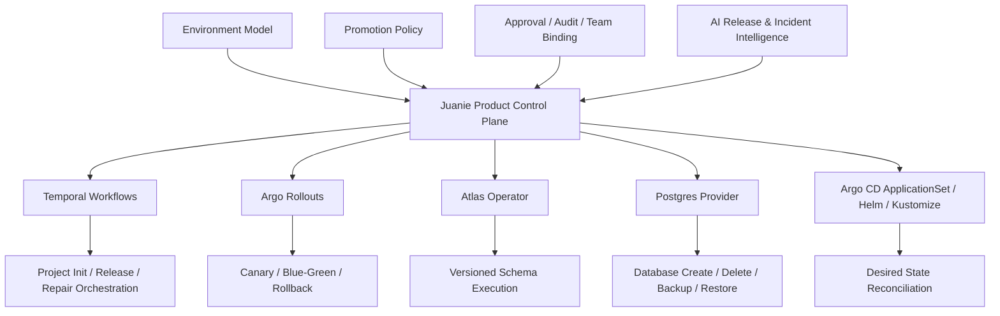

# 2026-04-20 Platform Modernization Buy Vs Build Design

## 结论

Juanie 现在有几块能力已经越过“产品控制面”的边界，进入了“自己维护基础设施执行层”的范围：

- 自己做数据库生命周期管理
- 自己做长流程编排与恢复
- 自己做 K8s 资源渲染、apply、prune
- 自己做渐进发布执行层
- 自己维护跨 Git Provider 的大段 CI 模板注入

这些能力不是不能自研，但它们都属于成熟生态已经有稳定解法的层级。继续自己扛，会把团队精力持续消耗在 operator、workflow engine、DBaaS、GitOps controller 这些通用基础设施上。

这次设计的核心判断只有一句话：

- Juanie 应继续做“决策层”和“产品控制面”
- 执行层、调和层、长流程 durability 应尽量交给成熟工具

推荐收敛后的职责边界：

### Juanie 保留自研

- 环境模型：`preview / staging / production` 与继承、提升、过期清理
- Git 事件到环境的领域语义
- promotion policy、审批、审计、权限、团队绑定
- 发布总结、风险提示、AI 辅助决策
- 用户可见的环境变量、数据库接入体验、项目级控制台

### 交给成熟工具

- 长流程 durability 与恢复：Temporal
- 渐进发布执行：Argo Rollouts
- PostgreSQL 生命周期：优先外部托管 PG API，次选 CloudNativePG
- Schema 执行控制：Atlas Operator
- CI 模板复用：GitHub reusable workflows + GitLab CI components
- K8s 声明式调和：中期评估 Argo CD ApplicationSet + Helm/Kustomize

## 当前问题

### 1. Juanie 现在同时像产品控制面和基础设施执行引擎

当前实现已经把很多基础设施层逻辑写进控制面：

- `project-init.ts` 同时做仓库校验、模板推送、命名空间创建、服务初始化、数据库供应、DNS 配置
- `postgres-ownership.ts` 在直接生成 `CREATE ROLE`、`CREATE DATABASE`、owner 迁移、清理 SQL
- `atlas-run.ts` 在 clone 仓库、构造运行时产物、创建 K8s Job、轮询执行结果
- `app-builder.ts` / `app-deployer.ts` 在自己维护 workload 渲染、apply 与 prune
- `releases/orchestration.ts` 在用 DB 状态 + 轮询等待 migration 与 deployment 完成

这类代码都不是“平台独有产品语义”，而是“平台内部为了跑起来不得不补的一层基础设施”。

### 2. 过去已经选过成熟方向，后来又回到了自建执行层

现有文档明确记录过两次方向：

- 先设计过 Flux + Helm + GitOps
- 后来又切到 TypeScript K8s resource manager

这说明问题不是“我们不知道生态里有什么”，而是当前边界还没彻底收敛，导致工具层和产品层反复穿插。

### 3. 现在最贵的不是功能缺失，而是维护面过宽

最近你们遇到的一些问题，本质上都像“自建执行层维护成本”：

- 数据库 ownership 和 SQL 细节报错
- Namespace 命名合法性要自己兜
- 预览环境链路依赖自己维护的一整套拼装逻辑
- 删除、清理、补偿、重试都容易散落在各模块里

如果继续往这条路上堆，Juanie 会越来越像一个自研的小型 PaaS 内核，而不是一个现代化的 AI DevOps 控制面。

## 现代化边界

### 应保留自研的能力

这些是 Juanie 的产品核心，不应该外包：

1. 环境与交付模型

- 什么是 preview
- 什么是长期环境
- 哪些环境可以自动接收 Git 事件
- 哪些环境只能通过 promotion 进入

2. 团队、权限、审批、审计控制面

- team integration binding
- environment access policy
- production approval policy
- audit trail

3. 面向用户的配置与可见性

- 用户在控制台查看与修改环境变量
- 用户在控制台查看数据库连接信息
- 用户在控制台理解“为什么发到这个环境”

4. AI 增强层

- 发布总结
- 风险提示
- schema repair 建议
- 环境与发布洞察

### 应优先停止继续自建的能力

这些不该再继续扩写：

1. 通用数据库供应层
2. 通用 rollout 执行层
3. 通用 workflow durability 层
4. 通用 K8s reconcile/apply/prune 层
5. 通用 CI 模板分发层

## 目标架构

这个架构的关键点不是“全平台外包”，而是分层：

- Juanie 决定该做什么
- 下层工具负责稳定地执行它

## 工具决策

### 1. 长流程编排：Temporal

#### 为什么现在要引入

Juanie 当前有大量长流程：

- 项目创建
- 预览环境初始化
- release 迁移前后编排
- schema repair
- 人工审批后的继续执行
- 失败补偿与重试

这类流程天然要求：

- 可恢复
- 可重试
- 可暂停等待人工输入
- 进程重启后继续
- 状态与日志可追踪

BullMQ 很适合做任务分发，但不适合继续承担整个 durable orchestration 语义。

#### 为什么选 Temporal，不先选别的

推荐：

- Temporal 作为工作流引擎

不优先推荐：

- 继续用 BullMQ + DB 状态机继续叠逻辑
- 用 Argo Workflows 直接替代全部业务编排

原因：

- Juanie 的流程中心是“应用级控制面语义”，不是纯 K8s batch pipeline
- Temporal 对 signal、query、human-in-the-loop、重试、补偿更自然
- 你们现有 TypeScript 代码较多，迁移心智负担低

### 2. 渐进发布：Argo Rollouts

#### 为什么现在该换

Juanie 的产品价值在于：

- 哪个环境允许 progressive release
- 谁能点 rollout
- 何时可以继续 promotion

而不是：

- 自己实现 canary / blue-green 的底层执行器
- 自己维护 traffic shift 细节
- 自己兜 rollout abort / pause / promote 细节

#### 推荐边界

Juanie 保留：

- release state machine
- rollout gate
- manual approval
- 用户可见的发布 timeline

Argo Rollouts 接管：

- canary / blue-green rollout resource
- stable / canary 切换
- rollout pause / abort / resume
- rollout 观测状态

#### 为什么优先 Argo Rollouts，不先选 Flagger

推荐：

- Argo Rollouts

备选：

- Flagger

原因：

- Juanie 已经在自己维护较强的 release 语义，Rollouts 更适合做“底层执行器”
- Flagger 更偏自动分析驱动型 controller，和 Juanie 自己的发布控制面边界会更重叠

### 3. PostgreSQL 生命周期：外部托管 PG API 优先，CloudNativePG 次选

#### 先说结论

如果你们的目标是“平台团队维护负担最小”，最佳路径是：

- 生产 / 重要环境：优先对接外部托管 PostgreSQL 提供商 API

如果你们确定要把数据库运行在集群内，最佳路径是：

- CloudNativePG

#### 为什么现在要收

当前自己维护：

- role 创建
- database 创建
- owner 转移
- schema/public 权限处理
- 清理与 drop

这会长期把团队拉进 PostgreSQL 内部细节泥潭。

#### 推荐责任边界

Juanie 保留：

- “项目想要一个数据库”的产品 API
- 数据库与环境、项目的关系
- 数据库接入信息如何展示给用户

底层供应方负责：

- 实例/集群生命周期
- HA、备份、恢复
- 用户与数据库的正确初始化

### 4. Schema 执行：Atlas Operator

既然已经选了 Atlas 作为 schema authoring/migration 工具，就不该再长期维持一套自建 Atlas Job orchestration。

推荐边界：

- Juanie 继续决定“何时允许迁移”“需要人工审批还是外部确认”
- Atlas Operator 负责真正的 schema execution 与 Kubernetes 侧声明式运行

这会明显缩小 `atlas-run.ts` 这类模块的职责范围。

### 5. CI 模板分发：GitHub reusable workflows + GitLab CI components

当前把整份 CI 文件直接注入到用户仓库，短期能跑，长期会有三个问题：

- 模板升级需要重新注入
- GitHub / GitLab 两套模板都很重
- 平台在做“模板维护系统”而不是“控制面”

推荐收敛成：

- Juanie 只向用户仓库注入一层很薄的入口文件
- 入口文件引用平台维护的 reusable workflow / CI component

这样可以把平台升级影响集中在一处，而不是散落到每个用户仓库。

### 6. K8s 资源调和：暂不立即大重构，但停止继续扩写自建 resource manager

这里我不建议现在立刻再来一次“全面切回 Flux/Argo CD”。

原因不是它们不好，而是当前更值钱的重构点在：

- 数据库生命周期
- rollout 执行层
- workflow durability

K8s reconcile 层应采取渐进策略：

1. 先冻结当前自建 resource manager 的职责范围
2. 不再继续往里塞更多数据库、发布、变量、清理语义
3. 等环境/发布模型彻底稳定后，再决定是否迁到 Argo CD ApplicationSet + Helm/Kustomize

这一步是中期重构，不该抢在前面。

### 7. Secrets：只部分引入 External Secrets Operator

ESO 适合：

- 平台自己的基础设施 secret
- 来自外部 secret provider 的系统级凭据

ESO 不适合直接替掉：

- 用户在 Juanie UI 中可见、可编辑的项目运行时环境变量

所以这里的现代化边界应是：

- 平台级 secret 用 ESO
- 租户级运行时 env 仍由 Juanie 保持 source of truth

## 推荐迁移顺序

### Phase 1: 先收敛 CI 与边界

目标：

- 停止继续扩大模板注入复杂度
- 把 GitHub / GitLab pipeline 入口做薄

动作：

- 抽出平台统一 reusable workflow / GitLab CI component
- 用户仓库只保留薄入口
- Juanie release API 与 CI 触发协议固定下来

收益：

- 最低风险
- 立刻减少后续维护面
- 为后续 release 执行层替换打基础

### Phase 2: 把 rollout 执行交给 Argo Rollouts

目标：

- Juanie 不再自己承担 progressive delivery 底层执行语义

动作：

- 为 progressive 环境引入 Rollout CRD
- Juanie release state machine 改为观察 Rollout 状态
- 人工“继续发布”改成 promote/abort Rollout

收益：

- 直接提升发布稳定性
- 最符合“现代化 DevOps 平台”的用户预期

### Phase 3: 收掉数据库生命周期自建层

目标：

- 不再自己维护 Postgres ownership / database lifecycle 细节

动作：

- 明确两条数据库产品线：
  - `managed-external`
  - `managed-in-cluster`
- `managed-external` 对接托管 PG API
- `managed-in-cluster` 基于 CloudNativePG
- Juanie 自身只保留数据库目录、接入信息与权限关系

收益：

- 去掉当前最容易出底层事故的一层

### Phase 4: 把项目初始化、release、schema repair 编排迁到 Temporal

目标：

- 让长流程从“队列 + 状态表 + sleep 轮询”升级成 durable workflow

动作：

- 先迁项目初始化
- 再迁 release orchestration
- 最后迁 schema repair / manual approval 恢复链路

收益：

- 重试、补偿、人工恢复、可观测性都会整齐很多

### Phase 5: 再评估 K8s desired state 是否回归标准 GitOps/controller

目标：

- 判断当前自建 resource manager 是否还值得保留

动作：

- 如果 Juanie 仍只需要少量同步 apply，保持瘦身后状态即可
- 如果环境与应用规模显著增长，迁到 Argo CD ApplicationSet + Helm/Kustomize

收益：

- 这时再做，边界会清晰很多，不容易再次半途折返

## 不推荐现在就做的事

### 1. 不推荐现在全面重写成 Crossplane-first

Crossplane 很强，但它更适合做统一基础设施 API 平台。Juanie 现在的核心痛点不是“缺一个更大的资源编排框架”，而是执行边界过宽。

### 2. 不推荐现在把所有流程都改成纯 GitOps 驱动

Juanie 有很多强交互控制面语义：

- 预览环境即建即看
- 手动提升
- 人工审批
- 环境到环境 promotion

这些语义不应该被“必须改 Git 仓库才能生效”绑死。

### 3. 不推荐先动环境模型之外的大规模 UI 重写

先把底层边界收住，再做 UI 统一，收益会更大。

## 风险与控制

### 风险 1：引入太多工具，平台复杂度反而上升

控制方式：

- 不一次性全上
- 只在最痛的层引入成熟工具
- 每一层都保持清晰边界

### 风险 2：控制面和执行层语义重叠

控制方式：

- Juanie 只保存产品状态与策略状态
- 执行状态通过 adapter 映射，不复制底层全部细节

### 风险 3：迁移过程中新旧链路并存导致行为漂移

控制方式：

- 环境级或项目级 feature flag
- 单条链路灰度迁移
- 先 preview / staging，再 production

## 成功标准

完成这轮现代化后，Juanie 应达到以下状态：

1. 团队不再频繁修改 Postgres ownership / lifecycle 细节
2. release progressive execution 不再由自定义逻辑直接实现
3. 长流程不再依赖大量 `sleep + poll + status table` 维持正确性
4. GitHub / GitLab CI 模板维护面显著下降
5. Juanie 的主要研发精力重新集中到环境、提升、审批、AI 洞察这些产品能力上

## 最终判断

Juanie 不是“不该自研”，而是“该把自研集中到真正值钱的地方”。

最值得保留自研的是：

- 环境语义
- promotion 语义
- 团队绑定与权限
- 审批与审计
- AI 辅助控制面

最值得尽快停止扩张自研的是：

- DB 生命周期
- rollout 执行层
- workflow durability
- CI 模板系统
- 通用 reconcile/apply/prune 层

如果只让我给一个最务实的现代化主线，我会选：

1. CI 模板做薄
2. Rollout 交给 Argo Rollouts
3. Postgres 生命周期交给托管 PG / CloudNativePG
4. 长流程迁到 Temporal
5. 最后再决定是否把 K8s reconcile 收回到标准 GitOps/controller

这样改，Juanie 会从“自己维护很多基础设施轮子”收敛成“现代化的 AI DevOps 控制面”。
