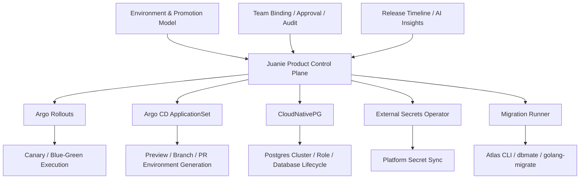

# 2026-04-20 Platform Modernization Open Source First Design

## 结论

Juanie 完全可以走一条“零订阅、开源优先、仍然现代化”的平台路线。

而且这条路线不是退而求其次，也不是“预算不够时的凑合方案”，它本身就是今天很多平台团队会认真采用的架构风格：

- 平台保留产品控制面
- 执行层交给成熟开源 controller / operator
- 只在确实值得的时候自建非常薄的一层 adapter

这次设计的核心结论是：

- Juanie 不需要为了现代化而强制订阅 SaaS
- 但也不该继续自己维护数据库生命周期、渐进发布执行器、通用 reconcile 层这类轮子
- 最合适的零订阅现代化方案，是“开源工具优先 + 保留 Juanie 领域控制面”

推荐的零订阅现代化技术栈：

### Juanie 保留自研

- 环境模型与 preview / staging / production 语义
- Git 事件到环境路由
- promotion policy、审批、审计、权限
- 团队集成绑定与控制面
- 用户可见的环境变量、数据库接入信息
- AI 辅助的发布、排障、schema 洞察

### 开源工具承担执行层

- Progressive delivery：Argo Rollouts
- Preview / 分支环境生成：Argo CD ApplicationSet
- PostgreSQL 生命周期：CloudNativePG
- 平台级 secrets：External Secrets Operator
- Schema migration 执行：Atlas CLI 基础能力或纯开源迁移器
- 长流程编排：短中期保留 BullMQ，必要时再评估 Temporal OSS

这条路线的重点不是“所有东西都自己写”，而是：

- 不订阅 SaaS
- 尽量使用成熟开源控制器
- 让 Juanie 回到产品控制面的核心职责

## 当前问题

Juanie 现在的问题，不是“没有现代工具可选”，而是“执行层职责太宽”。

当前控制面里已经吸收了很多原本应该由开源 operator / controller 承担的职责：

- 项目初始化流程同时负责仓库接入、命名空间、服务、数据库、DNS
- 发布流程同时负责部署、迁移、状态轮询、失败补偿
- 数据库生命周期在自己维护 SQL ownership 细节
- K8s 资源层在自己做渲染、apply、prune

如果继续沿着这条路走，Juanie 会越来越像一个自建 PaaS 内核。

零订阅并不意味着要继续自建。

更现代的理解应该是：

- 能用成熟开源 controller 解决的，不再自己写
- 真正差异化的产品语义继续保留在 Juanie

## 设计目标

### 功能目标

1. 保持 Juanie 的环境、预览、提升、审批、团队权限模型不变
2. 用开源控制器替代数据库生命周期、渐进发布、环境生成等执行层
3. 继续支持 GitHub / GitLab 双 Provider
4. 不强依赖第三方付费控制平面

### 非功能目标

1. 避免继续扩大自建基础设施层
2. 降低平台底层 bug 面
3. 将资源成本控制在可接受范围
4. 将运维复杂度控制在“小团队可持续维护”的水平

## 开源优先的职责边界

### Juanie 应继续保留

这些属于产品核心：

1. Environment 模型

- preview 是什么
- 哪些环境长期存在
- 哪些环境只能通过 promotion 进入

2. Delivery / Promotion 语义

- 某个 Git 事件为什么进入某个环境
- 哪些环境允许自动发布
- 哪些环境需要审批

3. Team / 权限 / 审计

- team integration binding
- production approval
- audit log

4. 用户控制台体验

- 环境变量可见
- 数据库接入信息可见
- 发布和环境状态可解释

### 不应继续自建

这些属于成熟开源生态已经覆盖得很好的层：

1. Progressive delivery 底层执行
2. PostgreSQL 集群和数据库生命周期
3. Preview / branch / PR 环境批量生成
4. 平台级 Secret 同步
5. 通用 K8s desired state reconciliation

## 目标架构

这套架构仍然是现代化的，因为：

- 控制面与执行层清晰分离
- 执行层由开源 operator / controller 承担
- 不需要为“现代化”支付 SaaS 订阅前提

## 工具决策

### 1. Progressive delivery：Argo Rollouts

#### 结论

推荐直接采用 Argo Rollouts。

#### 为什么它适合 Juanie

Juanie 的核心价值是：

- 某环境允许什么发布策略
- 谁可以继续 rollout
- rollout 完成后如何继续 promotion

而不是：

- 自己实现底层 canary / blue-green 执行器

Argo Rollouts 是开源、成熟、现代的 progressive delivery controller。它很适合做 Juanie 的“发布执行后端”。

#### Juanie 与 Rollouts 的边界

Juanie 保留：

- release state machine
- rollout gate
- manual approval
- 用户可见 timeline

Rollouts 接管：

- canary / blue-green 执行
- pause / promote / abort
- rollout 状态计算

#### 代价

- 需要安装 CRD 和 controller
- progressive 发布期间资源占用会高于普通 rolling update

但这仍然远比继续自建渐进发布执行层划算。

### 2. Preview / 分支环境生成：Argo CD ApplicationSet

#### 结论

推荐用 ApplicationSet 承担“批量生成环境实例”的执行层。

#### 为什么它适合 Juanie

Juanie 很适合继续做：

- preview 环境数据模型
- preview 环境生命周期策略
- preview 环境可见性与审计

ApplicationSet 更适合做：

- 根据 Git / PR / branch 信息生成一批 Application
- 驱动这些环境进入一致的 desired state

#### 建议边界

Juanie：

- 决定应该生成什么 preview 环境
- 维护 preview metadata
- 维护 preview 过期和清理策略

ApplicationSet：

- 真正把 preview 环境 Application 生成出来
- 保持这些环境与模板期望状态一致

#### 注意点

这不是要求 Juanie 全面变成“纯 GitOps 平台”。

更合理的方式是：

- Juanie 仍然是主控制面
- ApplicationSet 只是环境生成与 reconcile 的执行器

### 3. PostgreSQL 生命周期：CloudNativePG

#### 结论

如果坚持零订阅，CloudNativePG 是 Juanie 最合理的 PostgreSQL 现代化方案。

#### 为什么它是对的

你们当前自己在维护：

- role 创建
- database 创建
- owner 转移
- 清理 SQL

这部分继续自建，非常容易把团队拖入 PostgreSQL 内部细节。

CloudNativePG 已经提供：

- PostgreSQL 集群管理
- 备份恢复
- database / role 的声明式管理
- hibernation 等资源节省能力

#### Juanie 与 CloudNativePG 的边界

Juanie 保留：

- “我想要一个数据库”的产品语义
- 某数据库归属哪个项目、环境、服务
- 数据库接入信息如何展示给用户

CloudNativePG 负责：

- cluster lifecycle
- role / database lifecycle
- backup / recovery
- 数据库运行面

#### 注意点

CloudNativePG 很现代，但它仍然需要你们自己承担数据库运行和备份责任。

所以它比托管 PG 更省钱，但不一定更省心。

### 4. 平台级 Secrets：External Secrets Operator

#### 结论

推荐引入，但要控制边界。

#### 正确用法

适合接入：

- 平台自身 secret
- Git / OAuth / SMTP / S3 等基础设施 secret
- 来自 Vault / 1Password / 云 secret manager 的系统凭据

#### 不适合替代的部分

不建议直接拿 ESO 替掉：

- 用户在 Juanie 控制台中可见、可编辑的项目运行时环境变量

因为这些变量本身就是 Juanie 产品的一部分。

#### 边界

- 平台 secret：ESO
- 租户运行时 env：Juanie 继续做 source of truth

### 5. Schema migration：先不用强依赖付费控制平面

#### 结论

如果坚持零订阅，我不建议把 Atlas Operator 当作当前主路径。

#### 推荐顺序

短期优先：

- 继续使用 Atlas CLI 的基础能力

备选：

- `dbmate`
- `golang-migrate`

#### 为什么这么定

当前最需要解决的问题不是“缺少一个更高级的 migration 控制平面”，而是：

- 发布执行层过重
- 数据库生命周期过重
- 环境生成链路过重

先把这些收掉，schema migration 再慢慢演进，整体 ROI 更高。

### 6. 长流程编排：BullMQ 保守收敛，Temporal OSS 作为中期选项

#### 结论

零订阅路线下，我不建议立刻引入 Temporal OSS。

不是因为它不现代，而是因为：

- 它确实现代
- 但它 self-host 的运维重量也确实更大

#### 现阶段推荐策略

短期：

- 保留 BullMQ
- 但停止继续让 BullMQ + 状态表承担越来越多复杂 orchestration 语义

中期：

- 如果项目初始化、release、repair、审批恢复这些长流程继续变复杂
- 再评估引入 Temporal OSS

#### 为什么不是现在就上

在零订阅路线里，最值回票价的开源替换项不是 Temporal，而是：

1. Argo Rollouts
2. CloudNativePG
3. ApplicationSet

Temporal OSS 应该是第二阶段，而不是第一阶段。

## 推荐迁移顺序

### Phase 1: 先收掉最明显的轮子

目标：

- 立即停止继续自建 progressive delivery 与 PG lifecycle

动作：

- 引入 Argo Rollouts
- 引入 CloudNativePG
- 将 release progressive execution 接到 Rollouts
- 将 Postgres ownership / database lifecycle 迁到 CloudNativePG

收益：

- 直接砍掉两块最重的自建基础设施层

### Phase 2: 把 preview / branch 环境生成迁到 ApplicationSet

目标：

- 让 preview / branch 环境的生成与 reconcile 有标准执行器

动作：

- 为 preview 环境生成 Application 模板
- 用 Git generator / PR generator 驱动环境实例
- Juanie 继续维护 preview metadata、可见性、过期策略

收益：

- 预览环境链路更现代
- 环境生成与资源调和边界更清晰

### Phase 3: 引入 ESO 管理平台级 secret

目标：

- 把平台自己的 secret 管理从控制面业务逻辑里剥离

动作：

- OAuth / SMTP / 对外 API key / registry credentials 迁到 ESO
- 项目运行时 env 继续留在 Juanie

收益：

- 降低平台 secret 管理风险
- 不破坏用户对环境变量的控制体验

### Phase 4: 迁移 schema execution 到更轻的开源链路

目标：

- 把 schema execution 从重 orchestration 中抽出来

动作：

- 先统一到 Atlas CLI 基础命令
- 或改为 dbmate / golang-migrate
- 用 CI / Job 执行，不强依赖付费 operator

收益：

- 保持零订阅
- 降低 schema 执行层复杂度

### Phase 5: 再评估是否需要 Temporal OSS

目标：

- 仅在 BullMQ 的模型确实不再够用时，才引入更重的 durable workflow 引擎

动作：

- 统计项目初始化、release、repair、approval-resume 的复杂度与失败恢复成本
- 若确实需要，再迁最复杂的一条链路到 Temporal OSS

收益：

- 避免过早引入重型基础设施
- 保持零订阅前提下的理性演进

## 成本判断

### 现金成本

优点：

- 不依赖 SaaS 订阅
- 主体工具均为开源

代价：

- 集群、存储、备份、运维仍然是自己的成本

### 资源成本

会增加的部分：

- Rollouts controller
- Argo CD / ApplicationSet controller
- CloudNativePG operator
- ESO controller

会减少的部分：

- 大量自定义补偿逻辑和重复执行逻辑
- 自建数据库生命周期造成的额外运行态混乱与人工介入
- 自建 preview reconcile 带来的状态漂移排障

整体判断：

- 资源成本会略增
- 但不会像自托管整套 Temporal / 托管替代那样陡增

### 人力成本

这是这条路线最大的收益点。

因为最贵的问题一直不是 controller 的几十到几百 Mi 内存，而是：

- 平台团队要持续理解和维护越来越厚的执行层
- 每一个边界 bug 都要自己追到最底层

开源优先方案的核心价值，就是把这些职责还给成熟开源 controller。

## 为什么这条路线仍然算现代

“现代化”不等于“订阅越多越现代”。

真正现代的标准应该是：

1. 职责边界清楚
2. 尽量使用成熟控制器，而不是重复造轮子
3. 控制面与执行层分离
4. 系统能在有限团队规模下长期维护

按这个标准看：

- Argo Rollouts 是现代的
- CloudNativePG 是现代的
- ApplicationSet 是现代的
- ESO 是现代的
- Atlas CLI / dbmate / golang-migrate 也完全可以是现代的，只要边界清楚

所以“零订阅”并不会让架构变老，只要你不是继续自建一堆基础设施内核。

## 最终建议

如果你的原则是：

- 尽量不开订阅
- 但仍然要现代化
- 并且不想继续自己造底层轮子

那我建议 Juanie 走这条主线：

1. 用 Argo Rollouts 替掉自建 progressive delivery 执行层
2. 用 CloudNativePG 替掉自建 PostgreSQL lifecycle
3. 用 ApplicationSet 接 preview / branch 环境生成
4. 用 ESO 只管理平台级 secret
5. schema migration 先维持 CLI/Job 驱动，不强依赖付费控制面
6. BullMQ 先收敛使用边界，Temporal OSS 暂不第一时间引入

这条路线是开源的、现代的、能落地的，而且最重要的是：

- 它不会逼着 Juanie 为了零订阅继续自己维护一堆不该维护的轮子
