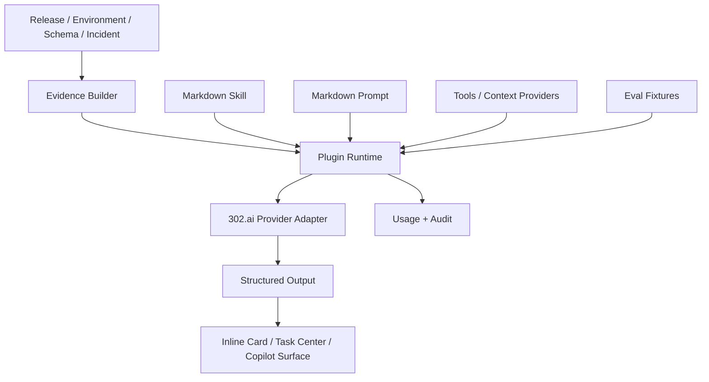

# AI 架构

## 30 秒版本

Juanie AI 架构分成五层：

1. Provider/model policy：当前通过 302.ai 适配多模型。
2. Prompt/skill assets：prompt 和 skill 用 markdown 做可读、可审查、可版本化真源。
3. Plugin runtime：每个能力有 manifest、scope、权限、surface 和 structured output。
4. Evidence/context：从 release、environment、schema、incident 等平台事实构建上下文。
5. Eval/usage/audit：用 fixtures 防回归，用 usage 记录追踪模型、prompt、token、结果和失败。

## 当前能力图

## 关键模块

| 层 | 当前入口 | 面试讲法 |
| --- | --- | --- |
| 配置 | `src/lib/ai/config.ts` | 运行时通过环境变量控制 provider、model 和开关，不把模型写死在业务代码里 |
| Provider | `src/lib/ai/provider/` | 适配 302.ai，未来可以替换 provider 而不重写 plugin |
| Prompt | `src/lib/ai/prompts/definitions/` | prompt 是 markdown 资产，有 key/version/skillId |
| Skill | `src/lib/ai/skills/definitions/` | skill 描述责任、scope、工具、输出约束 |
| Plugin | `src/lib/ai/plugins/` | plugin 是平台能力单元，不是一个 prompt |
| Runtime | `src/lib/ai/runtime/` | 负责 scope、运行、结构化输出、失败降级、usage |
| Evidence | `src/lib/ai/evidence/` | 把平台事实变成模型上下文 |
| Tasks | `src/lib/ai/tasks/` | 把 AI 建议转成可执行任务中心项 |
| Evals | `src/lib/ai/evals/` | 用 fixtures 检查输出质量和 schema |

## 内建插件

当前内建插件收敛在五个高价值场景：

| 插件 | 价值 |
| --- | --- |
| `environment-summary` | 用自然语言解释环境当前状态、风险和下一步 |
| `release-intelligence` | 总结发布计划、变更、阻塞和行动建议 |
| `incident-intelligence` | 面向故障排查，把日志/状态/事件压缩成诊断 |
| `migration-review` | 解释数据库变更和迁移风险 |
| `envvar-risk` | 分析环境变量变更风险，避免配置误伤 |

这个选择很重要：Juanie 没有先做十几个炫技插件，而是围绕发布主链路选最常用、最痛的五个点。

## Prompt / Skill / Plugin 为什么要分开

如果 AI 只是页面里的一段 prompt，会有几个问题：

- 产品和工程很难审查提示词。
- prompt 修改无法和 skill 能力边界绑定。
- UI 不知道这个 AI 能力能读哪些数据、能不能写、出现在哪个 surface。
- 评测和审计很难统一。

Juanie 拆成三层：

| 概念 | 负责什么 |
| --- | --- |
| Prompt | 模型行为和输出格式指令 |
| Skill | 任务能力、scope、工具、输出 schema |
| Plugin | 平台能力入口、manifest、权限、surface、审计 |

这样 provider 可以换，prompt 可以审，plugin 可以治理，UI 可以从 manifest 派生入口。

## 结构化输出

AI 输出不应该只是一段散文。Juanie 的工作流会落到 Zod schema 和 typed output 上，例如：

- release plan
- environment summary
- envvar risk
- migration review
- incident analysis

结构化输出带来三件事：

1. UI 可以稳定渲染，不用解析自然语言。
2. 任务中心可以把建议变成 action。
3. eval 可以判断模型输出是否仍符合契约。

## 失败与降级

AI 平台必须假设模型可能失败：

- API key 未配置。
- provider 超时。
- 输出不符合 schema。
- 上下文不足。
- 权限不足。

合理做法不是让页面崩，而是：

- 返回明确 degraded reason。
- 保留人工路径。
- 不阻塞确定性主链路。
- 记录失败 usage，便于排查模型和 prompt 问题。

## 面试深挖点

**为什么 302.ai？**

当前实现选择 302.ai 作为 provider adapter，优势是能通过统一 OpenAI-compatible 接口接入多模型。
面试里不要把产品说成某个模型绑定，而要说“Juanie 的 AI 架构是 provider-adapter 化的，当前生产配置通过
302.ai 管理模型入口”。

**如何保证 AI 可治理？**

通过 manifest scope、permission、prompt version、skill id、tool trace、usage record 和 eval fixtures。
这比在页面里直接 `fetch(model)` 更接近生产平台。

**如何防止 AI 幻觉？**

第一，输入来自平台 evidence builder，而不是任意用户长文本。第二，输出必须结构化。第三，关键动作不由 AI 直接执行。
第四，eval fixtures 覆盖典型场景。第五，usage 和审计让错误可以复盘。

## 代码入口

| 主题 | 文件 |
| --- | --- |
| 配置 | `src/lib/ai/config.ts` |
| Provider | `src/lib/ai/provider/providers/provider-302.ts` |
| Model policy | `src/lib/ai/core/model-policy.ts` |
| Structured generation | `src/lib/ai/core/generate-structured.ts` |
| Plugin manifest | `src/lib/ai/plugins/manifest.ts`, `src/lib/ai/plugins/manifest-schema.ts` |
| Built-ins | `src/lib/ai/plugins/builtins.ts` |
| Runtime usage | `src/lib/ai/runtime/usage-service.ts` |
| Eval runner | `src/lib/ai/evals/runner.ts` |
