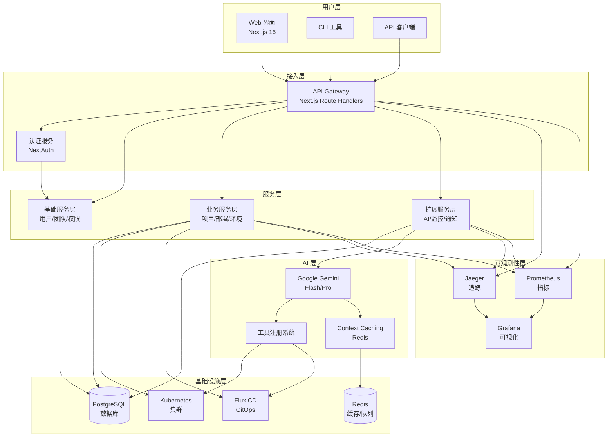
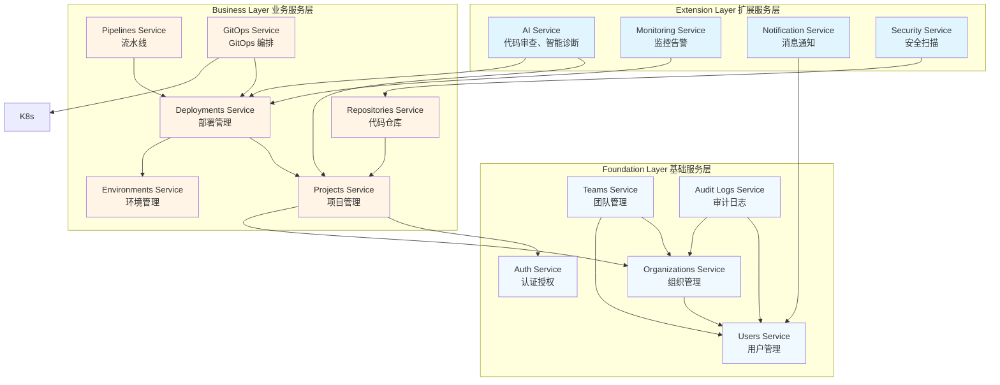
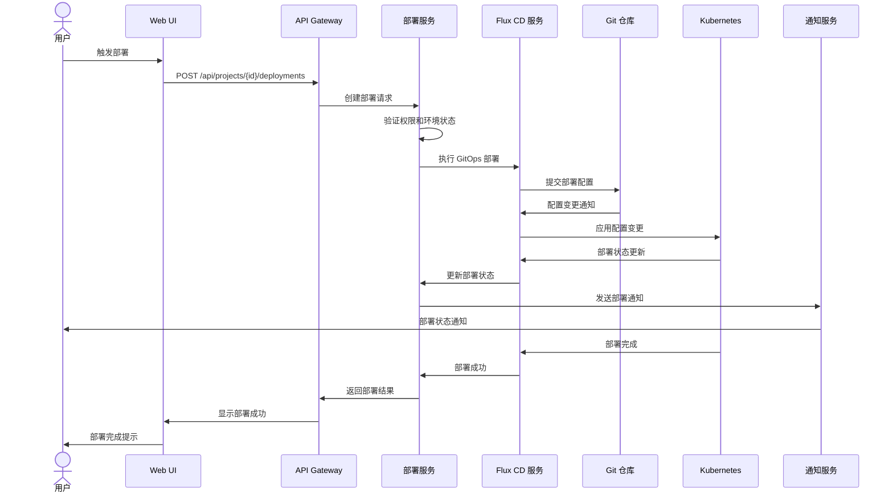
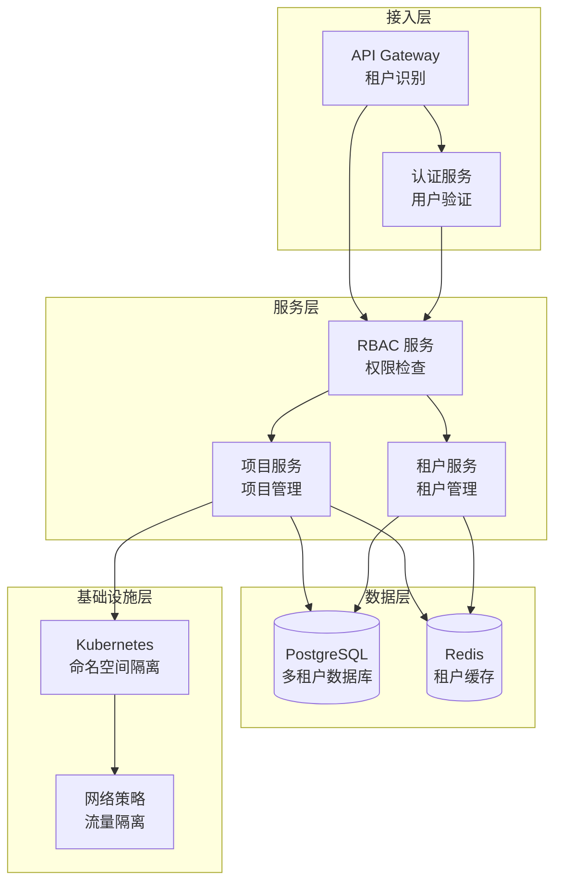
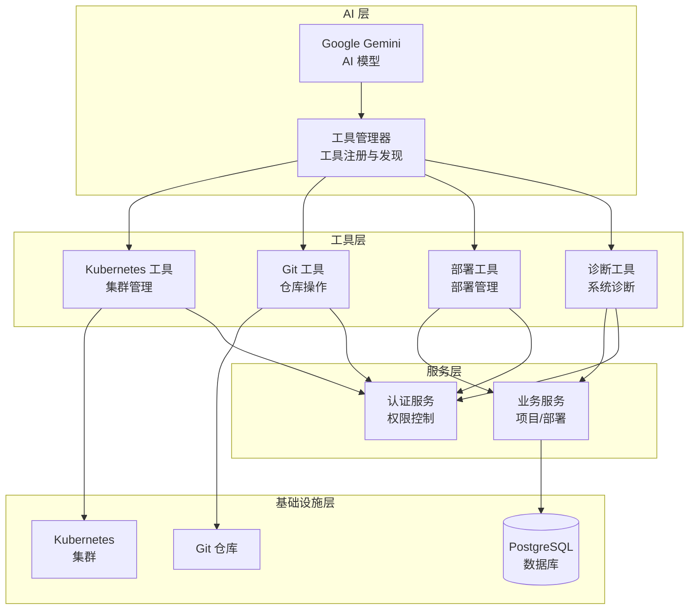
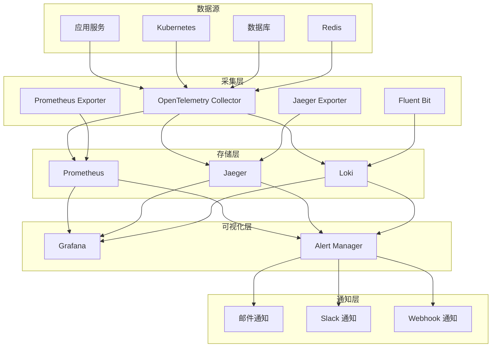

# 系统设计题 - Juanie 项目

基于 Juanie 项目的系统设计题集合，涵盖 AI 驱动的 DevOps 平台架构、三层服务架构、GitOps 部署流程等多个领域。

---

## 架构设计

### AI 驱动的 DevOps 平台架构
**题目**：设计一个 AI 驱动的 DevOps 平台，支持多团队协作、项目管理、GitOps 部署和 Kubernetes 资源管理。

**要求**：
- 高可用性
- 可扩展性
- 安全性
- 可观测性
- AI 能力集成

**参考架构**：

**关键点**：
1. **分层架构**：清晰的职责分离，便于维护和扩展
2. **AI 集成**：Gemini-First 架构，Tool Calling 能力
3. **GitOps**：Flux CD 实现声明式部署
4. **可观测性**：完整的监控、追踪和日志系统
5. **安全**：认证授权、多租户隔离、审计日志

---

### 三层服务架构设计
**题目**：设计一个三层服务架构（Foundation/Business/Extension），支持 DevOps 平台的核心功能。

**要求**：
- 职责分离
- 依赖管理
- 可扩展性
- 可维护性

**参考架构**：

**关键点**：
1. **依赖方向**：Extension → Business → Foundation（单向依赖）
2. **职责明确**：
   - Foundation：基础服务，无外部依赖
   - Business：核心业务逻辑
   - Extension：扩展功能，依赖业务服务
3. **服务通信**：使用 tRPC 实现类型安全的服务间通信
4. **数据访问**：统一通过 Drizzle ORM 访问数据库

---

### GitOps 部署流程设计
**题目**：设计一个 GitOps 部署流程，支持多环境部署、自动同步和回滚机制。

**要求**：
- 声明式配置
- 自动同步
- 多环境支持
- 回滚机制
- 审计追踪

**参考流程**：

**关键点**：
1. **声明式配置**：所有部署配置存储在 Git 仓库中
2. **自动同步**：Flux CD 自动检测配置变更并应用
3. **多环境**：通过不同分支或目录管理多环境配置
4. **回滚**：通过 Git 版本控制实现快速回滚
5. **审计**：所有部署操作都有完整的审计日志

---

### 多租户隔离系统设计
**题目**：设计一个多租户隔离系统，支持不同团队和项目的数据隔离和权限控制。

**要求**：
- 数据隔离
- 权限控制
- 资源隔离
- 性能
- 可扩展性

**参考架构**：

**关键点**：
1. **数据隔离**：数据库级别通过 tenant_id 字段隔离
2. **权限控制**：基于 RBAC 的细粒度权限系统
3. **资源隔离**：Kubernetes 命名空间隔离
4. **网络隔离**：网络策略控制租户间流量
5. **缓存**：租户级缓存提升性能

---

### AI 工具调用系统设计
**题目**：设计一个 AI 工具调用系统，支持 AI 模型通过工具与外部系统交互。

**要求**：
- 工具注册与发现
- 输入输出验证
- 权限控制
- 错误处理
- 性能优化

**参考架构**：

**关键点**：
1. **工具注册**：统一的工具注册系统，支持动态添加工具
2. **权限控制**：工具调用前的权限检查
3. **输入验证**：工具输入的类型安全验证
4. **错误处理**：工具调用失败的优雅处理
5. **缓存**：工具结果缓存提升性能

---

## 技术选型

### 数据库选型
**题目**：为 Juanie 平台选择合适的数据库方案，考虑性能、可扩展性和功能需求。

**选项**：
- PostgreSQL
- MySQL
- MongoDB
- CockroachDB

**评估**：
| 因素 | PostgreSQL | MySQL | MongoDB | CockroachDB |
|------|------------|-------|---------|-------------|
| **性能** | 优异 | 良好 | 良好 | 优异（分布式） |
| **可扩展性** | 良好（垂直） | 良好（垂直） | 优异（水平） | 优异（水平） |
| **功能** | 丰富（JSONB、全文搜索） | 基础 | 文档模型 | 分布式 SQL |
| **生态** | 成熟 | 成熟 | 成熟 | 成长中 |
| **成本** | 开源免费 | 开源免费 | 开源免费 | 开源免费 |
| **适用场景** | 关系数据、复杂查询 | 关系数据、简单查询 | 非结构化数据 | 全球分布式 |

**推荐**：PostgreSQL
- 丰富的功能满足 DevOps 平台需求
- 强大的事务支持和数据一致性
- JSONB 支持存储半结构化数据
- 成熟的生态系统和工具

### 缓存选型
**题目**：为 Juanie 平台选择合适的缓存方案，考虑性能、可靠性和功能需求。

**选项**：
- Redis
- Memcached
- Dragonfly
- Hazelcast

**评估**：
| 因素 | Redis | Memcached | Dragonfly | Hazelcast |
|------|-------|-----------|-----------|-----------|
| **性能** | 优异 | 良好 | 优异（比 Redis 快） | 良好 |
| **功能** | 丰富（持久化、发布订阅） | 基础 | 兼容 Redis API | 分布式数据结构 |
| **可靠性** | 良好（持久化） | 低（无持久化） | 良好 | 优异 |
| **可扩展性** | 良好（集群） | 良好（集群） | 良好 | 优异 |
| **生态** | 成熟 | 成熟 | 成长中 | 成长中 |

**推荐**：Redis 或 Dragonfly
- Redis：成熟的生态，丰富的功能
- Dragonfly：更高的性能，兼容 Redis API

### 容器编排选型
**题目**：为 Juanie 平台选择合适的容器编排方案，考虑性能、资源占用和功能需求。

**选项**：
- Kubernetes
- K3s
- ECS
- Docker Swarm

**评估**：
| 因素 | Kubernetes | K3s | ECS | Docker Swarm |
|------|------------|-----|-----|--------------|
| **功能** | 丰富 | 核心功能完整 | 基础 | 基础 |
| **资源占用** | 高 | 低（轻量级） | 中 | 低 |
| **可扩展性** | 优异 | 优异 | 良好 | 良好 |
| **生态** | 成熟 | 成长中 | 成熟（AWS） | 成熟 |
| **适用场景** | 大型集群 | 边缘计算、小型集群 | AWS 环境 | 简单部署 |

**推荐**：K3s
- 轻量级，资源占用小
- 完整的 Kubernetes 核心功能
- 适合边缘计算和小型部署
- 易于安装和管理

---

## 性能优化

### 数据库性能优化
**题目**：优化 Juanie 平台的数据库性能，考虑高并发场景下的查询效率。

**优化策略**：
1. **索引设计**：
   - 为频繁查询的字段创建索引
   - 复合索引优化多条件查询
   - 避免过度索引

2. **查询优化**：
   - 使用 Drizzle ORM 的高效查询
   - 避免 SELECT *
   - 合理使用 JOIN
   - 分页查询优化

3. **连接池管理**：
   - 使用连接池减少连接开销
   - 合理设置连接池大小
   - 连接超时和重试机制

4. **缓存策略**：
   - Redis 缓存热点数据
   - 缓存查询结果
   - 缓存失效策略

5. **架构优化**：
   - 读写分离
   - 数据分区
   - 微服务拆分

### API 性能优化
**题目**：优化 Juanie 平台的 API 性能，提升响应速度和并发处理能力。

**优化策略**：
1. **缓存**：
   - API 响应缓存
   - 中间件缓存
   - CDN 缓存静态资源

2. **并发处理**：
   - 异步处理非关键路径
   - 合理使用线程池
   - 避免阻塞操作

3. **序列化优化**：
   - 使用高效的序列化格式
   - 避免过度序列化
   - 增量序列化

4. **网络优化**：
   - HTTP/2 或 HTTP/3
   - 压缩响应数据
   - 减少请求数量

5. **代码优化**：
   - 减少中间件层级
   - 优化路由处理
   - 避免重复计算

### AI 系统性能优化
**题目**：优化 Juanie 平台的 AI 系统性能，降低成本并提升响应速度。

**优化策略**：
1. **Context Caching**：
   - 使用 Redis 缓存上下文
   - 合理设置缓存过期时间
   - 缓存键优化

2. **模型选择**：
   - 智能路由（Flash 用于简单查询，Pro 用于复杂推理）
   - 根据任务类型选择合适的模型

3. **请求优化**：
   - 批量处理请求
   - 减少不必要的请求
   - 优化 Prompt 长度

4. **异步处理**：
   - 异步执行 AI 任务
   - 流式响应提升用户体验
   - 后台处理复杂任务

5. **错误处理**：
   - 重试机制
   - 降级策略
   - 超时处理

---

## 安全设计

### 认证与授权系统设计
**题目**：设计 Juanie 平台的认证与授权系统，确保安全访问控制。

**设计要点**：
1. **认证**：
   - OAuth 2.0 / OpenID Connect
   - 多因素认证
   - 会话管理
   - 令牌过期和刷新

2. **授权**：
   - RBAC（基于角色的访问控制）
   - 细粒度权限
   - 权限继承
   - 权限检查中间件

3. **安全措施**：
   - 密码加密
   - 令牌签名
   - 防止 CSRF 攻击
   - 防止 XSS 攻击
   - 速率限制

4. **审计**：
   - 登录审计
   - 操作审计
   - 权限变更审计
   - 异常行为检测

### 多租户安全隔离
**题目**：设计 Juanie 平台的多租户安全隔离方案，防止租户间数据泄露。

**设计要点**：
1. **数据隔离**：
   - 数据库级别隔离（tenant_id 字段）
   - 应用级别隔离（租户过滤器）
   - 存储隔离

2. **网络隔离**：
   - Kubernetes 网络策略
   - 命名空间隔离
   - 服务网格

3. **资源隔离**：
   - 资源配额
   - 限制 CPU/内存使用
   - 限制网络带宽

4. **安全监控**：
   - 租户间访问监控
   - 异常行为检测
   - 安全告警

5. **合规性**：
   - 数据加密
   - 数据备份
   - 数据删除
   - 合规审计

---

## 可观测性设计

### 完整可观测性系统设计
**题目**：设计 Juanie 平台的可观测性系统，实现监控、追踪和日志的统一管理。

**设计要点**：
1. **监控（Metrics）**：
   - 系统指标（CPU、内存、磁盘）
   - 应用指标（QPS、响应时间、错误率）
   - 业务指标（部署次数、项目数）
   - 告警规则

2. **追踪（Tracing）**：
   - 分布式追踪
   - 服务依赖图
   - 性能瓶颈分析
   - 错误追踪

3. **日志（Logging）**：
   - 应用日志
   - 系统日志
   - 审计日志
   - 日志聚合和分析

4. **可视化**：
   - 仪表盘
   - 报表
   - 实时监控
   - 历史数据分析

5. **集成**：
   - OpenTelemetry 集成
   - 第三方服务集成
   - 告警通知集成

**参考架构**：

**关键点**：
1. **统一采集**：使用 OpenTelemetry 统一采集监控数据
2. **分离存储**：不同类型的数据使用专门的存储系统
3. **统一可视化**：Grafana 作为统一的可视化平台
4. **智能告警**：基于阈值和异常检测的告警系统
5. **可扩展性**：支持水平扩展和集成第三方服务

---

## 总结

系统设计是 Juanie 项目的核心竞争力之一，通过合理的架构设计、技术选型和性能优化，可以构建一个高可用、可扩展、安全可靠的 AI 驱动 DevOps 平台。

关键设计原则：
1. **分层架构**：清晰的职责分离，便于维护和扩展
2. **模块化**：功能模块化，支持独立部署和扩展
3. **可观测性**：完整的监控、追踪和日志系统
4. **安全性**：认证授权、多租户隔离、审计日志
5. **性能优化**：缓存策略、数据库优化、异步处理
6. **可扩展性**：水平扩展、服务拆分、容器化

通过本系统设计题集，希望能够帮助候选人准备技术面试，展示系统设计能力和对 Juanie 项目的理解。
