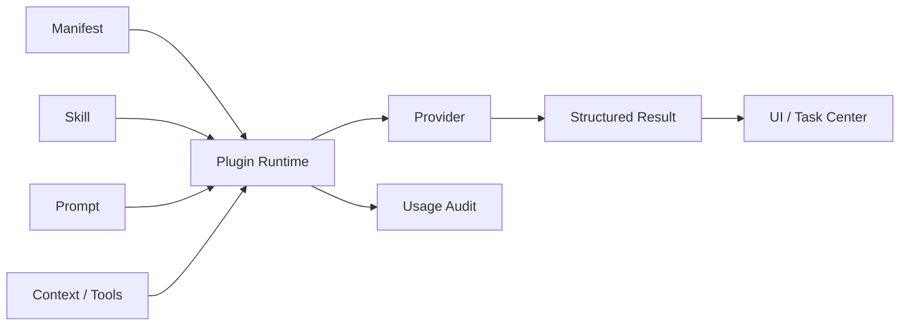

# 技术路线：AI 技术深挖

## 30 秒版本

Juanie AI 的技术关键不是调用模型，而是把模型调用产品化、工程化、可治理化：

- provider adapter 管模型入口。
- prompt/skill markdown 资产化。
- plugin manifest 管 scope、权限和 surface。
- evidence builder 管上下文。
- structured output 管 UI 和任务。
- eval fixtures 管质量回归。
- usage/audit 管成本和追踪。

## Provider 与模型策略

当前配置入口在 `src/lib/ai/config.ts`：

- `AI_ENABLED`
- `AI_302_API_KEY`
- `AI_302_BASE_URL`
- `AI_MODEL`
- `AI_MODEL_PRO`
- `AI_MODEL_TOOL`
- `AI_DEFAULT_PLAN`

面试讲法：

> 我们不把业务逻辑绑定到某个具体模型。当前通过 302.ai provider adapter 接入模型，业务侧只关心能力、prompt、
> skill、schema 和输出契约。

## Prompt 和 Skill 资产化

Prompt 在：

- `src/lib/ai/prompts/definitions/*.md`

Skill 在：

- `src/lib/ai/skills/definitions/*/SKILL.md`

这样做的价值：

- 产品可读。
- 工程可 review。
- 版本可追踪。
- 启动时可校验。
- 后续接 workspace plugin 或 MCP 时可以复用。

## Plugin Runtime

Plugin 是能力单元，不是 prompt：

Manifest 应描述：

- id/version/title。
- kind。
- scope。
- capabilities。
- skills/tools/context providers。
- surfaces。
- permissions。

## Evidence-first

Juanie 的 AI 不应该让模型到处搜索。更稳定的做法是平台先构建 evidence：

- release evidence。
- environment evidence。
- migration evidence。
- incident evidence。
- envvar evidence。

模型只基于这些 evidence 做解释和分类。这能降低幻觉，也便于审计。

## Structured Output

输出 schema 在 `src/lib/ai/schemas/`。这使 AI 结果可以稳定渲染：

- `release-plan`
- `environment-summary`
- `envvar-risk`
- `incident-analysis`
- `migration-review`

如果输出不符合 schema，runtime 应降级，而不是让 UI 解析自由文本。

## Eval Fixtures

Eval fixtures 在 `src/lib/ai/evals/fixtures/`。它们覆盖：

- environment-summary
- envvar-risk
- release-plan
- incident-analysis
- migration-review

面试里可以说：AI 能力影响发布判断，所以 prompt 变更不能只靠人工感觉，需要 fixtures 和 runner 防止回归。

## Usage 与审计

`recordAIPluginUsage` 记录：

- plugin id。
- skill id。
- actor。
- team/project/environment/release。
- provider/model。
- prompt key/version。
- output schema。
- tool calls。
- token usage。
- latency。
- status/degraded reason/error。

这让 AI 具备生产可观测性。

## 常见技术追问

**问：如何防 prompt 注入？**

DevOps 场景里，上下文可能包含日志、commit message、用户输入。需要做到：scope 限制、只读 evidence、
系统 prompt 明确忽略上下文中的指令、工具权限分级、写操作确认、输出 schema 校验。

**问：如何做缓存？**

对象型 AI 结果可以按 resource id、evidence hash、prompt version、model 和 plugin id 缓存。
刷新应是显式动作，而不是每次打开页面都调用模型。

**问：如何让 AI 变成可执行动作？**

不要让模型直接改系统。AI 输出 action candidates，任务中心将其映射成平台已定义动作，例如重新预检、
查看日志、创建修复 MR/PR、继续 rollout 或暂停发布。

**问：如果 provider 挂了？**

主链路继续。AI runtime 返回 degraded result，UI 显示简短状态，用户仍能通过确定性数据完成发布。
