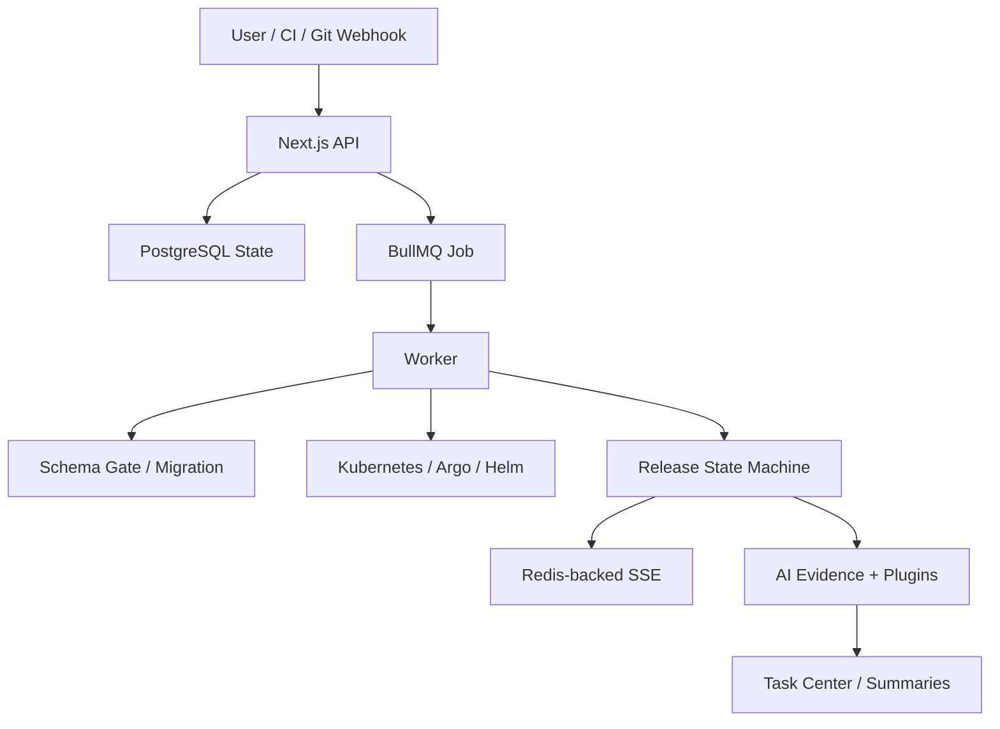

# 技术路线：架构总览

## 30 秒版本

Juanie 是 Next.js + PostgreSQL + BullMQ + Kubernetes + Argo CD/Rollouts + Atlas + AI plugin runtime
组成的发布控制平面。核心架构思想是：HTTP 只负责接收意图，长任务交给队列，状态落库，实时事件通过 SSE 推送，
Kubernetes 期望态尽量交给成熟控制器，AI 基于平台证据做结构化判断。

## 主链路

## 核心模块

| 模块 | 职责 |
| --- | --- |
| `src/app/api/` | 接收用户/API/CI 请求，做认证和作用域校验 |
| `src/lib/db/schema.ts` | 控制面数据模型 |
| `src/lib/projects/` | 项目创建、设置和生命周期 |
| `src/lib/queue/` | worker、scheduler、release、deployment、project init |
| `src/lib/releases/` | release 创建、状态机、编排、展示、rollout |
| `src/lib/environments/` | 环境模型、preview、promotion、runtime control |
| `src/lib/schema-safety/` | schema 门禁 API 层入口 |
| `src/lib/schema-management/` | inspect、repair、schema-runner job 等内部实现 |
| `src/lib/ai/` | AI provider、plugin、prompt、skill、eval、task center |
| `deploy/k8s/` | Helm chart、Argo CD、bootstrap 和基础设施 |

## 为什么要队列

项目初始化、发布、迁移、部署、清理都不是短请求：

- 可能等待 CI。
- 可能等待 Kubernetes 控制器。
- 可能需要重试。
- 可能要记录阶段日志。
- 需要实时推送给前端。

所以 API 应尽快落状态并 enqueue，worker 再推进状态机。

## 为什么要状态机

Release 不是“执行脚本成功/失败”这么简单。它至少包含：

- queued
- schema gate
- migration pre-running
- deployment running
- verification
- awaiting rollout
- completed / failed / canceled

状态机的价值是让 UI、API、worker、AI 和审计都围绕同一份事实协作。

## 为什么使用成熟控制器

Juanie 不应该手写所有基础设施能力：

- Argo CD 负责平台自身 GitOps 同步和 preview scaffold。
- Argo Rollouts 负责 production controlled rollout。
- CloudNativePG 负责 Postgres 集群生命周期。
- cert-manager / External Secrets Operator 负责 TLS 和 secret 集成。
- Atlas 负责 schema diff、migration hash 和控制面迁移执行。

面试里可以说：现代化不是把所有东西换成开源工具，而是把“期望态控制”和“平台业务状态”分清。

## 仍可优化

- `project-init` 仍然偏大，应该继续拆成仓库配置注入、K8s setup、数据库供应、首发构建等领域模块。
- `k8s.ts` 应保持为薄运行态 helper，避免重新发明控制器。
- UI 大组件应继续拆成 view model 和 presentational components。
- Worker 健康、queue 健康和 schema-runner 健康可做成统一 runtime baseline。
