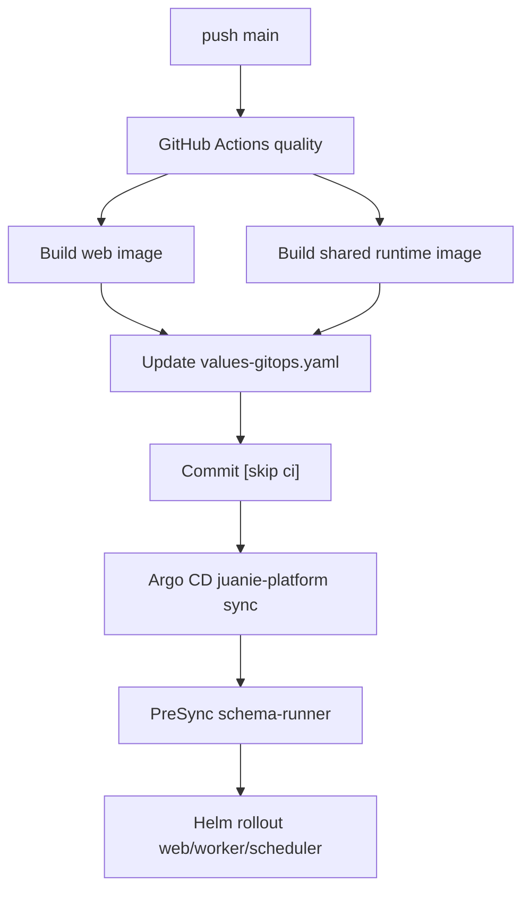

# 技术路线：平台自身发布

## 30 秒版本

Juanie 自身发布走 GitHub Actions + Argo CD + Helm。CI 只负责质量检查、构建镜像和更新 GitOps 指针；
Argo CD 负责把 Helm chart 同步到集群；PreSync schema-runner 负责控制面 Atlas 迁移。

## 当前链路

## 为什么要区分平台自身和用户应用

平台自身发布是 first-party control plane delivery。它适合 GitOps，因为：

- 期望态稳定。
- 环境少。
- 需要可审计基础设施变更。
- Argo CD 能持续对齐集群。

用户应用发布更适合 release state machine，因为：

- 发布频率高。
- 每次都需要实时状态、schema gate、promotion 和 AI/task context。
- 不应该制造大量 GitOps 指针提交。

## Runtime 基线

Juanie 是 Bun-first，但不是 Bun-only：

| 层面 | 运行时 |
| --- | --- |
| 本地脚本、测试、worker 编译 | Bun |
| Worker / scheduler / schema-runner | 共享 Bun runtime 镜像 |
| Web production | Node 24 + Next standalone |

这样既利用 Bun 的脚本和后台任务优势，又保持 Next production server 的官方语义。

## 不应该恢复的旧路径

- CI SSH 到服务器执行 Helm。
- 单独 worker 镜像和 migrate 镜像。
- 控制面 SQL 迁移脚本第二条路径。
- 平台发布绕过 Argo CD。

## 排障入口

- GitHub Actions `quality`, `build-images`, `promote-gitops`。
- `deploy/k8s/charts/juanie/values-gitops.yaml`。
- Argo CD Application `juanie-platform`。
- PreSync schema-runner Job logs。
- `/api/health/ready`。
