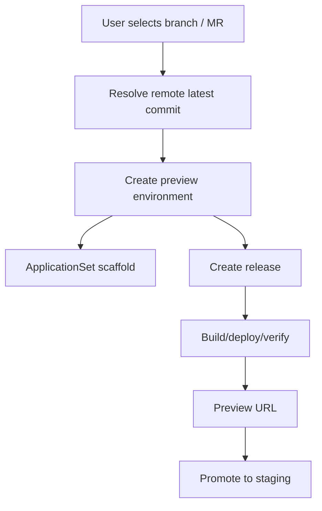

# 技术路线：Preview Environments

## 30 秒版本

Preview 是需求/分支级短生命周期环境。Juanie 的目标是让用户选择远端分支后直接基于最新 commit 创建可访问环境，
不需要为了触发 preview 再 push 一次无意义提交。

## 设计目标

- 基于远端分支或 MR/PR。
- 解析最新 commit。
- 创建独立环境记录。
- 记录 preview build source 和状态。
- 支持数据库策略，避免误迁移继承数据库。
- 可以提升到 staging。
- 到期或删除后可清理资源。

## 为什么 preview 不等于 staging

| 环境 | 生命周期 | 用途 |
| --- | --- | --- |
| Preview | 短，按需求/分支创建 | 看某个变更 |
| Staging | 持久 | 团队集成验证 |
| Production | 持久 | 正式流量 |

Preview 可以很多个，staging 默认一个。这样用户不会把需求验证和团队验证混在一起。

## 架构

## 数据库策略

Preview 数据库是高风险点。常见策略：

- empty：创建空库。
- clone/snapshot：从目标环境复制。
- inherit：继承连接，风险最大，应有保护。

现代化产品应该默认安全，不让用户误把继承源数据库迁坏。面试里可以强调：preview 的数据库策略是产品和安全问题，
不是单纯技术选项。

## 代码入口

| 主题 | 文件 |
| --- | --- |
| Preview launch | `src/lib/environments/preview-launch.ts` |
| Preview model | `src/lib/environments/preview.ts` |
| ApplicationSet | `src/lib/environments/application-set.ts` |
| Database guard | `src/lib/releases/preview-database-guard.ts` |
| Promotion | `src/lib/environments/promotion.ts` |
| Cleanup | `src/lib/environments/cleanup.ts` |
