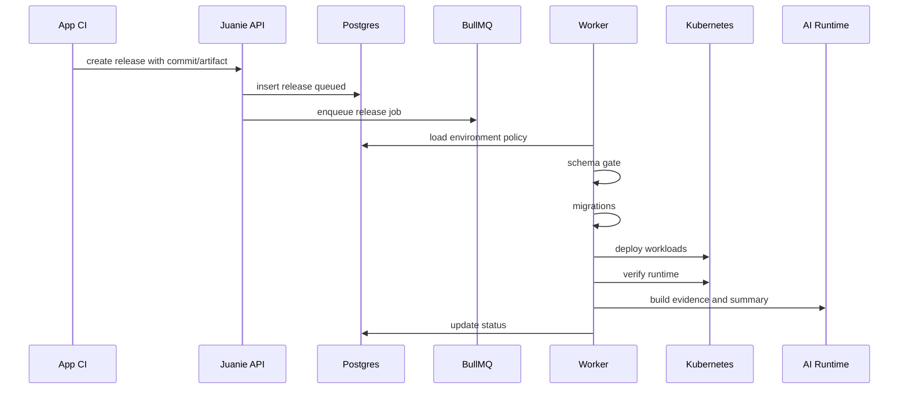

# 技术路线：发布控制平面

## 30 秒版本

Juanie 的 release control plane 把一次发布建模成可审计状态机。CI 负责构建 artifact，Juanie 负责环境策略、
schema gate、迁移、部署、验证、production rollout 和 AI/task context。

## 发布链路

## 为什么子应用不强制 GitOps

这是面试里很容易被问到的点。

平台自身发布适合 GitOps，因为平台控制面是少量、稳定、强声明式的基础设施。

子应用每次发布如果都写 GitOps 仓库，会有问题：

- 每次 release 制造 Git 历史噪音。
- 发布状态和 Git 同步之间有延迟。
- schema gate、AI、任务中心和 promotion 状态很难实时联动。
- 用户应用 CI 已经天然拥有 artifact 构建上下文。

所以 Juanie 的设计是：用户应用 CI 构建 artifact，调用 Juanie API；Juanie 用状态机推进 release。

## Production controlled rollout

Production 不应该只是“部署成功”。Juanie 可以让 production release 停在 `awaiting_rollout`，由用户在
release detail 完成放量动作。

技术上：

- release 记录候选版本。
- deployment 更新 workload/rollout。
- Argo Rollouts 管理流量推进。
- Juanie 记录状态和用户动作。

这使 production 发布从一次性命令变成可暂停、可继续、可审计的过程。

## Trace

Release 创建后使用 release id 派生稳定 trace，并透传到 release/deployment/migration BullMQ job。
新增链路日志应带 trace fields，避免只靠 release id 或 job id 手工拼。

## 常见追问

**问：release 和 deployment 区别是什么？**

Release 是用户意图和发布状态，deployment 是某次服务部署执行。一个 release 可能包含多个 deployment、
schema gate、migration、verification 和 rollout 状态。

**问：为什么不是一个 worker 直接跑完？**

可以由 worker 编排，但状态必须落库，阶段要可恢复、可观察、可被 UI/SSE/AI 使用。否则一旦 worker 断开，
用户只看到一个黑盒失败。

**问：如果 CI 重试调用 release API 怎么办？**

需要通过 source commit、environment、artifact、release idempotency 和状态校验处理重复请求。面试里可以承认
这是发布系统必须重视的点。

## 代码入口

| 主题 | 文件 |
| --- | --- |
| Release service | `src/lib/releases/service.ts`, `src/lib/releases/index.ts` |
| Release queue | `src/lib/queue/release.ts` |
| Deployment queue | `src/lib/queue/deployment.ts` |
| Orchestration | `src/lib/releases/orchestration.ts` |
| State machine | `src/lib/releases/state-machine.ts` |
| Rollout | `src/lib/releases/rollout.ts`, `src/lib/releases/argo-rollouts.ts` |
| Trace | `src/lib/trace/context.ts` |
